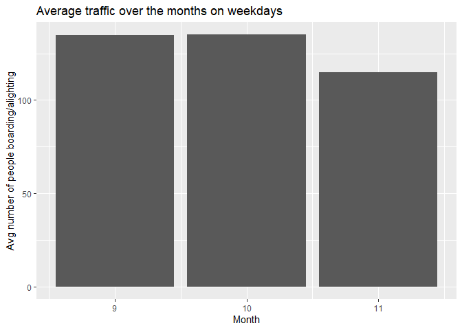
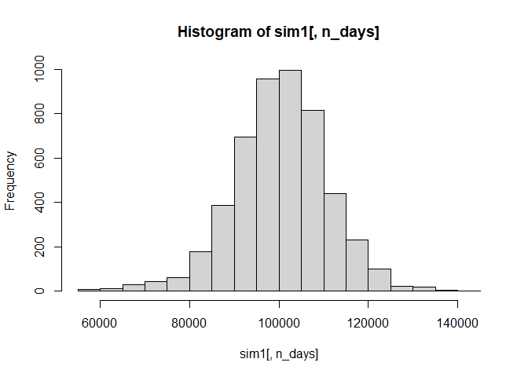
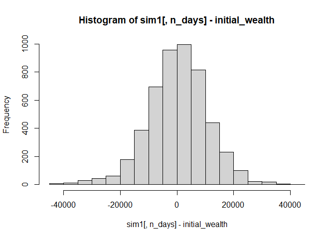
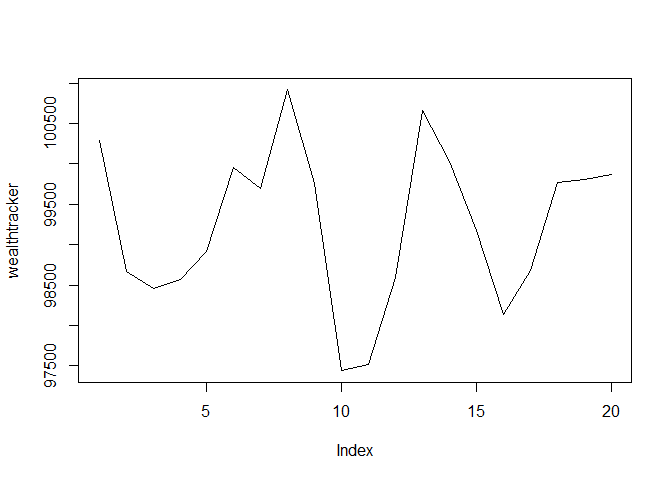
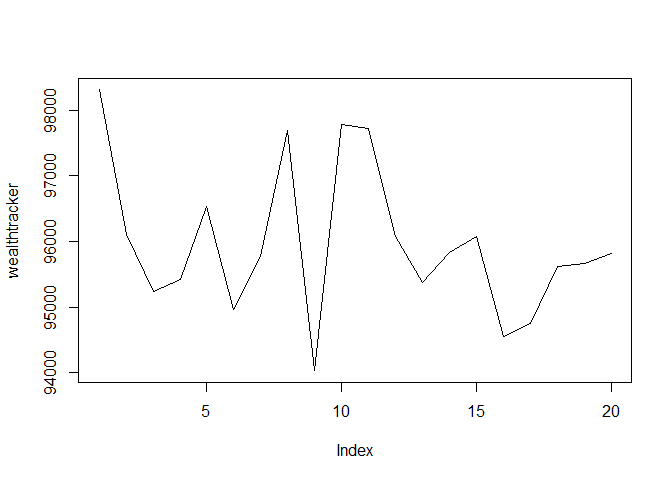
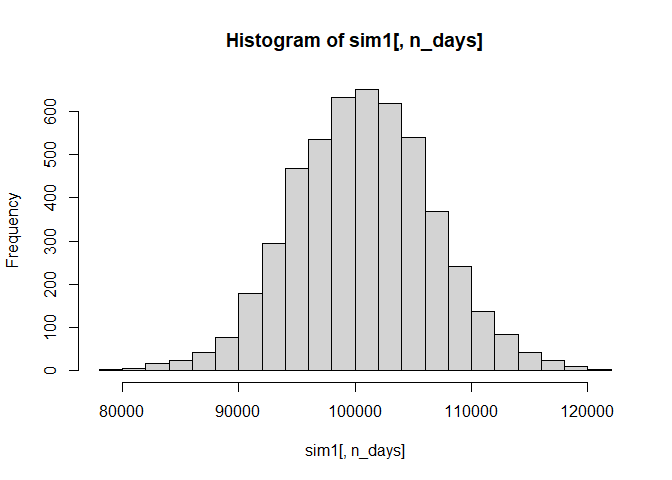
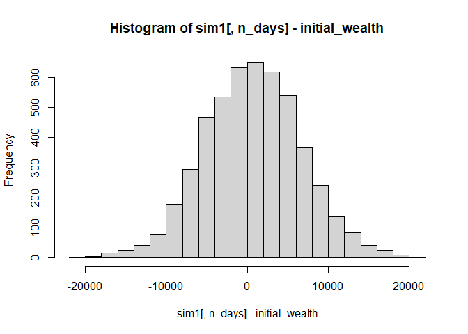
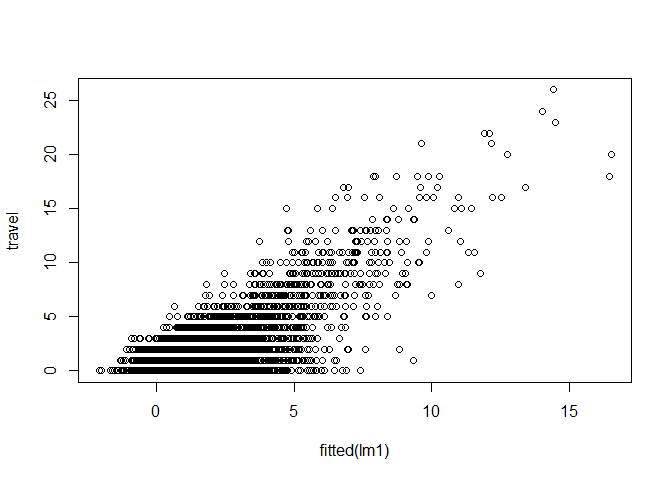
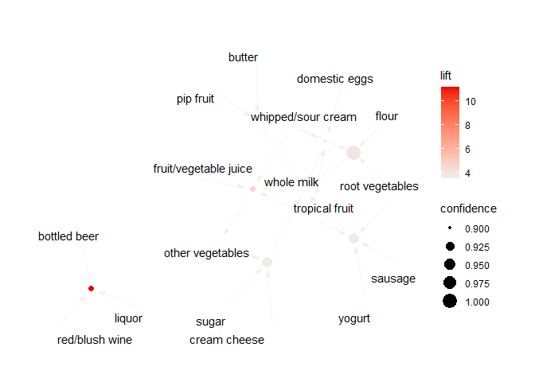

# 1. Probability practice

## Part. A

Visitors to your website are asked to answer a single survey question
before they get access to the content on the page. Among all of the
users, there are two categories: Random Clicker (RC), and Truthful
Clicker (TC). There are two possible answers to the survey: yes and no.
Random clickers would click either one with equal probability. You are
also giving the information that the expected fraction of random
clickers is 0.3. After a trial period, you get the following survey
results: 65% said Yes and 35% said No. What fraction of people who are
truthful clickers answered yes? Hint: use the rule of total probability.

> Lets start with the mathematical representations of all the fractions
> we know, <br> *P*(*Y*) = 0.65→ Marginal probability of a clicker
> saying Yes <br> *P*(*N*) = 0.35→ Marginal probability of a clicker
> saying No <br> *P*(*R*<sub>*c*</sub>) = 0.3→ Probability of a clicker
> being a random clicker <br> *P*(*T*<sub>*c*</sub>) = 0.7→ Probability
> of a clicker being a truthful clicker <br>
>
> To find the fraction of people truthful clickers who answered yes, we
> find the value of *P*(*Y*\|*T*<sub>*c*</sub>)
>
> We know that, <br>
> *P*(*Y*) = *P*(*Y*\|*R*<sub>*c*</sub>) + *P*(*Y*\|*T*<sub>*c*</sub>)
>
> Rearranging, <br>
> *P*(*Y*\|*T*<sub>*c*</sub>) = *P*(*Y*) − *P*(*Y*\|*R*<sub>*c*</sub>)
>
> If a random clicker clicking *Yes* or *No* is equally likely, then the
> probability (or fraction) of Random clickers, clicking yes \> is
> (Fraction of users among the 0.3 random clickers, clicking *Yes*),
> <br> *P*(*Y*\|*R*<sub>*c*</sub>) = 0.5 \* 0.3 = 0.15
>
> Substituting in the rearranged equation, <br>
> *P*(*Y*\|*T*<sub>*c*</sub>) = 0.65 − 0.15 <br>
> *P*(*Y*\|*T*<sub>*c*</sub>) = 0.5
>
> Therefore, the fraction of clickers among truthful clickers who
> clicked yes would be **0.5**

## Part. B

Imagine a medical test for a disease with the following two attributes:

-   The sensitivity is about 0.993. That is, if someone has the disease,
    there is a probability of 0.993 that they will test positive.
-   The specificity is about 0.9999. This means that if someone doesn’t
    have the disease, there is probability of 0.9999 that they will test
    negative.
-   In the general population, incidence of the disease is reasonably
    rare: about 0.0025% of all people have it (or 0.000025 as a decimal
    probability).

Suppose someone tests positive. What is the probability that they have
the disease?

> Lets start with the mathematical representations of all the
> probabilities we know, <br> *P*(*T*<sub>*p*</sub>\|*D*) = 0.993→
> Probability of testing positive given a person has the disease <br>
> *P*(*T*<sub>*n*</sub>\|*D*<sub>*c*</sub>) = 0.9999→ Probability of
> testing negative given a person doesn’t have the disease <br>
> *P*(*D*) = 0.000025→ Probability of a person having the disease <br>
> *P*(*D*<sub>*c*</sub>) = 1 − *P*(*D*) = 0.999975 Probability of a
> person not having the disease <br>
>
> We’ll find the probability of testing positive, given a person doesn’t
> have the disease, i.e.
> *P*(*T*<sub>*p*</sub>\|*D*<sub>*c*</sub>) = 1 − *P*(*T*<sub>*n*</sub>\|*D*<sub>*c*</sub>) = 1 − 0.9999 = 0.0001
>
> Probability of having the disease given that someone tested positive
> <br> $P(D\|T\_{p}) = \frac{P(T\_{p}\|D)\*P(D)}{P(T\_{p})}$ <br>
> $P(D\|T\_{p}) = \frac{P(T\_{p}\|D)\*P(D)}{P(T\_{p}\|D)\*P(D) + P(T\_{p}\|D\_{c})\*P(D\_{c})}$
> <br>
> $P(D\|T\_{p}) = \frac{0.993\*0.000025}{0.993\*0.000025 + 0.0001\*0.999975}$
> = 0.1989<br> *P*(*D*\|*T*<sub>*p*</sub>) = 0.1989 → 19.89% <br>
>
> Therefore, the probability of having the disease given that someone
> tested positive is **0.1989 or 19.89%**. It has significantly
> increased from the marginal probability of having the disease which
> was **0.000025 or 0.0025%**

# 2. Wrangling the Billboard Top 100

using [billboard.csv](./Data/billboard.csv)

``` r
billboard = read.csv("./Data/billboard.csv")
billboard = billboard[,c("performer", "song", "year", "week", "week_position")]
# Considering the relevant columns as mentioned in the question
head(billboard)
```

    ##    performer                   song year week week_position
    ## 1 Patty Duke Don't Just Stand There 1965   29            34
    ## 2 Patty Duke Don't Just Stand There 1965   30            22
    ## 3 Patty Duke Don't Just Stand There 1965   31            14
    ## 4 Patty Duke Don't Just Stand There 1965   32            10
    ## 5 Patty Duke Don't Just Stand There 1965   33             8
    ## 6 Patty Duke Don't Just Stand There 1965   34             8

## Part. A

Make a table of the top 10 most popular songs since 1958, as measured by
the *total number of weeks that a song spent on the Billboard Top 100.*
Note that these data end in week 22 of 2021, so the most popular songs
of 2021 will not have up-to-the-minute data; please send our apologies
to The Weeknd.

Your table should have **10 rows** and **3 columns**: `performer`,
`song`, and `count`, where `count` represents the number of weeks that
song appeared in the Billboard Top 100. Make sure the entries are sorted
in descending order of the `count` variable, so that the more popular
songs appear at the top of the table. Give your table a short caption
describing what is shown in the table.

(*Note*: you’ll want to use both `performer` and `song` in any
`group_by` operations, to account for the fact that multiple unique
songs can share the same title.)

``` r
top_songs_by_week = billboard %>% group_by(song, performer) %>% summarize(count = n())
top10_songs_by_week = head(top_songs_by_week[order(-top_songs_by_week$count),], 10)

knitr::kable(top10_songs_by_week,
             caption = "The Top 10 Songs (Jul 1958 - Jun 2021) by the number of weeks on the Billboard")
```

| song                                | performer                                 | count |
|:------------------------------|:-----------------------------------|-----:|
| Radioactive                         | Imagine Dragons                           |    87 |
| Sail                                | AWOLNATION                                |    79 |
| Blinding Lights                     | The Weeknd                                |    76 |
| I’m Yours                           | Jason Mraz                                |    76 |
| How Do I Live                       | LeAnn Rimes                               |    69 |
| Counting Stars                      | OneRepublic                               |    68 |
| Party Rock Anthem                   | LMFAO Featuring Lauren Bennett & GoonRock |    68 |
| Foolish Games/You Were Meant For Me | Jewel                                     |    65 |
| Rolling In The Deep                 | Adele                                     |    65 |
| Before He Cheats                    | Carrie Underwood                          |    64 |

The Top 10 Songs (Jul 1958 - Jun 2021) by the number of weeks on the
Billboard

## Part. B

Is the “musical diversity” of the Billboard Top 100 changing over time?
Let’s find out. We’ll measure the musical diversity of given year as
*the number of unique songs that appeared in the Billboard Top 100 that
year.* Make a line graph that plots this measure of musical diversity
over the years. The x axis should show the year, while the y axis should
show the number of unique songs appearing at any position on the
Billboard Top 100 chart in any week that year. For this part, please
filter the data set so that it excludes the years 1958 and 2021, since
we do not have complete data on either of those years. Give the figure
an informative caption in which you explain what is shown in the figure
and comment on any interesting trends you see.

There are number of ways to accomplish the data wrangling here. We offer
you two hints on two possibilities:

1.  You could use two distinct sets of data-wrangling steps. The first
    set of steps would get you a table that counts the number of times
    that a given song appears on the Top 100 in a given year. The second
    set of steps operate on the result of the first set of steps; it
    would count the number of unique songs that appeared on the Top 100
    in each year, *irrespective of how many times* it had appeared.
2.  You could use a single set of data-wrangling steps that combines the
    `length` and `unique` commands.

``` r
musical_diversity = billboard[,c("performer", "song", "year")]
musical_diversity = musical_diversity %>% filter(!(year %in% c(2021, 1958)))
musical_diversity = unique(musical_diversity)
musical_diversity = musical_diversity %>% group_by(year) %>% summarize(unique=n())
musical_diversity = musical_diversity[order(musical_diversity$year),]

# plot(musical_diversity$year, musical_diversity$unique, type="l", col="red", xlab="Year", ylab="# of unique songs on the Billboard Top-100", main="Musical Diversity")

ggplot(data=musical_diversity, aes(x=year, y=unique, group=1)) +
  geom_line(color="red", size=1) +
  ggtitle("Musical Diversity") +
  xlab("Year") +
  ylab("# of unique songs on the Billboard Top-100")
```


## Part. C

Let’s define a “ten-week hit” as a single song that appeared on the
Billboard Top 100 for at least ten weeks. There are 19 artists in U.S.
musical history since 1958 who have had *at least 30 songs* that were
“ten-week hits.” Make a bar plot for these 19 artists, showing how many
ten-week hits each one had in their musical career. Give the plot an
informative caption in which you explain what is shown.

*Notes*:

1.  You might find this easier to accomplish in two distinct sets of
    data wrangling steps.
2.  Make sure that the individuals names of the artists are readable in
    your plot, and that they’re not all jumbled together. If you find
    that your plot isn’t readable with vertical bars, you can add a
    `coord_flip()` layer to your plot to make the bars (and labels) run
    horizontally instead.
3.  By default a bar plot will order the artists in alphabetical order.
    This is acceptable to turn in. But if you’d like to order them
    according to some other variable, you can use the `fct_reorder`
    function, described in [this blog
    post](https://datavizpyr.com/re-ordering-bars-in-barplot-in-r/).
    This is optional.

``` r
ten_week_hitters = top_songs_by_week %>%
  filter(count >= 10) %>%
  group_by(performer) %>%
  summarize(count = n()) %>%
  filter(count >= 30)

ggplot(data=ten_week_hitters, aes(x=reorder(performer, +count), y=count)) +
  geom_bar(stat="identity", fill="steelblue") +
  ylab("# of 10-week-hits") + xlab("Artist") +
  coord_flip()
```


# 3. Visual story telling part 1: Green Buildings

using [greenbuildings.csv](./Data/greenbuildings.csv) <br> *\*use raw
preview (on the Solutions.Rmd) to view the R-code*

    ## 160 outliers were removed from the data

160 is a significant number of outliers to be discarded with a
justification of data cleaning. Let us also see how the outliers
modified the median value of the rent

    ## Median rent of all green buildings: 27.6 
    ## Median rent of all green buildings after removing the outliers: 27.6

The outlier removal does not seem to have affected the median rate at
all, rendering the process completely redundant. Additionally, removing
the outliers might have actually cost us a lot in terms of information
loss. Let’s see how

| cluster | perc_removed |
|:--------|:-------------|
| 142     | 100.00000    |
| 257     | 100.00000    |
| 1026    | 66.66667     |
| 153     | 50.00000     |
| 185     | 50.00000     |
| 255     | 50.00000     |
| 340     | 50.00000     |
| 395     | 50.00000     |
| 1023    | 50.00000     |
| 1024    | 50.00000     |
| 1082    | 50.00000     |
| 1175    | 50.00000     |
| 234     | 40.00000     |
| 177     | 33.33333     |
| 236     | 33.33333     |
| 385     | 33.33333     |
| 193     | 28.57143     |
| 536     | 28.57143     |
| 315     | 25.00000     |
| 1075    | 25.00000     |
| 266     | 20.00000     |
| 557     | 20.00000     |
| 956     | 20.00000     |
| 972     | 20.00000     |
| 1015    | 20.00000     |
| 1142    | 20.00000     |
| 1143    | 20.00000     |

The Percentage of cluster rows lost because of the outlier removal (top
27)

    ## In these 27 clusters, at least 20% of their properties (rows) were removed when the outliers were discarded. From intuition, we may suppose that each cluster might have characteristic rent of its own. So discarding a significant proportion of each cluster is removing vital information. We can also see that the outlier removal removed  1  of the green rated property.

Let’s see how the data is cluster-wise. Let us group the clusters and
look at the increase in rent for that cluster for a green building, and
then summarize it.

    ## Median increase in rent for a green property (among all cluster-wise increases): $ 3


| Var1           | Freq |
|:---------------|-----:|
| (2.65,5.59\]   |  161 |
| (-0.28,2.65\]  |  146 |
| (-3.21,-0.28\] |   95 |

From the histogram, we can see that the top 3 most frequent buckets
(range of rent increases) are as shown in the table above. Among the
top-3, 2 are negative, implying the rents for green buildings are lower
than the non-green buildings in some of the clusters. That’s all
aggregated data. Now let’s see how the spread of the rent difference is
among clusters.

|     |       x |
|:----|--------:|
| 25% | -0.4125 |
| 75% |  6.3475 |

the mid-50% of the data is in the range of (-0.4125,6.3475) meaning we
can expect our rent to increase by this amount (per sqaure feet) if we
ignore all other factors that might effect the rent. What other factors
might be having an effect on the rent?


We can see, although not clearly, that the rent varies with leasing
rate, electricity cost, cooling demand, heating demand, etc. all of
which depend on the location of the property. This information about our
propery under consideration being on East Cesar Chavez, just across I-35
from downtown is never being considered in the analysis. Considering
these variations might also give us a more *reliable* prediction of the
rent difference.

One more factor considered in the analysis was 100% or 90% occupancy
from day-1 of the property being ready for occupancy. This is rarely the
case. Let us assume the median rent difference of $3 per square fit per
year. and let us consider the property being occupied 100% over a span
of some years

|                                    | target_occupancy_100 | target_occupancy_75 |
|:--------------------------------|:-------------------|:------------------|
| Target occupancy reached by year 3 | 7.68                 | 9.90                |
| Target occupancy reached by year 5 | 8.67                 | 10.90               |
| Target occupancy reached by year 8 | 10.17                | 11.65               |

The Number of years required to recuperate the premium for green
certification

With this analysis, 7.7 years is still the best case scenario of
recuperating the premium spent on a green certification. For a more
realistic scenario, we can see that the cost will be recuperated before
making any profits after at least 10 years of the construction. This
gives a more realistic picture by just considering the rent increase of
the median cluster disregarding all other factors. We can still suggest
the developer to go for a linear regression model to get a more accurate
prediction of the returns. Additionally, the linear model would also
give a sense the role a particular factor plays in the estimation of the
returns.

# 4. Visual story telling part 2: Capital Metro data

using [capmetro_UT.csv](./Data/capmetro_UT.csv) <br> *\*use raw preview
(on the Solutions.Rmd) to view the R-code*

| year | month | day | hour | minute | date       | day_of_week | weekend | temperature | boarding | alighting | traffic |
|----:|----:|---:|----:|-----:|:-------|:--------|:-----|--------:|------:|-------:|-----:|
| 2018 |     9 |   1 |    6 |      0 | 2018-09-01 | Sat         | weekend |       74.82 |        0 |         1 |       1 |
| 2018 |     9 |   1 |    6 |     15 | 2018-09-01 | Sat         | weekend |       74.82 |        2 |         1 |       3 |
| 2018 |     9 |   1 |    6 |     30 | 2018-09-01 | Sat         | weekend |       74.82 |        3 |         4 |       7 |
| 2018 |     9 |   1 |    6 |     45 | 2018-09-01 | Sat         | weekend |       74.82 |        3 |         4 |       7 |
| 2018 |     9 |   1 |    7 |      0 | 2018-09-01 | Sat         | weekend |       74.39 |        2 |         4 |       6 |
| 2018 |     9 |   1 |    7 |     15 | 2018-09-01 | Sat         | weekend |       74.39 |        4 |         4 |       8 |

Initial data of CapMetro

We have formatted the initial data, where the date and time are now
different columns which we can analyze in terms of each day, month,
hour, etc. We have also added a new column called traffic, which is the
sum of boarding and alighting signifying the foot traffic in the buses
in general.


From the overall data, we can clearly see that weekdays have significant
traffic compared to weekends.


On a particular weekday, we can also see that there are two significant
time periods where the traffic is high. Around 8-10 am in the mornings
we see that most of the traffic is contributed by the “alighting”
passengers meaning buses have more people getting off near the
university in the morning. The other peak is around 3-5 pm when most of
the students finish their classes, and thus a large percentage of the
traffic is contributed by people “boarding” the buses near the
university.

We can also see this traffic is significantly high compared to weekends
from the second graph.

Let’s now see how the traffic varies through the months (Sep 2018 - Nov
2018)



We don’t see any drastic changes in the three months for which we have
the data. How does the traffic change over a closer look at the dates?
Does the traffic change over the temperatures of the day? Let’s take a
look.


There seem to be some outliers in the data where the traffic has steeply
fallen. Let’s see what those outliers are and see if removing them gives
us a more clear trend in the data.

| date       | temp_day | traffic_day |
|:-----------|---------:|------------:|
| 2018-09-03 | 81.63750 |   24.031250 |
| 2018-11-21 | 49.86625 |   30.921875 |
| 2018-11-22 | 56.95562 |    8.765625 |
| 2018-11-23 | 65.32625 |   14.328125 |

Outliers in traffic in the data

We can see that these dates where the outliers occurred were university
holidays. 3rd September was Labor Day, and the three days in November
were the Thanksgiving weekend.


We can see an overall decrease in the temperature over the time period
of the data from September to November. Along with the decrease in
temperature, can we also say there was a decrease in the ridership as it
follows a similar trend?


There is a correlation between temperature and bus rides. We can see
that people prefer to use public transportation (buses) when the weather
is good. As the temperature increases from 29 to 75 degrees, we see a
drastic increase in ridership. But at the same time, the ridership also
decreases drastically when the temperature goes above 80 degrees,
reaching almost zero traffic at high temperatures of 93+ degrees.

# 5. Portfolio Modeling

For this question, we decided to do three different tests with different
types of ETFs to understand the different gains and losses through
bootstrapping.

We first used Oil and Gas commodity ETFs to understand how much we would
potentially be gaining or losing if we were to invest in them.

These are the stocks we used for this portfolio:

USO: United States Oil Fund LP

UNG: United States Natural Gas Fund LP

OILK: ProShares K-1 Free Crude Oil Strategy ETF

GAZ: iPath Series B Bloomberg Natural Gas Subindex Total Return ETN

RJN: Elements Rogers International Commodity Index-Energy Total Return
ETN

    ##               ClCl.USOa   ClCl.UNGa   ClCl.OILKa    ClCl.GAZa    ClCl.RJNa
    ## 2017-08-14           NA          NA           NA           NA           NA
    ## 2017-08-15  0.003086394 -0.01052632 -0.001081059  0.000000000  0.000000000
    ## 2017-08-16 -0.018461564 -0.01367785 -0.017261926  0.000000000  0.000000000
    ## 2017-08-17  0.005224674  0.00924507  0.005451275 -0.008226846 -0.004405286
    ## 2017-08-18  0.036382576 -0.00610687  0.035049254  0.024885396  0.030973451
    ## 2017-08-21 -0.026078259  0.01996920 -0.025396847  0.000000000 -0.021459227

From the coefficients, we can see the difference in each stock and how
they differ from day to day. We started measuring from 5 years back till
today.

We then made a pairs plot to see each ETF against each other.


We then simulate a random day to where we distribute each ETF to our
$100K capital equally and then find the sum to compute our new total
wealth at the end of a random day.

    ##            ClCl.USOa ClCl.UNGa ClCl.OILKa ClCl.GAZa ClCl.RJNa
    ## 2021-04-01  20646.44  20250.52    20638.9  20200.33  20406.09

    ## [1] 102142.3

So as we can see on a random day we went from $100,000 in capital to the
output.

We then observed the change over a time period of two weeks.

    ## [1] 108580.6


So we can see the change in our capital over the time of 20 days.

So now we bootstrap this model.

    ##               [,1]      [,2]      [,3]      [,4]      [,5]      [,6]      [,7]
    ## result.1 101808.29 101785.39  98828.47  99548.83  99692.52  99801.02  99549.29
    ## result.2 100045.72  99322.90 100570.66 101357.61 102474.53 105481.68 107682.10
    ## result.3 100050.13 100659.60 100436.76 103235.09 101999.01 102369.20 104046.81
    ## result.4 101504.84 101496.10 101203.75 100463.13 100813.36 100578.94 100064.92
    ## result.5  99640.78 104848.76 104569.78 104768.20 104762.68 104139.09 105010.67
    ## result.6  98814.49  99730.43  97932.11  99658.97  99076.46 102565.13 103201.71
    ##               [,8]      [,9]    [,10]     [,11]    [,12]    [,13]    [,14]
    ## result.1 100803.58 103367.90 103043.1 104519.19 104631.1 105398.8 109154.3
    ## result.2 107830.73 107893.20 108543.8 106065.61 106119.2 106101.0 106900.8
    ## result.3 106052.89 108399.09 112568.1 110490.95 105275.8 104560.5 105604.6
    ## result.4 100355.11 101754.97 103103.6 101982.29 102683.6 103064.8 102329.8
    ## result.5 111152.48 110954.61 110556.3 110519.18 105873.2 106786.6 108426.0
    ## result.6  96884.16  96458.59  98875.8  98939.17 100578.8 100068.0 100836.6
    ##              [,15]     [,16]     [,17]     [,18]     [,19]     [,20]
    ## result.1 111549.81 111213.55 112641.87 112116.52 112340.65 114050.07
    ## result.2 106160.55 106793.98 107106.84 107775.77 107286.37 107961.36
    ## result.3 107073.31 108525.18 109447.67 108791.49 110962.28 111289.85
    ## result.4 102137.68 102400.68 101277.26  98221.75  99616.15 100721.42
    ## result.5  98318.53  97516.12  98087.07  96965.91  95772.41  96393.26
    ## result.6 102068.15  99790.70  99990.09  99762.98  96070.27  94823.14



So we can see the distribution of capital after bootstrapping. It is
mostly normal.

    ## [1] 100573.7

    ## [1] 573.6578



    ##        5% 
    ## -16577.25

So this is our ultimate gain/loss, which can vary from time to time.

Our next portfolio is emerging market equities, which can be important
for people who are interested in investing in new markets which can be
relatively risky.

These are the stocks we used for this portfolio:

VTO: Vanguard FTSE Emerging Markets ETF

IEMG: iShares Core MSCI Emerging Markets ETF

GEM: Goldman Sachs ActiveBeta Emerging Markets Equity ETF

DEM: WisdomTree Emerging Markets High Dividend Fund

PXH: Invesco FTSE RAFI Emerging Markets ETF

    ##               ClCl.VTOa    ClCl.IEMGa    ClCl.GEMa     ClCl.DEMa     ClCl.PXHa
    ## 2017-08-14           NA            NA           NA            NA            NA
    ## 2017-08-15  0.004189944  0.0007656393  0.002440574 -0.0007076179 -0.0004764173
    ## 2017-08-16 -0.009735744  0.0097552029  0.010346926  0.0056644325  0.0104862250
    ## 2017-08-17 -0.011235955 -0.0117447052 -0.014457831 -0.0105609244 -0.0136792918
    ## 2017-08-18 -0.002840909  0.0080506424  0.009779951  0.0078273719  0.0076518412
    ## 2017-08-21 -0.002849003  0.0032325157  0.002118644  0.0051776180  0.0047460845

From the coefficients, we can see the difference in each stock and how
they differ from day to day. We started measuring from 5 years back till
today.

We then made a pairs plot to see each ETF against each other


We then simulate a random day where we distribute each ETF to our $100K
capital equally and then find the sum to compute our new total wealth at
the end of a random day.

    ##            ClCl.VTOa ClCl.IEMGa ClCl.GEMa ClCl.DEMa ClCl.PXHa
    ## 2021-04-09  20834.22   19831.55  19855.25  19842.48  19831.56

    ## [1] 100195.1

So as we can see on a random day we went from $100,000 in capital to
output \[1\]. This amount varies from day to day.

We then observed the change over a time period of two weeks.

    ## [1] 96619.27



So we can see the change in our capital over the time of 20 days.

So now we bootstrap this model.

    ##               [,1]      [,2]      [,3]      [,4]      [,5]      [,6]      [,7]
    ## result.1  98554.22  98128.01  98234.84  98176.70  97127.19  98207.35  98561.66
    ## result.2 100834.10 101449.46 102195.68 100765.33  99633.36  99519.99  99423.39
    ## result.3 101874.64 101861.63 102304.81 102467.09 104116.18 103008.67 102499.69
    ## result.4 100460.82 100213.10  99027.44  99001.77  98754.29  97630.51  97026.05
    ## result.5 100430.22 101800.72 102217.79 103680.91 103926.77 103752.29 105977.03
    ## result.6  99892.15  99673.65 100418.31 100824.99 101471.65 102113.20  97455.37
    ##               [,8]      [,9]     [,10]     [,11]     [,12]     [,13]     [,14]
    ## result.1  97531.65  96073.34  95667.56  95917.66  96227.76  96093.04  97934.11
    ## result.2 100272.06 100110.90 100710.74 100209.88 100023.85  99572.50  99066.42
    ## result.3 103210.87 103714.86 103401.93 102966.85 102768.12 103581.35 102409.68
    ## result.4  98199.88  99444.47  99400.65  99512.62  99850.29  98575.71  98192.49
    ## result.5 107605.72 109165.65 109428.95 110332.28 110607.59 110889.29 111584.26
    ## result.6  98530.32  98604.02  98908.84  98374.34  99235.94 100205.59 100817.84
    ##              [,15]     [,16]     [,17]     [,18]     [,19]     [,20]
    ## result.1  99256.11  99087.64  98464.69  97517.44  97043.69  97286.42
    ## result.2  99577.84  98737.25  99742.07  98902.29  99234.95 100424.75
    ## result.3 102701.65 103745.29 103908.06 104454.76 104520.74 102749.56
    ## result.4  97999.09  98528.89  97369.97  97483.24  97339.62  94936.97
    ## result.5 112782.10 113440.81 113754.51 114324.59 115505.60 114958.56
    ## result.6 101367.43 101299.92 101239.97 101699.49 101193.48 106809.53


So we can see the distribution of capital after bootstrapping. It is
mostly normal.

    ## [1] 100586.7

    ## [1] 586.6699


    ##        5% 
    ## -7832.953

So our ultimate gain/loss would be output \[1\]. This could vary due to
randomization in bootstrapping.

The last portfolio we used is with Health and Biotech Equities, which is
slightly less common but still has a large capital.

These are the stocks we used for this portfolio:

XHE: SPDR S&P Health Care Equipment ETF

PSCH: Invesco S&P SmallCap Health Care ETF

IHE: IShares U.S. Pharmaceuticals ETF

PBE: Invesco Dynamic Biotechnology & Genome ETF

FHLC: Fidelity MSCI Health Care Index ETF

    ##                ClCl.XHEa    ClCl.PSCHa    ClCl.IHEa    ClCl.PBEa    ClCl.FHLCa
    ## 2017-08-14            NA            NA           NA           NA            NA
    ## 2017-08-15  0.0016534722 -0.0009331739  0.001342802 -0.003025065  0.0002630029
    ## 2017-08-16  0.0037966159  0.0035025685  0.004425399 -0.001950585  0.0023659305
    ## 2017-08-17 -0.0106890477 -0.0176846661 -0.011615520 -0.011509208 -0.0120640700
    ## 2017-08-18  0.0006649102  0.0015397134 -0.003377009 -0.005711819 -0.0034509426
    ## 2017-08-21 -0.0004983887  0.0023652318 -0.001219795  0.001104795  0.0034628928

From the coefficients, we can see the difference in each stock and how
they differ from day to day. We started measuring from 5 years back till
today.

We then made a pairs plot to see each ETF against each other.


We then simulate a random day where we distribute each ETF to our $100K
capital equally and then find the sum to compute our new total wealth at
the end of a random day.

    ##            ClCl.XHEa ClCl.PSCHa ClCl.IHEa ClCl.PBEa ClCl.FHLCa
    ## 2018-02-09  20200.97    20262.4  20223.25  20111.02   20274.88

    ## [1] 101072.5

So as we can see on a random day we went from $100,000 in capital to
output\[1\].

We then observed the change over a time period of two weeks.

    ## [1] 97318.17



So we can see the change in our capital over the time of 20 days.

So now we bootstrap this model.

    ##               [,1]      [,2]     [,3]      [,4]     [,5]      [,6]      [,7]
    ## result.1 100308.84 100232.35 100247.1  99510.29  99607.9  99839.79 100055.62
    ## result.2 100807.96 100465.35 100124.5 100111.94 100126.1 100671.27 100388.47
    ## result.3  99486.52 100806.16 101154.0 101802.58 101752.4 100139.85 100737.51
    ## result.4  99458.88  99518.47 100809.3 101343.25  97787.1  96638.45  97111.94
    ## result.5  99643.44 100532.66 100696.4 100382.91 101522.4 100202.35  98574.88
    ## result.6 100131.97 101439.11 101494.2 100487.44 100545.6 102565.05 103668.56
    ##               [,8]     [,9]     [,10]     [,11]     [,12]     [,13]     [,14]
    ## result.1 100522.28 101437.7 101460.18 102592.91 102552.56 101035.22 101364.38
    ## result.2 102937.87 102428.0 103475.25 103261.23 104246.13 104225.26 104745.68
    ## result.3 101486.83 101755.6 102073.11 102171.39 101863.26  99918.41 100341.58
    ## result.4  94527.26  95637.7  95885.57  95602.74  95778.32  97051.05  97628.77
    ## result.5  98256.98  97285.1  99495.85 102202.96 103401.38 103360.51 103980.25
    ## result.6 105067.21 105786.6 106036.00 107731.99 108000.35 107538.00 106982.87
    ##              [,15]     [,16]     [,17]     [,18]    [,19]    [,20]
    ## result.1 101037.01  99143.20  98755.31  95862.34  97448.5 100899.1
    ## result.2 104000.65 101998.63 102216.52 102396.01 102454.1 103019.8
    ## result.3 100907.28 100164.52 100303.88 101552.86 101924.2 103350.1
    ## result.4  97526.21  99207.24  99221.29 100499.18 100519.6 101652.3
    ## result.5 103844.70 105650.49 104466.14 102610.93 103360.1 103213.2
    ## result.6 107169.60 107918.45 109186.69 108268.64 109262.1 107573.7



So we can see the distribution of capital after bootstrapping. It is
mostly normal.

    ## [1] 101060.8

    ## [1] 1060.779



    ##        5% 
    ## -9138.233

So our ultimate gain/loss would be output \[1\]. However, this could
change due to randomization in bootstrapping.

When we compare all three, we can see which portfolio is better to
invest in, as it gains more capital or loses the least.

# 6. Clustering and PCA

``` r
pr.out = prcomp(wine, ncp=5, scale = TRUE)
```

    ## Warning: In prcomp.default(wine, ncp = 5, scale = TRUE) :
    ##  extra argument 'ncp' will be disregarded

``` r
names(pr.out)
```

    ## [1] "sdev"     "rotation" "center"   "scale"    "x"

``` r
pr.out$center #means of variables
```

    ##        fixed.acidity     volatile.acidity          citric.acid 
    ##           7.21530706           0.33966600           0.31863322 
    ##       residual.sugar            chlorides  free.sulfur.dioxide 
    ##           5.44323534           0.05603386          30.52531938 
    ## total.sulfur.dioxide              density                   pH 
    ##         115.74457442           0.99469663           3.21850085 
    ##            sulphates              alcohol              quality 
    ##           0.53126828          10.49180083           5.81837771

``` r
pr.out$scale #standard deviations of variables
```

    ##        fixed.acidity     volatile.acidity          citric.acid 
    ##          1.296433758          0.164636474          0.145317865 
    ##       residual.sugar            chlorides  free.sulfur.dioxide 
    ##          4.757803743          0.035033601         17.749399772 
    ## total.sulfur.dioxide              density                   pH 
    ##         56.521854523          0.002998673          0.160787202 
    ##            sulphates              alcohol              quality 
    ##          0.148805874          1.192711749          0.873255272

``` r
pr.out$rotation
```

    ##                              PC1        PC2         PC3         PC4
    ## fixed.acidity        -0.25692873  0.2618431 -0.46748619  0.14396377
    ## volatile.acidity     -0.39493118  0.1051983  0.27968932  0.08005785
    ## citric.acid           0.14646061  0.1440935 -0.58807557 -0.05551036
    ## residual.sugar        0.31890519  0.3425850  0.07550170 -0.11245623
    ## chlorides            -0.31344994  0.2697701 -0.04676921 -0.16529004
    ## free.sulfur.dioxide   0.42269137  0.1111788  0.09899801 -0.30330631
    ## total.sulfur.dioxide  0.47441968  0.1439475  0.10128143 -0.13223199
    ## density              -0.09243753  0.5549205  0.05156338 -0.15057853
    ## pH                   -0.20806957 -0.1529219  0.40678741 -0.47147768
    ## sulphates            -0.29985192  0.1196342 -0.16869128 -0.58801992
    ## alcohol              -0.05892408 -0.4927275 -0.21293142 -0.08003179
    ## quality               0.08747571 -0.2966009 -0.29583773 -0.47243936
    ##                               PC5         PC6         PC7          PC8
    ## fixed.acidity        -0.165362611  0.03003708 -0.39343530  0.001155415
    ## volatile.acidity     -0.147774077 -0.38266373 -0.44511080  0.310077574
    ## citric.acid           0.234621394  0.36224839 -0.04769762  0.444962196
    ## residual.sugar       -0.507921181 -0.06331719  0.09576310  0.081944829
    ## chlorides             0.393896604 -0.42544212  0.47329609  0.375531558
    ## free.sulfur.dioxide   0.248451958 -0.28318017 -0.36271398  0.120097626
    ## total.sulfur.dioxide  0.223966811 -0.10676882 -0.23481304  0.011279269
    ## density              -0.330357303  0.15455292 -0.01328572  0.042943625
    ## pH                    0.001457502  0.56089714 -0.07932113  0.362281828
    ## sulphates             0.193245549 -0.02014082 -0.17023612 -0.592220645
    ## alcohol              -0.116023190 -0.16947538 -0.33890566  0.226040866
    ## quality              -0.459129140 -0.27788835  0.27317740  0.093046206
    ##                              PC9        PC10         PC11          PC12
    ## fixed.acidity         0.42416913 -0.27243245 -0.276932032 -0.3350925313
    ## volatile.acidity     -0.12323319  0.49394624  0.140799120 -0.0824207437
    ## citric.acid          -0.24623265  0.33035538  0.229276179  0.0013466535
    ## residual.sugar       -0.48802361 -0.20717448  0.005144195 -0.4512148285
    ## chlorides            -0.04404975 -0.23887258 -0.193398397 -0.0432778637
    ## free.sulfur.dioxide   0.30139683 -0.30344826  0.486158400 -0.0009050256
    ## total.sulfur.dioxide  0.00181386  0.29478016 -0.720162498  0.0640632122
    ## density               0.07108094 -0.07681483 -0.003324491  0.7156665472
    ## pH                    0.13666158 -0.11240888 -0.139083153 -0.2067626762
    ## sulphates            -0.29740108  0.08546912  0.047219109 -0.0781995574
    ## alcohol              -0.41706026 -0.41605905 -0.191289020  0.3320120790
    ## quality               0.35664731  0.30782956 -0.018082206  0.0082880344

``` r
dim(pr.out$x)
```

    ## [1] 6497   12

``` r
biplot(pr.out, scale =0)
```


``` r
pr.out$rotation = -pr.out$rotation
pr.out$x = -pr.out$x
biplot(pr.out, scale = 0)
```


``` r
pr.out$sdev
```

    ##  [1] 1.7440032 1.6278372 1.2812130 1.0337433 0.9167881 0.8126495 0.7508838
    ##  [8] 0.7183195 0.6770320 0.5468207 0.4770613 0.1810667

``` r
pr.var = pr.out$sdev^2
pr.var
```

    ##  [1] 3.04154713 2.64985400 1.64150682 1.06862526 0.84050047 0.66039918
    ##  [7] 0.56382645 0.51598284 0.45837228 0.29901290 0.22758752 0.03278516

``` r
pve = pr.var/sum(pr.var)
pve
```

    ##  [1] 0.253462261 0.220821166 0.136792235 0.089052105 0.070041705 0.055033265
    ##  [7] 0.046985537 0.042998570 0.038197690 0.024917742 0.018965627 0.002732097

``` r
#PVE explained by each component
plot(pve, xlab = "Principal Component", ylab = "Proportion of Variance Explained", ylim = c(0,1), type = 'b')
```


``` r
#the cumulative PVE
plot(cumsum(pve), xlab = "Principal Component", ylab = "Cumulative Proportion of Variance Explained", ylim = c(0,1), type = 'b')
```


PCA allowed us to reduce the dimensionality of this massive dataset.
This gave us a deeper insight into the key variables in the dataset.
This unsupervised learning tool is valuable, as the information
generated from this model can be applied in supervised learning methods.
From this model, 12 different principal components were generated. The
graph shows that PC1 and PC2 explain a greater proportion of variance in
the dataset than the other principal components do. This is the general
trend, so it was expected these principal components would capture the
most variance. In PC1, the variables with the highest magnitude were
total sulfur dioxide, free sulfur dioxide, and volatile acidity. For PC2
alcohol had the highest magnitude. This gives insight into where the
highest variance exists in the dataset, as the first PC attempts to
account for the highest variance, and then the second is the next
highest, and so forth.

``` r
wine = read.csv("./Data/wine.csv")
wine=wine[ , names(wine) != "color"]

wine <- scale(wine)
head(wine)
```

    ##      fixed.acidity volatile.acidity citric.acid residual.sugar chlorides
    ## [1,]     0.1424623        2.1886645   -2.192664     -0.7447208 0.5699140
    ## [2,]     0.4510010        3.2819823   -2.192664     -0.5975941 1.1978825
    ## [3,]     0.4510010        2.5531038   -1.917405     -0.6606484 1.0266184
    ## [4,]     3.0735801       -0.3624106    1.660957     -0.7447208 0.5413699
    ## [5,]     0.1424623        2.1886645   -2.192664     -0.7447208 0.5699140
    ## [6,]     0.1424623        1.9457049   -2.192664     -0.7657389 0.5413699
    ##      free.sulfur.dioxide total.sulfur.dioxide   density         pH sulphates
    ## [1,]          -1.1000552           -1.4462472 1.0349132  1.8129500 0.1930819
    ## [2,]          -0.3112961           -0.8624022 0.7014323 -0.1150642 0.9995017
    ## [3,]          -0.8746955           -1.0924018 0.7681285  0.2580999 0.7978967
    ## [4,]          -0.7620156           -0.9862481 1.1016093 -0.3638402 0.3274852
    ## [5,]          -1.1000552           -1.4462472 1.0349132  1.8129500 0.1930819
    ## [6,]          -0.9873753           -1.3400936 1.0349132  1.8129500 0.1930819
    ##         alcohol    quality
    ## [1,] -0.9153937 -0.9371575
    ## [2,] -0.5800235 -0.9371575
    ## [3,] -0.5800235 -0.9371575
    ## [4,] -0.5800235  0.2079830
    ## [5,] -0.9153937 -0.9371575
    ## [6,] -0.9153937 -0.9371575

``` r
distance <- get_dist(wine)
set.seed(2)
km <- kmeans(wine, centers = 2)
km$cluster
```

    ##    [1] 1 1 1 1 1 1 1 1 1 1 1 1 1 1 1 1 1 1 1 1 1 1 1 1 1 1 1 1 1 1 1 1 1 2 1 1 1
    ##   [38] 1 1 1 1 1 1 1 1 1 1 1 1 1 1 1 1 1 1 1 1 1 1 1 1 1 1 1 1 1 1 1 1 1 1 1 1 1
    ##   [75] 1 1 1 1 1 1 1 1 1 1 1 1 1 1 1 1 1 1 1 1 1 1 1 1 1 1 1 1 1 1 1 1 1 1 1 1 1
    ##  [112] 1 1 1 1 1 1 1 1 1 1 1 1 1 1 1 1 1 1 1 1 1 1 1 1 1 1 1 1 1 1 1 1 1 1 1 1 1
    ##  [149] 1 1 1 1 1 1 1 1 1 1 1 1 1 1 1 2 2 1 1 1 1 1 1 1 1 1 1 1 1 1 1 1 1 1 1 1 1
    ##  [186] 1 1 1 1 1 1 1 1 1 1 1 1 1 1 1 1 1 1 1 1 1 1 1 1 1 1 1 1 1 1 1 1 1 1 1 1 1
    ##  [223] 1 1 1 1 1 1 1 1 1 1 1 1 1 1 1 1 1 1 1 1 1 1 1 1 1 1 1 1 1 1 1 1 1 1 1 1 1
    ##  [260] 1 1 1 1 1 1 1 1 1 1 1 1 1 1 1 1 1 1 1 1 1 1 1 1 1 1 1 1 1 1 1 1 1 1 1 1 1
    ##  [297] 1 1 1 1 1 1 1 1 1 1 1 1 1 1 1 1 1 1 1 1 1 1 1 1 1 1 1 1 1 1 1 1 1 1 1 1 1
    ##  [334] 1 1 1 1 1 1 1 1 1 1 1 1 1 1 1 1 1 1 1 1 1 1 1 1 1 1 1 1 1 1 1 1 1 1 1 1 1
    ##  [371] 1 1 1 1 1 1 1 1 1 1 1 1 1 1 1 1 1 1 1 1 1 1 1 1 1 1 2 1 1 1 2 1 1 1 1 1 1
    ##  [408] 1 1 1 1 1 1 1 1 1 1 1 1 1 1 1 1 1 1 1 1 1 1 1 1 1 1 1 1 1 1 1 1 1 1 1 1 1
    ##  [445] 1 1 1 1 1 1 1 1 1 1 1 1 1 1 1 1 1 1 1 1 1 1 1 1 1 1 1 1 1 1 1 1 1 1 1 1 2
    ##  [482] 1 1 1 1 1 1 1 1 1 1 1 1 1 1 1 1 1 1 1 1 1 1 1 1 1 1 1 1 1 1 1 1 1 1 1 1 1
    ##  [519] 1 1 1 1 1 2 1 1 1 1 1 1 1 1 1 1 1 1 1 1 1 1 1 1 1 1 1 2 1 1 1 1 1 1 1 1 1
    ##  [556] 1 1 1 1 1 1 1 2 1 1 1 1 1 1 1 1 1 1 1 1 1 1 1 1 1 1 1 1 1 1 1 1 1 1 1 1 1
    ##  [593] 1 1 1 2 1 1 1 1 1 1 1 1 1 1 1 1 1 1 1 1 1 1 1 1 1 1 1 1 1 1 1 1 1 1 1 1 1
    ##  [630] 1 1 1 1 1 1 1 1 1 1 1 1 1 1 1 1 1 1 1 1 1 1 1 1 1 1 1 1 1 1 1 1 1 1 1 1 1
    ##  [667] 1 1 1 1 1 1 1 1 1 1 1 1 1 1 1 1 1 1 1 1 1 1 1 1 1 1 1 1 1 1 1 1 1 1 1 1 1
    ##  [704] 1 1 1 1 1 1 1 1 1 1 1 1 1 1 1 1 1 1 1 1 1 1 1 1 1 1 1 1 1 1 1 1 1 1 1 1 1
    ##  [741] 1 1 1 1 1 1 1 1 1 1 1 1 1 1 1 1 1 1 1 1 1 1 1 1 1 1 1 1 1 1 1 1 1 1 1 1 1
    ##  [778] 1 1 1 1 1 1 1 1 1 1 1 1 1 1 1 1 1 1 1 1 1 1 1 1 1 1 1 1 1 1 1 1 1 1 1 1 1
    ##  [815] 1 1 1 1 1 1 1 1 1 1 1 1 1 1 1 1 1 1 1 1 1 1 1 1 1 1 1 1 1 1 1 1 1 1 1 1 1
    ##  [852] 1 1 1 1 1 1 1 1 1 1 1 1 1 1 1 1 1 1 1 1 1 1 1 1 1 1 1 1 1 1 1 1 1 1 1 1 1
    ##  [889] 1 1 1 1 1 1 1 1 1 1 1 1 1 1 1 1 1 1 1 1 1 1 1 1 1 1 1 1 1 1 1 1 1 1 1 1 1
    ##  [926] 1 1 1 1 1 1 1 1 1 1 1 1 1 1 1 1 1 1 1 1 1 1 1 1 1 1 1 1 1 1 1 1 1 1 1 1 1
    ##  [963] 1 1 1 1 1 1 1 1 1 1 1 1 1 1 1 1 1 1 1 1 1 1 1 1 1 1 1 1 1 1 1 1 1 1 1 1 1
    ## [1000] 1 1 1 1 1 1 1 1 1 1 1 1 1 1 1 1 1 1 1 1 1 1 1 1 1 1 1 1 1 1 1 1 1 1 1 1 1
    ## [1037] 1 1 1 1 1 1 1 1 1 1 1 1 1 1 1 1 1 1 1 1 1 1 1 1 1 1 1 1 1 1 1 1 1 1 1 1 1
    ## [1074] 1 1 1 1 1 1 2 1 2 1 1 1 1 1 1 1 1 1 1 1 1 1 1 1 1 1 1 1 1 1 1 1 1 1 1 1 1
    ## [1111] 1 1 1 1 1 1 1 1 1 1 1 1 1 1 1 1 1 1 1 1 1 2 1 1 1 1 1 1 1 1 1 1 1 1 1 1 1
    ## [1148] 1 1 1 1 1 1 1 1 1 1 1 1 1 1 1 1 1 1 1 1 1 1 1 1 1 1 1 1 1 1 1 1 1 1 1 1 1
    ## [1185] 1 1 1 1 1 1 1 1 1 1 1 1 1 1 1 1 1 1 1 1 1 1 1 1 1 1 1 1 1 1 1 1 1 1 1 1 1
    ## [1222] 1 1 1 1 1 1 1 1 1 1 1 1 1 1 1 1 1 1 1 1 1 1 1 2 1 1 1 1 1 1 1 1 1 1 1 1 1
    ## [1259] 1 1 1 1 1 1 1 1 1 1 1 1 1 1 1 1 1 1 1 1 1 1 1 1 1 1 1 1 1 1 1 1 1 1 1 1 1
    ## [1296] 1 1 1 1 1 1 1 1 1 1 1 1 1 1 1 1 1 1 1 1 1 1 1 1 1 1 1 1 1 1 1 1 1 1 1 1 1
    ## [1333] 1 1 1 1 1 1 1 1 1 1 1 1 1 1 1 1 1 1 1 1 1 1 1 1 1 1 1 1 1 1 1 1 1 1 1 1 1
    ## [1370] 1 1 1 1 1 1 1 1 1 1 1 1 1 1 1 1 1 1 1 1 1 1 1 1 1 1 1 1 1 1 1 1 1 1 1 1 1
    ## [1407] 1 1 1 1 1 1 1 1 1 1 1 1 1 1 1 1 1 1 1 1 1 1 1 1 1 1 1 1 2 2 1 1 1 1 1 1 1
    ## [1444] 1 1 1 1 1 1 1 1 1 1 1 1 1 1 1 1 1 1 1 1 1 1 1 1 1 1 1 1 1 1 1 2 1 2 1 1 1
    ## [1481] 1 1 1 1 1 1 1 1 1 1 1 1 1 1 1 1 1 1 1 1 1 1 1 1 1 1 1 1 1 1 1 1 1 1 1 1 1
    ## [1518] 1 1 1 1 1 1 1 1 1 1 1 1 1 1 1 1 1 1 1 1 1 1 1 1 1 1 1 1 1 1 1 1 1 1 1 1 1
    ## [1555] 1 1 1 1 2 1 1 1 1 1 1 1 1 1 1 1 1 1 1 1 2 1 1 1 1 1 1 1 1 1 1 1 1 1 1 1 1
    ## [1592] 1 1 1 1 1 1 1 1 2 1 1 2 2 1 2 2 1 1 1 1 1 1 2 1 1 1 1 2 1 1 1 1 1 2 1 2 1
    ## [1629] 1 2 1 1 1 2 1 1 1 2 2 2 2 2 1 1 1 2 2 2 2 1 1 1 1 2 1 2 2 1 1 2 2 1 1 1 1
    ## [1666] 1 2 1 2 2 2 1 1 1 2 1 1 2 1 1 2 2 2 2 2 2 2 2 2 2 2 1 1 1 2 2 1 2 2 2 2 2
    ## [1703] 2 2 2 2 2 2 1 2 2 2 2 2 1 1 1 2 2 1 2 2 1 2 1 1 2 1 1 1 2 2 2 2 2 1 2 1 1
    ## [1740] 1 2 1 1 1 1 2 1 1 1 2 2 1 1 1 2 2 1 1 1 1 2 1 2 2 2 2 1 2 2 1 1 1 1 2 2 1
    ## [1777] 2 1 2 2 2 2 2 2 2 2 1 1 2 2 2 1 2 2 2 2 2 2 2 2 2 2 2 1 2 2 2 1 1 1 1 2 1
    ## [1814] 1 2 2 2 2 2 2 2 1 1 1 2 2 2 2 2 2 2 2 2 2 2 2 2 1 2 2 1 1 2 2 1 1 1 1 1 2
    ## [1851] 2 2 1 2 1 1 1 1 1 1 2 1 2 1 2 2 1 1 1 2 1 2 1 2 2 2 1 1 1 1 1 2 2 2 2 2 2
    ## [1888] 2 2 2 2 2 1 2 1 2 2 2 1 1 1 1 1 2 2 2 2 1 1 1 1 1 2 2 2 1 2 1 1 1 2 1 2 1
    ## [1925] 2 2 1 2 1 1 1 1 2 1 1 1 2 1 1 2 1 2 1 1 2 1 2 2 2 1 1 1 1 2 2 2 1 1 2 2 1
    ## [1962] 2 2 1 1 1 1 1 1 1 1 1 1 1 1 1 1 1 1 1 2 2 1 1 1 1 2 1 2 2 1 1 1 2 2 1 1 2
    ## [1999] 1 1 2 1 2 1 2 1 1 1 1 2 2 1 1 2 2 1 2 1 1 1 2 2 2 2 2 2 2 1 2 2 1 2 1 1 1
    ## [2036] 2 1 2 1 1 1 1 2 2 1 1 2 2 1 2 1 1 1 1 2 1 2 1 2 2 2 2 1 2 2 2 1 2 2 2 2 1
    ## [2073] 1 1 2 1 1 1 2 2 1 2 2 2 1 1 1 1 2 1 1 2 1 1 1 2 1 1 2 2 2 1 1 2 2 1 1 1 1
    ## [2110] 1 1 1 1 2 1 2 2 1 1 1 1 1 1 1 1 1 1 1 1 1 2 2 2 2 2 2 2 1 2 1 2 1 2 2 1 2
    ## [2147] 1 1 2 2 1 1 2 1 1 2 1 2 1 2 1 2 1 2 2 1 2 2 2 2 1 2 1 1 2 2 1 1 1 2 1 2 2
    ## [2184] 1 2 2 1 1 2 2 1 2 1 1 1 2 1 2 1 1 1 1 1 1 1 2 2 2 1 1 1 2 2 2 2 1 1 1 1 2
    ## [2221] 2 1 1 1 2 2 2 2 1 2 2 1 2 1 1 1 2 2 2 1 2 2 2 2 2 1 2 2 2 2 2 2 2 1 1 1 1
    ## [2258] 1 2 1 2 2 1 2 1 1 2 1 2 2 1 2 1 2 2 2 1 1 1 2 1 2 2 1 2 1 2 2 1 1 2 2 2 2
    ## [2295] 2 1 2 2 2 2 1 1 1 1 1 2 2 2 1 2 1 1 2 1 1 2 2 1 1 2 1 1 1 1 1 1 2 2 1 2 2
    ## [2332] 1 2 2 1 2 2 1 1 1 1 1 2 2 1 2 2 2 2 2 2 2 2 1 1 2 2 1 1 2 2 2 2 2 1 2 1 2
    ## [2369] 2 1 2 2 2 2 1 1 2 2 2 1 2 2 2 2 2 2 2 1 2 2 1 1 1 2 2 2 2 1 1 2 2 2 2 1 2
    ## [2406] 2 2 2 2 2 1 1 2 2 1 1 2 1 2 1 2 2 2 1 2 2 1 1 1 1 2 1 1 1 1 1 1 1 1 1 2 2
    ## [2443] 1 1 1 2 1 2 1 1 2 1 2 1 1 2 2 2 2 1 2 1 1 2 1 1 2 2 1 2 2 1 1 1 1 1 1 1 1
    ## [2480] 1 1 1 1 2 1 1 1 1 1 2 1 1 1 1 1 2 1 1 2 1 2 2 2 2 1 1 1 2 2 1 1 1 1 1 1 1
    ## [2517] 1 1 1 2 2 2 2 1 1 1 2 2 2 1 2 2 2 2 2 1 2 2 2 2 2 1 1 2 1 2 1 1 1 1 2 1 1
    ## [2554] 2 1 1 1 1 2 2 1 2 1 2 1 2 2 1 1 1 1 2 1 1 1 1 2 1 1 1 1 1 1 1 1 2 2 1 1 2
    ## [2591] 1 2 1 1 1 1 2 2 2 1 2 2 1 1 1 1 1 1 1 1 1 1 2 2 1 2 1 2 2 1 1 2 2 1 1 1 1
    ## [2628] 1 2 1 2 2 2 2 1 1 1 1 1 1 1 1 2 1 1 1 1 1 1 2 2 1 1 1 1 1 2 1 2 1 2 2 2 1
    ## [2665] 2 2 1 1 1 1 2 2 2 2 1 2 1 2 2 1 2 2 2 1 2 1 1 2 1 2 2 1 1 2 1 2 1 2 1 2 1
    ## [2702] 1 1 2 1 1 1 1 2 1 1 2 1 1 1 1 2 1 2 2 1 1 1 1 2 1 1 1 1 2 1 2 1 1 2 1 2 2
    ## [2739] 1 1 2 2 1 1 2 1 1 1 2 2 2 1 1 2 1 2 2 2 2 1 2 2 2 1 1 1 1 1 1 1 1 1 1 2 2
    ## [2776] 2 1 2 2 1 2 1 1 1 2 2 1 2 1 1 1 2 2 2 2 1 2 2 1 1 1 2 1 1 1 2 2 1 1 1 2 1
    ## [2813] 1 1 2 1 2 1 1 1 1 1 2 1 1 1 1 1 1 2 1 1 1 1 2 1 1 1 2 2 1 1 1 1 2 2 1 1 2
    ## [2850] 1 1 1 1 2 1 1 2 2 2 2 1 1 2 1 1 1 2 2 2 2 1 2 1 2 1 2 2 1 1 1 1 2 1 1 1 1
    ## [2887] 1 1 1 1 2 1 1 1 2 1 1 1 2 2 2 2 2 2 1 1 2 1 1 2 1 1 1 2 2 1 1 1 2 1 1 1 1
    ## [2924] 1 1 2 1 1 1 1 2 2 1 1 2 1 2 2 2 1 1 2 2 1 1 1 1 1 1 1 1 2 2 2 1 2 2 1 1 2
    ## [2961] 2 1 1 1 1 1 1 2 2 1 2 2 2 1 1 1 1 1 1 1 1 1 1 1 1 1 1 1 2 2 1 1 1 1 1 1 2
    ## [2998] 2 1 2 2 1 1 1 1 1 1 2 1 1 1 1 1 1 1 1 2 1 1 2 1 1 2 1 1 1 1 1 1 1 1 1 1 1
    ## [3035] 2 2 1 2 2 2 1 1 1 2 1 1 1 1 2 2 1 2 2 2 2 1 1 1 1 1 2 1 1 1 1 2 1 1 1 2 2
    ## [3072] 1 2 1 1 2 1 1 1 1 1 2 1 1 1 1 2 2 2 1 1 2 2 2 2 1 1 1 1 2 2 1 1 2 1 2 2 2
    ## [3109] 1 1 1 2 2 2 1 2 2 1 2 2 1 1 2 2 2 1 2 1 2 2 2 2 1 2 1 1 1 1 1 2 1 1 1 1 2
    ## [3146] 2 2 1 1 2 2 1 1 1 1 2 2 2 1 1 1 1 1 1 1 2 1 2 2 2 2 2 1 2 2 1 1 2 2 2 1 1
    ## [3183] 2 2 2 1 2 2 1 1 2 1 1 2 2 1 2 1 1 2 2 1 1 1 1 1 2 2 2 1 1 1 1 2 1 2 1 2 1
    ## [3220] 1 1 2 2 1 2 2 1 1 2 1 1 1 1 2 1 2 2 2 1 2 2 2 2 2 2 2 1 1 2 1 2 1 2 2 1 1
    ## [3257] 2 2 2 2 2 1 2 2 1 1 1 1 1 2 1 2 2 2 2 1 2 2 1 2 2 2 2 2 2 2 2 2 1 1 2 1 2
    ## [3294] 2 1 2 1 1 1 1 2 1 2 2 1 1 2 1 2 1 1 1 1 2 1 1 1 2 1 1 1 2 1 1 2 1 2 2 1 1
    ## [3331] 2 1 1 2 1 1 2 1 1 2 1 2 2 2 2 1 2 1 1 2 1 2 1 1 2 2 2 1 2 2 1 1 2 2 2 2 2
    ## [3368] 1 1 2 1 2 2 1 2 2 1 1 1 2 1 2 1 1 2 1 1 1 1 2 1 1 2 1 2 1 1 2 2 2 1 2 2 2
    ## [3405] 2 1 2 2 2 1 1 1 1 1 1 2 1 1 1 1 1 1 2 2 1 2 2 2 2 2 2 2 2 2 2 1 1 2 1 1 1
    ## [3442] 2 1 1 2 2 2 2 1 1 1 1 1 2 2 1 1 1 2 2 2 1 2 1 2 2 2 1 2 1 2 2 2 2 2 2 1 2
    ## [3479] 2 2 2 2 2 2 2 1 2 2 1 2 2 2 2 2 2 2 2 1 1 2 2 2 1 2 2 1 1 1 2 2 1 1 1 1 1
    ## [3516] 2 1 2 2 2 2 2 1 1 1 1 2 2 2 2 2 1 2 1 2 2 1 1 2 2 2 2 2 2 2 2 2 1 2 2 1 1
    ## [3553] 2 2 2 1 2 2 1 1 1 1 2 2 2 1 2 1 1 1 1 2 2 2 2 2 2 1 2 2 2 2 2 2 2 1 2 2 1
    ## [3590] 1 2 1 1 2 2 2 2 2 2 1 1 1 1 1 2 2 1 1 1 1 1 1 2 1 1 1 1 1 2 1 1 2 1 2 2 1
    ## [3627] 2 2 2 1 2 1 2 1 1 1 2 1 1 2 1 1 1 2 1 2 2 2 2 2 2 2 1 1 1 2 1 2 2 2 1 1 1
    ## [3664] 2 1 1 1 1 1 1 1 2 2 2 1 1 1 1 1 1 1 2 2 1 1 1 2 1 1 2 2 1 2 2 2 1 2 2 2 2
    ## [3701] 1 2 1 2 1 2 2 2 2 2 2 2 1 2 2 1 1 1 1 2 1 2 2 1 2 2 2 1 1 1 2 2 1 1 2 1 2
    ## [3738] 1 2 2 2 2 1 2 2 1 2 2 1 1 2 1 1 2 2 1 1 1 1 1 1 1 1 2 1 1 2 2 2 2 2 1 2 2
    ## [3775] 2 1 1 2 1 2 1 2 2 2 2 1 1 2 2 1 2 2 2 2 1 1 1 2 2 2 1 2 1 1 2 2 1 1 1 1 1
    ## [3812] 1 1 1 2 1 1 1 1 1 2 2 2 2 2 2 2 2 2 2 2 1 1 1 2 2 2 1 2 2 2 2 2 2 1 2 1 1
    ## [3849] 2 2 1 2 2 2 1 1 1 2 1 2 1 1 2 2 2 1 2 2 2 1 2 1 1 1 2 2 1 2 2 1 1 2 2 2 2
    ## [3886] 2 2 2 1 1 1 2 1 1 2 2 2 1 1 1 2 2 2 1 1 1 2 1 1 2 1 1 1 1 2 1 2 2 1 1 1 1
    ## [3923] 1 2 1 2 1 2 1 2 1 2 1 2 2 2 2 2 1 1 2 1 1 1 2 2 1 1 2 2 2 1 1 1 1 1 1 2 1
    ## [3960] 2 1 1 2 2 1 2 2 2 1 1 2 1 1 1 1 1 1 2 1 1 1 1 1 1 2 1 1 1 1 1 2 1 1 2 1 2
    ## [3997] 1 1 1 1 1 2 1 1 2 1 1 2 1 2 2 2 1 2 1 2 2 1 2 1 2 2 1 2 1 1 2 1 2 2 2 2 2
    ## [4034] 2 1 2 2 2 2 2 1 2 2 2 2 2 1 1 1 2 2 1 1 2 2 2 2 2 2 2 1 1 2 1 2 2 1 1 1 2
    ## [4071] 1 1 2 1 1 2 1 2 2 1 2 2 2 2 2 2 1 1 2 1 2 2 2 2 1 2 2 2 1 2 2 1 1 2 2 2 1
    ## [4108] 2 2 2 2 1 1 1 1 1 2 1 2 2 1 2 1 2 2 1 1 1 2 1 2 2 2 1 1 2 2 2 1 2 1 2 2 1
    ## [4145] 1 2 1 2 2 1 2 2 1 1 1 2 1 1 1 1 2 1 1 1 2 1 1 2 1 1 1 1 2 2 2 2 2 1 2 2 2
    ## [4182] 2 2 2 2 2 1 2 1 2 1 1 2 1 1 1 1 1 2 1 2 1 1 1 1 1 2 2 1 2 2 1 2 1 2 2 2 1
    ## [4219] 2 2 2 1 2 1 2 1 1 2 1 1 1 2 2 2 1 2 2 1 1 1 2 1 1 2 1 1 1 2 2 2 1 1 2 2 2
    ## [4256] 2 1 2 1 2 1 1 1 1 2 1 1 1 2 1 1 2 1 1 1 1 1 1 2 1 2 1 1 1 1 1 2 2 2 1 2 1
    ## [4293] 1 2 1 2 1 1 1 1 2 2 2 2 2 2 2 2 2 2 1 2 2 2 2 2 2 1 2 1 2 1 1 2 2 1 1 2 1
    ## [4330] 2 2 1 1 2 2 1 2 2 1 2 2 2 1 1 1 1 2 1 2 1 1 1 1 1 2 2 1 1 1 2 2 1 1 2 1 1
    ## [4367] 2 1 1 2 1 1 1 1 1 1 1 1 1 1 2 2 2 2 2 1 2 2 2 2 2 2 1 2 1 1 2 1 1 2 2 1 1
    ## [4404] 1 1 2 2 2 1 1 1 1 1 1 1 1 1 2 1 2 2 2 1 2 1 2 1 1 2 2 2 1 1 1 1 2 2 1 1 1
    ## [4441] 1 1 1 1 1 1 1 1 2 2 2 1 1 1 1 1 1 1 1 2 1 1 1 1 1 1 1 1 1 1 1 1 1 1 1 2 2
    ## [4478] 1 1 1 1 2 1 1 1 1 1 1 1 1 2 2 1 1 1 2 2 1 2 1 1 2 1 1 1 2 1 1 1 2 2 1 2 1
    ## [4515] 1 1 1 1 2 2 1 1 2 2 2 1 2 2 2 1 1 2 2 1 1 1 2 2 2 2 1 2 2 2 1 1 1 2 2 1 1
    ## [4552] 1 1 1 1 1 1 1 1 2 1 2 1 1 1 2 2 1 1 1 1 1 2 2 2 1 2 2 1 1 2 2 1 1 2 2 2 1
    ## [4589] 2 1 1 2 2 2 1 1 1 1 2 2 2 1 1 1 1 2 1 1 2 2 1 1 2 2 1 2 1 1 1 1 1 1 2 2 1
    ## [4626] 2 2 1 1 1 2 1 2 2 1 1 2 1 2 2 2 2 2 2 1 1 1 1 2 2 2 2 1 1 1 1 1 2 1 2 2 1
    ## [4663] 2 2 2 2 1 1 1 1 1 2 1 2 1 2 2 1 1 1 2 1 1 1 2 1 2 1 1 1 2 1 1 1 1 1 1 1 1
    ## [4700] 2 1 1 1 1 1 1 1 2 2 1 1 1 2 1 1 1 1 1 1 2 1 1 1 2 2 2 1 1 1 1 2 1 1 1 2 1
    ## [4737] 1 1 2 2 1 1 1 2 2 2 2 2 2 1 2 2 1 1 1 2 1 1 1 1 2 1 1 1 1 1 1 1 1 2 1 1 1
    ## [4774] 1 2 1 2 1 1 1 1 1 1 1 2 1 1 1 2 1 1 1 1 1 1 2 1 2 1 1 1 1 2 2 1 1 1 1 2 2
    ## [4811] 2 1 2 1 1 1 2 1 1 1 1 1 2 2 1 1 2 2 1 2 1 1 1 1 2 1 1 1 1 1 1 1 1 1 1 1 1
    ## [4848] 1 1 1 2 1 1 2 2 2 2 2 2 2 1 2 1 2 2 1 1 1 2 1 1 1 1 1 1 1 1 2 1 1 1 1 2 1
    ## [4885] 1 1 1 2 2 1 1 2 1 1 2 2 2 1 1 1 1 1 1 1 1 1 2 2 1 1 1 1 1 2 1 1 1 1 1 2 1
    ## [4922] 1 1 1 1 2 1 1 1 2 2 1 2 1 2 2 2 1 1 1 1 1 2 2 2 2 2 1 2 1 1 1 1 1 1 2 1 1
    ## [4959] 1 1 2 1 1 1 1 1 1 2 1 1 1 1 1 2 2 2 1 1 2 1 2 1 1 2 1 1 2 1 1 1 1 1 1 2 2
    ## [4996] 2 2 2 1 1 1 1 1 1 1 1 2 2 1 1 2 2 2 1 1 2 1 2 1 2 1 1 2 1 2 2 2 1 2 2 2 1
    ## [5033] 1 1 1 1 2 2 2 1 1 1 1 2 1 2 2 1 1 1 1 1 1 1 1 1 1 1 2 2 2 1 1 2 1 1 2 1 2
    ## [5070] 2 2 1 1 2 2 1 1 2 1 1 1 1 1 1 1 1 2 1 1 1 1 2 2 2 1 1 2 1 1 2 2 2 1 1 1 1
    ## [5107] 1 2 2 2 1 1 1 1 1 1 1 1 1 2 1 2 2 1 1 1 2 1 1 2 2 1 2 2 2 1 1 1 1 1 1 2 1
    ## [5144] 1 2 2 2 1 1 1 2 2 2 1 1 1 1 2 1 1 1 1 1 1 1 1 1 1 1 1 1 1 1 1 1 2 1 1 1 2
    ## [5181] 1 1 1 1 1 1 2 2 2 1 1 1 1 1 1 1 2 1 2 2 1 1 1 1 2 2 1 2 2 2 1 1 2 2 1 2 1
    ## [5218] 2 2 2 2 1 2 1 2 1 2 2 2 1 1 2 1 2 1 1 1 1 1 1 2 2 1 1 1 1 1 2 1 1 2 1 2 1
    ## [5255] 1 1 2 1 1 1 1 1 1 1 1 2 1 1 1 2 1 1 1 1 1 1 1 2 1 2 1 1 2 1 2 1 2 1 1 1 1
    ## [5292] 1 1 2 1 1 2 1 1 1 2 2 2 2 2 1 1 2 1 1 2 2 2 1 2 1 1 2 2 1 1 1 2 1 1 1 2 1
    ## [5329] 1 2 2 1 1 2 1 1 2 1 2 2 2 2 2 2 2 1 2 2 1 2 1 1 1 1 2 1 1 1 2 1 1 1 1 1 2
    ## [5366] 2 2 2 2 1 2 2 1 2 1 1 1 1 1 2 1 1 2 2 1 2 2 2 2 2 2 2 2 1 2 2 2 1 1 1 1 1
    ## [5403] 1 1 1 2 1 1 1 2 1 1 1 2 1 2 1 1 1 1 2 1 2 1 1 1 1 1 1 1 2 2 2 2 2 1 1 2 2
    ## [5440] 1 2 1 1 1 2 1 2 1 1 1 1 1 1 1 2 1 1 1 2 2 2 2 2 1 1 1 2 2 2 2 2 2 2 2 1 2
    ## [5477] 1 2 1 2 2 1 1 2 1 1 1 2 2 1 1 2 1 1 1 2 2 1 2 1 1 1 1 1 1 1 1 1 1 1 2 1 1
    ## [5514] 1 1 1 2 1 1 1 2 1 1 1 1 2 1 2 2 1 1 1 1 1 2 1 2 1 2 2 1 1 1 2 2 1 1 2 2 1
    ## [5551] 2 1 1 2 1 1 1 2 2 2 2 1 1 2 1 2 2 2 1 2 1 1 2 2 1 1 1 1 1 2 2 1 1 1 2 2 2
    ## [5588] 1 2 2 2 1 1 1 1 1 1 1 1 1 1 2 1 1 1 1 1 2 2 1 1 1 2 2 1 2 1 2 1 1 1 2 2 1
    ## [5625] 1 2 1 1 1 1 1 2 1 2 2 1 1 1 1 2 2 2 2 2 2 2 2 2 1 2 1 2 2 2 1 2 1 2 1 1 1
    ## [5662] 1 2 1 1 2 1 2 2 2 1 2 1 2 2 2 1 1 1 2 2 2 1 1 1 1 1 1 1 2 1 1 2 1 2 1 1 1
    ## [5699] 1 2 2 2 1 1 1 1 2 1 1 1 1 1 1 1 1 2 2 1 1 2 2 2 1 1 2 2 2 2 1 1 2 2 2 1 1
    ## [5736] 1 2 1 2 2 2 2 2 2 2 2 2 2 1 2 1 2 2 2 2 2 2 2 2 2 2 2 1 1 1 1 1 1 1 2 1 1
    ## [5773] 1 2 1 2 1 1 2 2 1 2 1 1 2 1 1 1 1 1 1 1 1 1 1 1 2 2 1 1 1 1 1 2 1 2 1 1 1
    ## [5810] 2 2 2 1 2 2 2 1 1 2 1 1 1 1 1 2 2 1 2 1 1 1 1 1 1 2 2 1 2 1 2 2 2 1 2 2 1
    ## [5847] 1 1 1 2 1 2 1 2 1 1 1 1 1 1 1 1 1 1 1 1 1 1 2 2 2 2 2 2 2 1 2 1 2 2 2 2 1
    ## [5884] 1 1 1 1 1 2 2 2 1 2 1 2 1 1 1 2 2 2 2 1 1 1 2 1 1 1 2 1 1 1 1 1 2 1 1 1 2
    ## [5921] 2 1 1 1 2 2 2 1 2 2 2 2 2 2 2 2 2 2 1 2 2 1 1 1 1 1 1 2 2 1 1 1 1 2 1 2 1
    ## [5958] 2 2 1 1 1 2 2 2 1 2 2 2 1 1 1 1 2 1 1 1 2 1 1 1 1 1 2 2 2 1 2 2 2 2 2 2 2
    ## [5995] 2 2 2 2 2 2 1 1 2 2 2 1 1 2 1 2 1 1 1 1 2 2 1 2 2 2 2 1 1 2 2 2 2 1 2 2 1
    ## [6032] 1 2 1 1 1 1 1 1 2 1 2 1 1 1 1 1 1 2 2 2 2 1 2 2 2 2 1 1 2 1 1 1 2 2 1 2 1
    ## [6069] 1 1 1 1 1 2 1 1 2 2 1 2 2 1 1 1 1 1 1 1 1 1 1 1 2 1 2 1 2 1 1 1 2 1 1 2 2
    ## [6106] 1 1 2 1 1 1 1 1 2 1 1 1 1 2 2 2 1 2 2 2 2 1 1 2 2 2 1 2 1 2 2 1 1 1 1 1 1
    ## [6143] 1 1 1 1 1 2 1 1 1 1 1 1 2 1 2 1 1 1 1 2 2 1 2 2 2 1 1 1 1 1 1 1 1 1 2 1 2
    ## [6180] 2 1 1 2 1 1 1 1 1 1 2 2 1 2 1 2 1 1 2 1 1 2 2 1 2 1 1 2 1 1 1 1 2 2 2 1 1
    ## [6217] 1 1 2 1 1 1 1 1 1 2 1 1 1 2 1 2 2 2 2 1 1 1 2 1 1 1 2 1 1 1 1 2 1 1 1 2 1
    ## [6254] 2 2 2 2 1 1 1 1 1 1 1 1 2 1 1 1 2 2 2 1 1 2 2 1 2 2 1 1 1 1 1 2 1 2 2 2 2
    ## [6291] 2 1 2 2 1 1 1 1 2 2 1 1 1 2 1 1 2 1 1 1 2 1 1 1 1 1 1 2 1 1 1 2 2 1 2 1 2
    ## [6328] 2 1 1 2 2 1 1 1 1 1 1 1 2 1 1 2 1 2 2 2 2 2 2 2 1 1 2 1 1 1 1 2 2 2 1 1 1
    ## [6365] 1 1 1 2 2 2 2 2 1 1 1 1 1 2 1 2 2 2 2 2 1 1 1 2 1 1 2 1 2 2 1 1 1 2 2 1 1
    ## [6402] 1 1 1 2 2 2 1 1 1 1 1 2 1 1 2 1 1 1 2 1 1 1 2 1 1 1 2 1 1 1 1 1 1 1 2 2 1
    ## [6439] 1 1 2 1 1 1 1 1 1 2 2 2 2 1 1 1 2 2 1 2 1 1 1 1 1 1 1 1 1 1 1 1 1 2 1 1 1
    ## [6476] 1 1 1 2 2 2 1 1 2 2 1 1 2 2 1 1 1 1 2 1 1 1

``` r
#plot(wine, col = (km$cluster + 1), main = "K-Means Clustering Results with K =2", xlab = "", ylab = "", pch = 20, cex =2)

# get cluster means
aggregate(wine ,by=list(km$cluster), FUN=mean)
```

    ##   Group.1 fixed.acidity volatile.acidity citric.acid residual.sugar   chlorides
    ## 1       1     0.1033250        0.1856508  -0.1191990     -0.5295558  0.05467156
    ## 2       2    -0.2066024       -0.3712159   0.2383429      1.0588671 -0.10931788
    ##   free.sulfur.dioxide total.sulfur.dioxide    density         pH  sulphates
    ## 1          -0.4179075           -0.4562950 -0.3141782  0.1829386  0.1453534
    ## 2           0.8356221            0.9123793  0.6282113 -0.3657927 -0.2906397
    ##      alcohol    quality
    ## 1  0.3512070  0.1048649
    ## 2 -0.7022519 -0.2096813

``` r
# append cluster assignment
mydata <- data.frame(wine, km$cluster)

fit <- kmeans(mydata, 2)
library(cluster)
clusplot(mydata, fit$cluster, color=TRUE, shade=TRUE,
   labels=2, lines=0)
```


For this dataset, K Means Clustering was chosen over PCA to analyze
different wines and their 11 associated chemical properties. K Means
Clustering made more sense for this problem as it will identify groups
not explicitly labeled in the data, which is exactly what we were
testing. The goal of this unsupervised learning model was to see if
these wines can be clustered based on similar properties. The ‘color’
column was removed because we were trying to create a model that would
correctly cluster the wines as red or white.

The K Means Clustering model did correctly cluster some of the red and
white wines, but it was not 100% accurate. To test how well our K Means
Clustering model was at classifying red vs white wines, we added back
the color column and studied if all the red wines and white wines were
assigned the same cluster. It appeared that the red wines were correctly
classified, but several of the white wines were not. Overall, this model
was able to distinguish between red and white wine but did not have
perfect accuracy.

Finally, we tested if the K Means Clustering model was able to correctly
distinguish between high and low-quality wines. To study this, the
clusters column and the quality columns were compared and there did not
appear to be any clustering based on quality. For example, a wine rated
as a 3 was clustered in the same cluster as wines getting a rating of
6+. Further tests could be run to study why this was occurring.

# 7. Market Segmentation

The social marketing data set consists of users and their different
tweets categorized into 35 main topics. Our goal was to define a “market
segment” using this data set. We initially took a look at the data and
decided which type of analysis was to fit best to define the market
segment.

Since there were likely to be groups of different types of tweets, we
decided to take a look at hierarchical clustering, however this did not
end with favorable results, as there are too many splits on the decision
tree and whichever k we chose was leading to an uneven distribution.
Even with a K++ cluster we ended up with very high numbers, and decided
to move to the next type of analysis.

We then attempted PCA to understand through which factors leads in the
most variance of the data set. This split could potentially be defined
as the market segment, so we decided to take a look into that.

We ran a quick few plots to see the relationship between the User and
various categories. In the following graphs we can see the relationship
between chatter tweets by the user and travel tweets by the user
respectively.


We can see that there is some sort of relationship, so we proceeded with
PCA.

We took a more general look at the correlation between each variable in
the following graph.


Looking through the correlation plot, we can see some variables that
have a fairly strong correlation with each other.

Next we took a look at the distribution of variance among the data set.
This will then split our PCs so we can observe them individually.


    ## Importance of components:
    ##                           PC1     PC2     PC3     PC4     PC5     PC6     PC7
    ## Standard deviation     2.1186 1.69824 1.59388 1.53457 1.48027 1.36885 1.28577
    ## Proportion of Variance 0.1247 0.08011 0.07057 0.06541 0.06087 0.05205 0.04592
    ## Cumulative Proportion  0.1247 0.20479 0.27536 0.34077 0.40164 0.45369 0.49961
    ##                            PC8     PC9    PC10    PC11    PC12    PC13    PC14
    ## Standard deviation     1.19277 1.15127 1.06930 1.00566 0.96785 0.96131 0.94405
    ## Proportion of Variance 0.03952 0.03682 0.03176 0.02809 0.02602 0.02567 0.02476
    ## Cumulative Proportion  0.53913 0.57595 0.60771 0.63580 0.66182 0.68749 0.71225
    ##                           PC15    PC16   PC17    PC18    PC19    PC20    PC21
    ## Standard deviation     0.93297 0.91698 0.9020 0.85869 0.83466 0.80544 0.75311
    ## Proportion of Variance 0.02418 0.02336 0.0226 0.02048 0.01935 0.01802 0.01575
    ## Cumulative Proportion  0.73643 0.75979 0.7824 0.80287 0.82222 0.84024 0.85599
    ##                           PC22    PC23    PC24    PC25    PC26    PC27    PC28
    ## Standard deviation     0.69632 0.68558 0.65317 0.64881 0.63756 0.63626 0.61513
    ## Proportion of Variance 0.01347 0.01306 0.01185 0.01169 0.01129 0.01125 0.01051
    ## Cumulative Proportion  0.86946 0.88252 0.89437 0.90606 0.91735 0.92860 0.93911
    ##                           PC29    PC30    PC31   PC32    PC33    PC34    PC35
    ## Standard deviation     0.60167 0.59424 0.58683 0.5498 0.48442 0.47576 0.43757
    ## Proportion of Variance 0.01006 0.00981 0.00957 0.0084 0.00652 0.00629 0.00532
    ## Cumulative Proportion  0.94917 0.95898 0.96854 0.9769 0.98346 0.98974 0.99506
    ##                           PC36
    ## Standard deviation     0.42165
    ## Proportion of Variance 0.00494
    ## Cumulative Proportion  1.00000

We can see that around PC16 gives us around 75% of the cumulative
proportion, which is around 1/2 of the PCs. So we decided to take a look
at a few.

The following table shows the first 10 PCs. We decided to take a look at
the first three to see if we can draw a conclusion.

    ##                    PC1   PC2   PC3   PC4   PC5   PC6   PC7   PC8   PC9  PC10
    ## chatter          -0.13  0.20 -0.07  0.11 -0.19  0.46 -0.11  0.07 -0.02  0.11
    ## current_events   -0.10  0.06 -0.05  0.03 -0.06  0.14  0.04 -0.05 -0.02 -0.11
    ## travel           -0.12  0.04 -0.42 -0.15 -0.01 -0.16  0.09  0.31  0.02 -0.11
    ## photo_sharing    -0.18  0.30  0.01  0.15 -0.23  0.21 -0.13  0.02  0.02 -0.13
    ## uncategorized    -0.09  0.15  0.03  0.02  0.06 -0.04  0.19 -0.05 -0.05  0.27
    ## tv_film          -0.10  0.08 -0.09  0.09  0.21  0.06  0.50 -0.22  0.13 -0.10
    ## sports_fandom    -0.29 -0.32  0.05  0.06 -0.03  0.01 -0.07 -0.11  0.02 -0.03
    ## politics         -0.13  0.01 -0.49 -0.20 -0.06 -0.13 -0.07  0.01  0.03 -0.04
    ## food             -0.30 -0.24  0.11 -0.07  0.07  0.02  0.04  0.09  0.05 -0.10
    ## family           -0.24 -0.20  0.05  0.07 -0.01  0.05 -0.10 -0.02  0.00 -0.10
    ## home_and_garden  -0.12  0.05 -0.02 -0.01  0.04  0.04  0.09 -0.10 -0.08  0.27
    ## music            -0.12  0.14  0.01  0.08  0.07 -0.01  0.15 -0.09  0.07 -0.18
    ## news             -0.13 -0.04 -0.34 -0.18 -0.03 -0.09 -0.14 -0.46  0.01  0.08
    ## online_gaming    -0.07  0.08 -0.06  0.22  0.48 -0.01 -0.29  0.06 -0.04 -0.01
    ## shopping         -0.13  0.21 -0.05  0.10 -0.20  0.43 -0.09  0.03  0.05 -0.13
    ## health_nutrition -0.12  0.15  0.23 -0.46  0.17  0.08 -0.04  0.04  0.06 -0.03
    ## college_uni      -0.09  0.12 -0.09  0.26  0.49  0.00 -0.19  0.04 -0.01 -0.04
    ## sports_playing   -0.13  0.11 -0.04  0.18  0.37 -0.03 -0.22  0.06  0.01  0.07
    ## cooking          -0.19  0.31  0.19  0.01 -0.12 -0.36 -0.06 -0.05  0.00 -0.11
    ## eco              -0.15  0.09  0.03 -0.12  0.02  0.18  0.00  0.04 -0.08 -0.11
    ## computers        -0.14  0.04 -0.37 -0.14 -0.06 -0.14 -0.01  0.36 -0.01 -0.10
    ## business         -0.14  0.10 -0.11  0.01 -0.05  0.07  0.09  0.14  0.11  0.07
    ## outdoors         -0.14  0.11  0.14 -0.41  0.15  0.04 -0.06 -0.08 -0.03  0.02
    ## crafts           -0.19 -0.02  0.00  0.02  0.04  0.08  0.24  0.03  0.03  0.04
    ## automotive       -0.13 -0.03 -0.19 -0.04 -0.06  0.06 -0.24 -0.59 -0.06  0.08
    ## art              -0.10  0.06 -0.05  0.06  0.16  0.03  0.49 -0.16  0.05 -0.04
    ## religion         -0.30 -0.32  0.09  0.07 -0.02 -0.03  0.02  0.10  0.03 -0.07
    ## beauty           -0.20  0.21  0.15  0.15 -0.19 -0.37 -0.02 -0.06 -0.02 -0.04
    ## parenting        -0.29 -0.30  0.09  0.05 -0.04 -0.01 -0.04  0.06 -0.01 -0.04
    ## dating           -0.11  0.07 -0.03 -0.03 -0.01  0.00  0.03  0.17 -0.05  0.76
    ## school           -0.28 -0.20  0.08  0.09 -0.09  0.01  0.02  0.08 -0.03  0.25
    ## personal_fitness -0.14  0.14  0.22 -0.44  0.16  0.09 -0.04  0.04  0.04 -0.03
    ## fashion          -0.18  0.28  0.14  0.14 -0.17 -0.36 -0.03 -0.02 -0.02  0.04
    ## small_business   -0.12  0.09 -0.10  0.08  0.03  0.05  0.21  0.01 -0.12  0.00
    ## spam             -0.01  0.00 -0.01 -0.02  0.02  0.01  0.07  0.01 -0.66 -0.12
    ## adult            -0.03 -0.01  0.00 -0.02  0.01  0.02  0.07  0.00 -0.69 -0.06

    ##            Question         PC1
    ## 1              spam -0.01146092
    ## 2             adult -0.02673097
    ## 3     online_gaming -0.07388979
    ## 4       college_uni -0.09415672
    ## 5     uncategorized -0.09443507
    ## 6    current_events -0.09723669
    ## 7           tv_film -0.09745666
    ## 8               art -0.09794933
    ## 9            dating -0.10515646
    ## 10  home_and_garden -0.11576501
    ## 11           travel -0.11664903
    ## 12   small_business -0.11904181
    ## 13            music -0.12408921
    ## 14 health_nutrition -0.12420109
    ## 15          chatter -0.12599239
    ## 16             news -0.12764328
    ## 17   sports_playing -0.13021653
    ## 18         politics -0.13026617
    ## 19       automotive -0.13132522
    ## 20         shopping -0.13299500
    ## 21         business -0.13501004
    ## 22 personal_fitness -0.13750109
    ## 23         outdoors -0.14260424
    ## 24        computers -0.14333124
    ## 25              eco -0.14533561
    ## 26    photo_sharing -0.18027952
    ## 27          fashion -0.18388185
    ## 28          cooking -0.18880850
    ## 29           crafts -0.19362762
    ## 30           beauty -0.20151836
    ## 31           family -0.24426866
    ## 32           school -0.28063791
    ## 33    sports_fandom -0.28773177
    ## 34        parenting -0.29400412
    ## 35             food -0.29690952
    ## 36         religion -0.29709999

After looking at PC1, we did not find any obvious meaning of the
vectors, meaning that it is likely noise, so we proceeded to the next
PC.

    ##            Question          PC2
    ## 1           cooking  0.314287972
    ## 2     photo_sharing  0.303077634
    ## 3           fashion  0.279799725
    ## 4          shopping  0.209852847
    ## 5            beauty  0.208609941
    ## 6           chatter  0.197225501
    ## 7  health_nutrition  0.146577761
    ## 8     uncategorized  0.146498856
    ## 9  personal_fitness  0.144611756
    ## 10            music  0.144259544
    ## 11      college_uni  0.115959664
    ## 12         outdoors  0.113581774
    ## 13   sports_playing  0.108595355
    ## 14         business  0.098782574
    ## 15   small_business  0.094048059
    ## 16              eco  0.085321972
    ## 17    online_gaming  0.083591578
    ## 18          tv_film  0.079352508
    ## 19           dating  0.071535239
    ## 20   current_events  0.064036499
    ## 21              art  0.060347094
    ## 22  home_and_garden  0.046803486
    ## 23           travel  0.039947269
    ## 24        computers  0.037334899
    ## 25         politics  0.013939964
    ## 26             spam -0.004551609
    ## 27            adult -0.006918154
    ## 28           crafts -0.021623185
    ## 29       automotive -0.031564108
    ## 30             news -0.036198891
    ## 31           family -0.196253208
    ## 32           school -0.197572367
    ## 33             food -0.237808675
    ## 34        parenting -0.295082234
    ## 35         religion -0.316152778
    ## 36    sports_fandom -0.316923635

Looking at the categories for the tweets and how they are arranged, we
can see that there is a separation between recreational tweets such as
cooking, shopping, fashion, and serious tweets such as politics and
news.

Now lets look at PC3.

    ##            Question          PC3
    ## 1  health_nutrition  0.225514824
    ## 2  personal_fitness  0.217374744
    ## 3           cooking  0.194499733
    ## 4            beauty  0.150710454
    ## 5          outdoors  0.140390281
    ## 6           fashion  0.138769497
    ## 7              food  0.111477283
    ## 8          religion  0.093129415
    ## 9         parenting  0.089165526
    ## 10           school  0.081644047
    ## 11    sports_fandom  0.051996724
    ## 12           family  0.049318370
    ## 13    uncategorized  0.030541854
    ## 14              eco  0.029449623
    ## 15            music  0.012287743
    ## 16    photo_sharing  0.010709504
    ## 17            adult  0.002867189
    ## 18           crafts -0.002364522
    ## 19             spam -0.012630747
    ## 20  home_and_garden -0.021178952
    ## 21           dating -0.031346280
    ## 22   sports_playing -0.042594612
    ## 23         shopping -0.047222593
    ## 24              art -0.049891634
    ## 25   current_events -0.052239713
    ## 26    online_gaming -0.055108087
    ## 27          chatter -0.074806851
    ## 28      college_uni -0.085412395
    ## 29          tv_film -0.086209601
    ## 30   small_business -0.100597333
    ## 31         business -0.105175459
    ## 32       automotive -0.190842652
    ## 33             news -0.336035553
    ## 34        computers -0.367031460
    ## 35           travel -0.424259712
    ## 36         politics -0.489902729

PC3 looks similar to PC2, except that some of the variables have
different vectors. We can conclude that this is also similar to
recreational or influencer tweets vs serious tweets.

We then made some plots using the PCs that worked.


Both of these graphs look similar but have a distinct distribution

    ## 
    ## Call:
    ## lm(formula = travel ~ PC1 + PC2 + PC3, data = social_marketing)
    ## 
    ## Residuals:
    ##     Min      1Q  Median      3Q     Max 
    ## -8.3132 -0.8452 -0.0832  0.7325 11.5625 
    ## 
    ## Coefficients:
    ##              Estimate Std. Error t value Pr(>|t|)    
    ## (Intercept)  1.585004   0.017784  89.125   <2e-16 ***
    ## PC1         -0.266605   0.008395 -31.758   <2e-16 ***
    ## PC2          0.091301   0.010473   8.718   <2e-16 ***
    ## PC3         -0.969658   0.011158 -86.899   <2e-16 ***
    ## ---
    ## Signif. codes:  0 '***' 0.001 '**' 0.01 '*' 0.05 '.' 0.1 ' ' 1
    ## 
    ## Residual standard error: 1.579 on 7878 degrees of freedom
    ## Multiple R-squared:  0.523,  Adjusted R-squared:  0.5228 
    ## F-statistic:  2879 on 3 and 7878 DF,  p-value: < 2.2e-16

    ## 
    ## Call:
    ## lm(formula = college_uni ~ PC1 + PC2 + PC3, data = social_marketing)
    ## 
    ## Residuals:
    ##     Min      1Q  Median      3Q     Max 
    ## -6.6397 -1.2967 -0.7047  0.2091 26.9039 
    ## 
    ## Coefficients:
    ##             Estimate Std. Error t value Pr(>|t|)    
    ## (Intercept)  1.54948    0.03101   49.96   <2e-16 ***
    ## PC1         -0.27279    0.01464  -18.63   <2e-16 ***
    ## PC2          0.33595    0.01826   18.39   <2e-16 ***
    ## PC3         -0.24745    0.01946  -12.72   <2e-16 ***
    ## ---
    ## Signif. codes:  0 '***' 0.001 '**' 0.01 '*' 0.05 '.' 0.1 ' ' 1
    ## 
    ## Residual standard error: 2.753 on 7878 degrees of freedom
    ## Multiple R-squared:  0.09711,    Adjusted R-squared:  0.09676 
    ## F-statistic: 282.4 on 3 and 7878 DF,  p-value: < 2.2e-16



After plotting linear models with all 3 PCs, we can see that the main
difference in tweets is recreational vs serious. We can use this to
define our market segment. In this dataset, the market is separated by
the types of tweets that are recreational and serious. It shows the main
differences in tweets by users.

# 8. The Reuters corpus

## Objective: To build two separate models for predicting the author of an article on the basis of that article’s textual content.The first part of this exercise derives a lot of its content from `NaiveBayes.R`, that was discussed in class. To start with, let’s create the reader file

Read the test file

``` r
readerPlain = function(fname){readPlain(elem=list(content=readLines(fname)),
                                        id=fname, language='en') }
author_dirs_train = Sys.glob('./Data/ReutersC50/C50train/*')
file_list_train = NULL
labels_train = NULL
for(author in author_dirs_train) {
  files_to_add = Sys.glob(paste0(author, '/*.txt'))
  file_list_train = append(file_list_train, files_to_add)
  author_name = substring(author, first=21)
  labels_train = append(labels_train, rep(author_name, length(files_to_add)))
}
```

Read the test data

``` r
author_dirs_test = Sys.glob('./Data/ReutersC50/C50test/*')
file_list_test = NULL
labels_test = NULL
for(author in author_dirs_test) {
  files_to_add = Sys.glob(paste0(author, '/*.txt'))
  file_list_test = append(file_list_test, files_to_add)
  author_name = substring(author, first=20)
  labels_test = append(labels_test, rep(author_name, length(files_to_add))) }
```

The training and test sets were combined to deal with the words in the
test set that we never saw in the training set. This will later be used
to create a single document term matrix with all words from the training
and test datasets.

``` r
file_lists = append(file_list_train,file_list_test)
labels = NULL
labels <- unique(append(labels_train, labels_test))
all_docs = lapply(file_lists, readerPlain)
names(all_docs) = file_lists
names(all_docs) = sub('.txt', '', names(all_docs))
my_corpus = Corpus(VectorSource(all_docs))
#names(my_corpus) = names(all_docs)

# Preprocessing
my_corpus= tm_map(my_corpus, content_transformer(tolower)) # make everything
```

    ## Warning in tm_map.SimpleCorpus(my_corpus, content_transformer(tolower)):
    ## transformation drops documents

``` r
my_corpus= tm_map(my_corpus, content_transformer(removeNumbers)) # remove numbers
```

    ## Warning in tm_map.SimpleCorpus(my_corpus, content_transformer(removeNumbers)):
    ## transformation drops documents

``` r
my_corpus= tm_map(my_corpus, content_transformer(removePunctuation)) # remove punctuation
```

    ## Warning in tm_map.SimpleCorpus(my_corpus,
    ## content_transformer(removePunctuation)): transformation drops documents

``` r
my_corpus = tm_map(my_corpus, content_transformer(stripWhitespace)) ## remove excess white-space
```

    ## Warning in tm_map.SimpleCorpus(my_corpus, content_transformer(stripWhitespace)):
    ## transformation drops documents

``` r
my_corpus = tm_map(my_corpus, content_transformer(removeWords), stopwords("SMART"))
```

    ## Warning in tm_map.SimpleCorpus(my_corpus, content_transformer(removeWords), :
    ## transformation drops documents

``` r
DTM = DocumentTermMatrix(my_corpus)
DTM
```

    ## <<DocumentTermMatrix (documents: 5000, terms: 45522)>>
    ## Non-/sparse entries: 954272/226655728
    ## Sparsity           : 100%
    ## Maximal term length: 45
    ## Weighting          : term frequency (tf)

We can see that the sparsity of the document is very high. Let us now
remove all elements that have a sparse factor greater than 0.975.

``` r
#inspect(DTM[1:10,1:5])
DTM = removeSparseTerms(DTM, 0.975)
DTM
```

    ## <<DocumentTermMatrix (documents: 5000, terms: 1407)>>
    ## Non-/sparse entries: 581774/6453226
    ## Sparsity           : 92%
    ## Maximal term length: 18
    ## Weighting          : term frequency (tf)

The first model was built using Naive Bayes, which was discussed in
class.

Naive Bayes: Let us first convert the DTM to a data matrix. Then we
separate the training set and the test set by just taking the first 2500
and the subsequent 2500 entries in the DTM. This should work well simply
because our file lists were correctly ordered based on train and test.
We can see that here.

``` r
X = as.matrix(DTM)

file_lists[2490:2510]
```

    ##  [1] "./Data/ReutersC50/C50train/WilliamKazer/257526newsML.txt"
    ##  [2] "./Data/ReutersC50/C50train/WilliamKazer/258689newsML.txt"
    ##  [3] "./Data/ReutersC50/C50train/WilliamKazer/264132newsML.txt"
    ##  [4] "./Data/ReutersC50/C50train/WilliamKazer/268647newsML.txt"
    ##  [5] "./Data/ReutersC50/C50train/WilliamKazer/278687newsML.txt"
    ##  [6] "./Data/ReutersC50/C50train/WilliamKazer/281216newsML.txt"
    ##  [7] "./Data/ReutersC50/C50train/WilliamKazer/28223newsML.txt" 
    ##  [8] "./Data/ReutersC50/C50train/WilliamKazer/282935newsML.txt"
    ##  [9] "./Data/ReutersC50/C50train/WilliamKazer/287736newsML.txt"
    ## [10] "./Data/ReutersC50/C50train/WilliamKazer/289747newsML.txt"
    ## [11] "./Data/ReutersC50/C50train/WilliamKazer/304402newsML.txt"
    ## [12] "./Data/ReutersC50/C50test/AaronPressman/421829newsML.txt"
    ## [13] "./Data/ReutersC50/C50test/AaronPressman/424074newsML.txt"
    ## [14] "./Data/ReutersC50/C50test/AaronPressman/42764newsML.txt" 
    ## [15] "./Data/ReutersC50/C50test/AaronPressman/43033newsML.txt" 
    ## [16] "./Data/ReutersC50/C50test/AaronPressman/433558newsML.txt"
    ## [17] "./Data/ReutersC50/C50test/AaronPressman/436774newsML.txt"
    ## [18] "./Data/ReutersC50/C50test/AaronPressman/439561newsML.txt"
    ## [19] "./Data/ReutersC50/C50test/AaronPressman/450383newsML.txt"
    ## [20] "./Data/ReutersC50/C50test/AaronPressman/450788newsML.txt"
    ## [21] "./Data/ReutersC50/C50test/AaronPressman/466275newsML.txt"

``` r
# split the data into train and test
X_train = X[1:2500,]
labels = unique(labels)
```

Now let us calculate the term level weights for each author by applying
the Laplace smoothing factor.

``` r
smooth_count = 1/nrow(X_train)
for(i in 1:50)
{
  w_name <- paste("w",labels[i], sep = "_")
  temp <- colSums(X_train[(50*(i-1)+1):(50*i),] + smooth_count)
  assign(w_name, temp/sum(temp))
}
```

Now, using the above weight vectors, let us predict the author name of
the test data. We do this by calculating the log probabilities of all
documents across all authors. The author with the highest value will be
the most probable author for that document.

``` r
X_test =  X[2501:5000,]

pred = matrix(, nrow = 2500, ncol = 51)
for(i in 1:2500)
{
  for(j in 1:50)
    {
    w_name <- paste("w",labels[j], sep = "_")
    pred[i,j] = sum(X_test[i,]*log(get(w_name))) }
}

pred[1:10,1:5]
```

    ##             [,1]       [,2]       [,3]       [,4]       [,5]
    ##  [1,] -1141.3371 -1373.8130 -1228.3718 -1392.2463 -1332.9768
    ##  [2,]  -713.6580  -862.0305  -804.7082  -793.6201  -885.4680
    ##  [3,] -2334.7733 -2987.4629 -2637.8410 -2992.9717 -2679.2438
    ##  [4,]  -718.5838 -1015.4031  -915.7827  -888.8474  -896.2174
    ##  [5,] -1305.5739 -1785.1911 -1629.8309 -1655.1692 -1609.7853
    ##  [6,] -1062.9179 -1271.2063 -1152.5635 -1291.6468 -1220.3490
    ##  [7,] -1723.9753 -1803.1448 -1653.9345 -1834.3448 -1687.3351
    ##  [8,] -1249.1888 -1756.4301 -1572.0937 -1539.3582 -1571.2925
    ##  [9,]  -930.3097 -1346.0966 -1219.1991 -1182.9760 -1215.9201
    ## [10,]  -873.7192 -1119.2714  -952.2299 -1108.8045  -988.7300

Let us now create a list with the predicted authors for each document by
finding the highest probable authors for each document.

``` r
for (i in 1:2500)
{
  pred[i,51] = which.max(pred[i,])
}

predicted = data.frame(
  actual_author = as.factor(rep(1:50, each=50)),
  pred_author = as.factor(pred[,51])
)

confusionMatrix(predicted$pred_author,predicted$actual_author)
```

    ## Confusion Matrix and Statistics
    ## 
    ##           Reference
    ## Prediction  1  2  3  4  5  6  7  8  9 10 11 12 13 14 15 16 17 18 19 20 21 22 23
    ##         1  42  0  0  0  0  0  0  0  0  0  0  0  0  0  0  0  0  0  0  0  0  0  0
    ##         2   0 25  0  0  0  0  0  0  0  0  0  0  0  0  0  0  0  0  1  0  0  0  0
    ##         3   0  0 21  0  2  0  0  0  2  0  0  0  0  0  0  0  3  5  0  2  0  0  0
    ##         4   0  0  0 11  0  0  0  0  0  0  0  0  0  0 10  0  0  0  0  0  0  0  0
    ##         5   0  0  0  0 27  0  0  0  0  0  0  0  0  0  0  0  0  0  0  0  0  0  0
    ##         6   1  0  0  0  0 44  0  8  0  1  0  0  0  0  0  0  0  0  0  0  0  0  6
    ##         7   1  0  0  0  0  0 14  0  0  0  0  0  7  0  0  0  0  0  0  0  0  0  0
    ##         8   0  0  0  0  0  0  0  7  0  0  0  0  0  0  0  0  0  0  0  0  0  0  0
    ##         9   0  0  0  0  0  0  0  0 20  0  0  0  0  0  0  0  3  0  0  1  0  4  0
    ##         10  0  0  0  0  0  1  0  0  0 25  0  0  0  0  0  0  0  0  0  0  0  0  0
    ##         11  0  0  0  0  0  0  0  0  0  0 49  0  0  0  0  0  0  0  0  0  0  0  0
    ##         12  0  0  0  2  0  0  0  0  0  0  0 41  0  0  2  0  0  0  0  0  0  0  0
    ##         13  0  0  0  0  3  0 36  0  0  0  0  0 17  0  0  0  0  0  0  0  0  0  0
    ##         14  0  8  0  0  0  0  0  0  0  0  0  0  1 23  0  0  0  0 12  0  0  0  0
    ##         15  0  0  0 13  0  0  0  1  0  0  0  3 12  0 18  0  0  0  0  0  0  0  0
    ##         16  0  0  0  0  0  0  0  0  0  0  0  1  0  0  0 50  0  0  0  0  0  0  0
    ##         17  0  0  0  0  0  0  0  0  4  0  0  0  0  0  0  0 34  0  0  3  0  1  0
    ##         18  1  0 27  0  1  0  0  1  0  0  0  0  0  0  0  0  1 40  0  0  0  0  0
    ##         19  0 17  0  0  0  0  0  0  0  0  0  0  3 24  0  0  0  0 32  0  0  0  0
    ##         20  0  0  1  0  0  0  0  0  1  0  0  0  0  0  0  0  0  0  0 36  0  1  0
    ##         21  0  0  0  0  0  0  0  1  0  0  0  0  0  0  0  0  0  0  1  0 47  0  0
    ##         22  0  0  0  0  0  0  0  0  1  0  0  0  0  0  0  0  0  0  0  1  0 37  1
    ##         23  0  0  0  0  0  2  0  3  0  3  0  0  0  0  0  0  0  0  0  0  0  1 27
    ##         24  0  0  0  0  5  0  0  0  0  0  0  0  0  0  0  0  0  0  0  0  0  0  0
    ##         25  0  0  0  0  0  0  0  0  5  0  0  0  0  0  0  0  0  0  0  1  0  5  0
    ##         26  0  0  0  0  0  0  0  0  0  1  0  0  0  0  0  0  0  0  0  0  0  0  0
    ##         27  0  0  0  0  0  0  0  0  0  0  0  0  0  0  0  0  0  0  0  0  0  0  0
    ##         28  0  0  0  0  0  0  0  0  0  0  0  0  0  0  0  0  0  0  0  0  0  0  0
    ##         29  0  0  0  0  1  0  0  0  0  0  0  0  1  0  0  0  0  0  0  1  0  0  0
    ##         30  0  0  0  0  0  0  0  0  0  0  0  0  0  0  0  0  0  0  0  0  0  0  0
    ##         31  0  0  0  0  3  0  0  0  1  0  0  0  4  0  0  0  0  0  0  0  0  0  0
    ##         32  0  0  0  0  0  1  0  2  0  1  0  0  0  0  0  0  0  0  0  0  0  0  0
    ##         33  0  0  0  0  0  0  0  0  0  0  0  0  0  0  0  0  0  0  0  0  2  0  0
    ##         34  0  0  0  0  2  0  0  0  0  0  0  0  0  1  0  0  0  0  0  0  0  0  2
    ##         35  0  0  0  3  0  0  0  0  0  0  0  0  0  0  4  0  0  0  0  0  0  1  0
    ##         36  0  0  0  0  0  0  0  0  0 11  0  0  0  0  0  0  0  0  0  0  0  0  0
    ##         37  0  0  0  0  0  0  0  0  0  0  0  0  0  0  0  0  0  0  0  0  0  0  9
    ##         38  0  0  0  3  0  0  0  0  0  0  0  0  1  0  0  0  0  0  1  0  0  0  0
    ##         39  0  0  0  0  0  0  0  0  4  0  0  0  0  2  0  0  0  0  1  0  0  0  0
    ##         40  0  0  0  0  0  1  0  4  0  1  0  0  0  0  0  0  0  0  0  0  0  0  0
    ##         41  0  0  0  0  0  0  0  0  0  1  0  0  1  0  0  0  0  0  0  0  0  0  0
    ##         42  3  0  1  0  0  0  0  0  0  3  0  0  0  0  0  0  0  0  0  0  0  0  4
    ##         43  0  0  0  0  4  0  0  0  0  0  1  2  0  0  0  0  0  1  0  0  0  0  0
    ##         44  0  0  0  7  0  0  0  0  0  0  0  1  2  0 14  0  0  0  1  0  1  0  0
    ##         45  0  0  0  0  0  0  0  0  0  0  0  0  0  0  0  0  0  3  0  2  0  0  0
    ##         46  0  0  0  0  0  0  0  0  0  0  0  0  0  0  0  0  0  0  0  0  0  0  0
    ##         47  0  0  0  0  0  0  0  0  0  3  0  0  0  0  0  0  0  0  0  0  0  0  1
    ##         48  0  0  0  0  2  0  0  0  6  0  0  0  0  0  0  0  9  1  0  3  0  0  0
    ##         49  0  0  0  0  0  1  0 23  6  0  0  0  0  0  0  0  0  0  1  0  0  0  0
    ##         50  2  0  0 11  0  0  0  0  0  0  0  2  1  0  2  0  0  0  0  0  0  0  0
    ##           Reference
    ## Prediction 24 25 26 27 28 29 30 31 32 33 34 35 36 37 38 39 40 41 42 43 44 45 46
    ##         1   0  2  0  0  0  0  0  0  0  0  0  0  0  0  0  0  0  2  1  0  0  0  0
    ##         2   0  0  0  0  0  0  0  0  0  0  0  0  0  0  0  0  0  0  0  0  0  0  0
    ##         3   0  0  0  0  0  0  0  0  0  0  0  0  0  0  0  1  0  0  0  0  0 16  0
    ##         4   0  0  0  0  0  0  0  0  0  0  0  1  0  0  0  0  0  0  0  0  0  0  0
    ##         5   6  0  0  0  0  0  0  5  0  0  0  0  0  0  0  0  0  0  0  0  0  0  1
    ##         6   0  0  0  6  0  0  0  0  3  0  0  0  1  4  0  0  2  0  0  0  0  0  0
    ##         7   0  0  0  4  0  0  0  0  0  0  0  0  0  0  0  0  0  0  0  0  0  0  0
    ##         8   0  0  0  0  0  0  0  0  0  0  0  0  0  0  0  0  0  0  0  0  0  0  0
    ##         9   1  0  0  0  0  0  0  0  0  0  0  0  0  0  0  1  0  0  0  0  0  0  0
    ##         10  0  0  9  1  0  0  0  0  0  0  0  0  3  2  0  0  1  0  5  0  0  0  0
    ##         11  0  0  0  0  0  0  0  0  0  0  0  0  0  0  0  0  0  0  0  0  0  1  0
    ##         12  0  0  0  1  1  0  0  0  0  0  0  4  0  0  0  0  0  0  0  1  1  0  1
    ##         13  0  0  0  1  0  0  0  2  0  2  0  0  0  0  0  0  0  0  0  0  0  0  0
    ##         14  0  0  0  0  0  0  0  0  0  0  0  0  0  0  0  0  0  0  0  0  0  0  0
    ##         15  2  0  0  0  4  1  0  1  0  3  0  9  0  0  1  0  0  1  0  0 28  0  0
    ##         16  0  0  0  0  0  0  0  0  0  0  0  0  0  0  1  0  0  0  0  1  0  0  0
    ##         17  0  2  0  0  0  0  0  0  0  0  0  0  0  0  0  0  0  0  0  0  0  0  0
    ##         18  0  1  0  0  0  0  1  2  0  0  4  0  0  0  0  0  0  0  0  0  0  4  0
    ##         19  0  0  0  0  0  0  0  0  0  0  0  0  0  0  0  0  0  0  0  0  0  0  0
    ##         20  0  2  0  0  0  0  5  0  0  0  0  0  0  1  0  1  2  0  0  0  0  0  0
    ##         21  0  0  0  0  0  0  0  0  0  0  0  0  0  0  0  0  0  0  0  0  0  0  0
    ##         22  1  7  0  0  0  0  1  0  0  0  2  0  0  0  0  0  0  2  0  0  0  0  0
    ##         23  0  0  1  2  0  0  2  0  2  0  1  0  0  6  0  0  1  0  2  0  0  0  0
    ##         24 27  0  0  0  0  0  0  8  0  0  0  0  0  0  0  0  1  0  0  0  0  0  0
    ##         25  2 34  0  0  0  0  1  1  0  0  0  0  2  0  0  0  0  0  0  0  0  0  0
    ##         26  0  0 32  0  0  0  0  0  1  0  0  0  0  0  0  0  0  0  1  0  0  0  0
    ##         27  0  0  0 31  0  0  0  0  0  0  0  0  0  0  0  0  0  0  0  0  0  0  0
    ##         28  0  0  0  0 39  0  0  0  0  0  0  1  0  0  0  0  0  0  0  0  1  0  0
    ##         29  0  0  0  0  0 49  4  0  0  2  0  1  0  0  0  0  0  0  0  0  0  0  0
    ##         30  0  0  0  0  0  0 30  0  0  0  0  0  0  0  0 12  1  0  0  0  0  0  0
    ##         31  4  0  0  0  0  0  0 20  0  0  0  0  0  0  0  0  0  0  0  0  0  0  0
    ##         32  0  0  0  0  0  0  0  0 25  0  0  0  0  0  0  0  1  0  2  0  0  0  0
    ##         33  0  0  0  0  0  0  0  0  0 42  0  0  0  0  0  0  0  0  0  0  0  0  0
    ##         34  0  0  0  1  0  0  0  0  0  0 40  0  1  1  0  0  1  2  1  0  0  1  0
    ##         35  0  0  0  0  2  0  0  1  0  0  0 14  0  0  0  0  0  0  0  1  2  0  0
    ##         36  1  0  1  0  0  0  0  0  0  0  0  0 40  3  0  0  0  2  0  0  0  0  0
    ##         37  0  0  0  0  0  0  0  0  1  0  1  0  1 31  0  0  0  0  0  0  0  0  0
    ##         38  0  0  0  0  0  0  0  0  0  0  0  3  0  0 33  0  0  0  0 10  4  0 17
    ##         39  0  0  0  0  0  0  3  3  0  0  0  1  0  0  0 34  0  0  0  0  0  0  0
    ##         40  0  0  0  0  0  0  0  0  0  0  0  0  0  0  0  0 40  0  0  0  0  0  0
    ##         41  0  0  0  0  0  0  0  0  0  0  0  0  1  0  0  0  0 38  0  0  0  0  0
    ##         42  0  0  2  2  0  0  1  0  7  0  1  0  1  0  0  0  0  1 32  0  0  0  0
    ##         43  2  1  0  1  0  0  0  4  1  0  0  0  0  0  3  0  0  0  0 27  0  0  8
    ##         44  0  0  0  0  0  0  0  1  1  0  0  7  0  0  1  0  0  2  0  1 13  0  1
    ##         45  0  0  0  0  0  0  0  0  0  0  0  0  0  1  0  0  0  0  0  0  0 27  0
    ##         46  0  0  0  0  1  0  0  0  0  1  0  1  0  0 11  0  0  0  0  9  1  0 21
    ##         47  0  0  5  0  0  0  2  0  7  0  1  0  0  1  0  0  0  0  6  0  0  0  0
    ##         48  1  1  0  0  0  0  0  0  0  0  0  0  0  0  0  1  0  0  0  0  0  1  0
    ##         49  0  0  0  0  1  0  0  2  2  0  0  0  0  0  0  0  0  0  0  0  0  0  0
    ##         50  3  0  0  0  2  0  0  0  0  0  0  8  0  0  0  0  0  0  0  0  0  0  1
    ##           Reference
    ## Prediction 47 48 49 50
    ##         1   4  0  0  0
    ##         2   0  0  0  0
    ##         3   0  0  0  0
    ##         4   0  0  0  4
    ##         5   0  0  0  0
    ##         6   2  0  2  0
    ##         7   0  0  1  0
    ##         8   0  0 14  0
    ##         9   0  2  0  0
    ##         10  8  0  0  0
    ##         11  0  0  0  2
    ##         12  0  0  0  4
    ##         13  0  0  0  0
    ##         14  0  0  0  0
    ##         15  0  0  0  9
    ##         16  0  0  1  0
    ##         17  0  0  0  0
    ##         18  0  0  0  0
    ##         19  0  0  0  0
    ##         20  0  1  0  0
    ##         21  0  0  7  0
    ##         22  0  1  0  0
    ##         23  3  0  3  0
    ##         24  0  0  0  0
    ##         25  0  0  0  0
    ##         26  1  0  0  0
    ##         27  0  0  0  0
    ##         28  0  0  0  1
    ##         29  0  0  0  0
    ##         30  0  0  0  0
    ##         31  0  0  0  0
    ##         32  2  0  0  0
    ##         33  0  0  0  0
    ##         34  0  1  1  0
    ##         35  0  0  0  2
    ##         36  0  0  0  0
    ##         37  0  0  0  0
    ##         38  0  0  0  1
    ##         39  0  0  0  0
    ##         40  0  0  0  0
    ##         41  0  0  0  0
    ##         42  5  0  1  0
    ##         43  0  0  1  1
    ##         44  0  0  0  5
    ##         45  0  6  0  0
    ##         46  0  0  0  4
    ##         47 25  0  0  0
    ##         48  0 39  0  0
    ##         49  0  0 19  0
    ##         50  0  0  0 17
    ## 
    ## Overall Statistics
    ##                                           
    ##                Accuracy : 0.6024          
    ##                  95% CI : (0.5829, 0.6217)
    ##     No Information Rate : 0.02            
    ##     P-Value [Acc > NIR] : < 2.2e-16       
    ##                                           
    ##                   Kappa : 0.5943          
    ##                                           
    ##  Mcnemar's Test P-Value : NA              
    ## 
    ## Statistics by Class:
    ## 
    ##                      Class: 1 Class: 2 Class: 3 Class: 4 Class: 5 Class: 6
    ## Sensitivity            0.8400   0.5000   0.4200   0.2200   0.5400   0.8800
    ## Specificity            0.9963   0.9996   0.9873   0.9939   0.9951   0.9853
    ## Pos Pred Value         0.8235   0.9615   0.4038   0.4231   0.6923   0.5500
    ## Neg Pred Value         0.9967   0.9899   0.9882   0.9842   0.9907   0.9975
    ## Prevalence             0.0200   0.0200   0.0200   0.0200   0.0200   0.0200
    ## Detection Rate         0.0168   0.0100   0.0084   0.0044   0.0108   0.0176
    ## Detection Prevalence   0.0204   0.0104   0.0208   0.0104   0.0156   0.0320
    ## Balanced Accuracy      0.9182   0.7498   0.7037   0.6069   0.7676   0.9327
    ##                      Class: 7 Class: 8 Class: 9 Class: 10 Class: 11 Class: 12
    ## Sensitivity            0.2800   0.1400   0.4000    0.5000    0.9800    0.8200
    ## Specificity            0.9947   0.9943   0.9951    0.9878    0.9988    0.9931
    ## Pos Pred Value         0.5185   0.3333   0.6250    0.4545    0.9423    0.7069
    ## Neg Pred Value         0.9854   0.9827   0.9878    0.9898    0.9996    0.9963
    ## Prevalence             0.0200   0.0200   0.0200    0.0200    0.0200    0.0200
    ## Detection Rate         0.0056   0.0028   0.0080    0.0100    0.0196    0.0164
    ## Detection Prevalence   0.0108   0.0084   0.0128    0.0220    0.0208    0.0232
    ## Balanced Accuracy      0.6373   0.5671   0.6976    0.7439    0.9894    0.9065
    ##                      Class: 13 Class: 14 Class: 15 Class: 16 Class: 17
    ## Sensitivity             0.3400    0.4600    0.3600    1.0000    0.6800
    ## Specificity             0.9820    0.9914    0.9641    0.9984    0.9959
    ## Pos Pred Value          0.2787    0.5227    0.1698    0.9259    0.7727
    ## Neg Pred Value          0.9865    0.9890    0.9866    1.0000    0.9935
    ## Prevalence              0.0200    0.0200    0.0200    0.0200    0.0200
    ## Detection Rate          0.0068    0.0092    0.0072    0.0200    0.0136
    ## Detection Prevalence    0.0244    0.0176    0.0424    0.0216    0.0176
    ## Balanced Accuracy       0.6610    0.7257    0.6620    0.9992    0.8380
    ##                      Class: 18 Class: 19 Class: 20 Class: 21 Class: 22
    ## Sensitivity             0.8000    0.6400    0.7200    0.9400    0.7400
    ## Specificity             0.9824    0.9820    0.9939    0.9963    0.9931
    ## Pos Pred Value          0.4819    0.4211    0.7059    0.8393    0.6852
    ## Neg Pred Value          0.9959    0.9926    0.9943    0.9988    0.9947
    ## Prevalence              0.0200    0.0200    0.0200    0.0200    0.0200
    ## Detection Rate          0.0160    0.0128    0.0144    0.0188    0.0148
    ## Detection Prevalence    0.0332    0.0304    0.0204    0.0224    0.0216
    ## Balanced Accuracy       0.8912    0.8110    0.8569    0.9682    0.8665
    ##                      Class: 23 Class: 24 Class: 25 Class: 26 Class: 27
    ## Sensitivity             0.5400    0.5400    0.6800    0.6400    0.6200
    ## Specificity             0.9869    0.9943    0.9931    0.9984    1.0000
    ## Pos Pred Value          0.4576    0.6585    0.6667    0.8889    1.0000
    ## Neg Pred Value          0.9906    0.9906    0.9935    0.9927    0.9923
    ## Prevalence              0.0200    0.0200    0.0200    0.0200    0.0200
    ## Detection Rate          0.0108    0.0108    0.0136    0.0128    0.0124
    ## Detection Prevalence    0.0236    0.0164    0.0204    0.0144    0.0124
    ## Balanced Accuracy       0.7635    0.7671    0.8365    0.8192    0.8100
    ##                      Class: 28 Class: 29 Class: 30 Class: 31 Class: 32
    ## Sensitivity             0.7800    0.9800    0.6000    0.4000    0.5000
    ## Specificity             0.9988    0.9959    0.9947    0.9951    0.9963
    ## Pos Pred Value          0.9286    0.8305    0.6977    0.6250    0.7353
    ## Neg Pred Value          0.9955    0.9996    0.9919    0.9878    0.9899
    ## Prevalence              0.0200    0.0200    0.0200    0.0200    0.0200
    ## Detection Rate          0.0156    0.0196    0.0120    0.0080    0.0100
    ## Detection Prevalence    0.0168    0.0236    0.0172    0.0128    0.0136
    ## Balanced Accuracy       0.8894    0.9880    0.7973    0.6976    0.7482
    ##                      Class: 33 Class: 34 Class: 35 Class: 36 Class: 37
    ## Sensitivity             0.8400    0.8000    0.2800    0.8000    0.6200
    ## Specificity             0.9992    0.9939    0.9935    0.9927    0.9951
    ## Pos Pred Value          0.9545    0.7273    0.4667    0.6897    0.7209
    ## Neg Pred Value          0.9967    0.9959    0.9854    0.9959    0.9923
    ## Prevalence              0.0200    0.0200    0.0200    0.0200    0.0200
    ## Detection Rate          0.0168    0.0160    0.0056    0.0160    0.0124
    ## Detection Prevalence    0.0176    0.0220    0.0120    0.0232    0.0172
    ## Balanced Accuracy       0.9196    0.8969    0.6367    0.8963    0.8076
    ##                      Class: 38 Class: 39 Class: 40 Class: 41 Class: 42
    ## Sensitivity             0.6600    0.6800    0.8000    0.7600    0.6400
    ## Specificity             0.9837    0.9943    0.9976    0.9988    0.9869
    ## Pos Pred Value          0.4521    0.7083    0.8696    0.9268    0.5000
    ## Neg Pred Value          0.9930    0.9935    0.9959    0.9951    0.9926
    ## Prevalence              0.0200    0.0200    0.0200    0.0200    0.0200
    ## Detection Rate          0.0132    0.0136    0.0160    0.0152    0.0128
    ## Detection Prevalence    0.0292    0.0192    0.0184    0.0164    0.0256
    ## Balanced Accuracy       0.8218    0.8371    0.8988    0.8794    0.8135
    ##                      Class: 43 Class: 44 Class: 45 Class: 46 Class: 47
    ## Sensitivity             0.5400    0.2600    0.5400    0.4200    0.5000
    ## Specificity             0.9878    0.9816    0.9951    0.9886    0.9894
    ## Pos Pred Value          0.4737    0.2241    0.6923    0.4286    0.4902
    ## Neg Pred Value          0.9906    0.9848    0.9907    0.9882    0.9898
    ## Prevalence              0.0200    0.0200    0.0200    0.0200    0.0200
    ## Detection Rate          0.0108    0.0052    0.0108    0.0084    0.0100
    ## Detection Prevalence    0.0228    0.0232    0.0156    0.0196    0.0204
    ## Balanced Accuracy       0.7639    0.6208    0.7676    0.7043    0.7447
    ##                      Class: 48 Class: 49 Class: 50
    ## Sensitivity             0.7800    0.3800    0.3400
    ## Specificity             0.9898    0.9853    0.9869
    ## Pos Pred Value          0.6094    0.3455    0.3469
    ## Neg Pred Value          0.9955    0.9873    0.9865
    ## Prevalence              0.0200    0.0200    0.0200
    ## Detection Rate          0.0156    0.0076    0.0068
    ## Detection Prevalence    0.0256    0.0220    0.0196
    ## Balanced Accuracy       0.8849    0.6827    0.6635

The accuracy of the Naive Bayes classification model is 60.24%. Since
some authors had works that were very similar, it was tough to
distinguish them. These authors have a similar “bag of words”, making it
safe to assume that they write on similar topics. In fact, we can see
several of these occurrences in the confusion matrix. For example, look
at authors 14 and 19. Twenty-three articles by author JanLopatka (author
number 14) have been classified as written by JohnMastrini (author
number 19). 11 of John’s articles have again been classified as written
by Jan. This means both authors are writing about similar topics.

Let us go ahead and verify that! Below we used the random forest to
verify this.

``` r
actual_author = rep(rep(1:50,each=50),2)
author = as.data.frame(X)
colnames(author) = make.names(colnames(author))
author$actual_author=actual_author
author$actual_author=as.factor(author$actual_author)

# SPLIT DATA
# The data was split into the training and test datasets.
# A seed was also set so this code can be replicated.

author_train=author[1:2500,]
author_test=author[2501:5000,]
set.seed(23432)
rf_author=randomForest(actual_author~.,data=author_train)

predicted_author=predict(rf_author,newdata=author_test)
confusionMatrix(predicted_author,author_test$actual_author)
```

    ## Confusion Matrix and Statistics
    ## 
    ##           Reference
    ## Prediction  1  2  3  4  5  6  7  8  9 10 11 12 13 14 15 16 17 18 19 20 21 22 23
    ##         1  46  0  1  0  0  1  0  1  0  1  0  0  0  0  0  0  0  1  0  0  0  0  0
    ##         2   0 34  0  0  0  0  0  0  0  0  0  0  0  3  0  0  0  0  1  0  0  0  0
    ##         3   0  0  9  0  0  0  0  0  1  0  0  0  0  0  0  0  0  0  0  0  0  0  0
    ##         4   0  0  0 18  0  0  0  0  0  0  0  1  0  0 17  0  0  0  0  0  0  0  0
    ##         5   0  0  0  0 25  0  0  0  0  0  0  0  0  0  0  0  0  0  0  0  0  0  0
    ##         6   0  0  0  0  0 28  0  5  0  1  0  0  0  0  0  0  0  0  0  0  0  0  4
    ##         7   0  0  0  0  0  0 14  0  0  0  0  0 26  0  0  0  0  0  0  0  0  0  1
    ##         8   0  0  0  0  0  0  0  7  2  0  0  0  0  0  0  0  0  0  0  0  0  0  0
    ##         9   0  0  1  0  0  0  0  0 17  0  0  0  0  0  0  0  1  2  0  2  0  3  0
    ##         10  1  0  0  0  0  0  0  0  0 15  0  0  0  0  0  0  0  0  0  0  0  0  1
    ##         11  0  0  0  0  0  0  0  0  0  1 50  0  0  0  0  0  0  0  0  0  0  0  1
    ##         12  0  0  0  2  0  0  0  0  0  0  0 48  0  0  3  0  0  0  0  0  0  0  0
    ##         13  0  0  1  0  2  0 36  0  0  0  0  0 18  0  0  0  0  0  0  0  0  0  0
    ##         14  0  2  0  0  0  0  0  0  0  0  0  0  0 32  0  0  0  0 13  0  0  0  0
    ##         15  0  0  0  9  0  0  0  0  0  0  0  0  1  0 13  0  0  0  0  0  0  0  0
    ##         16  0  0  0  0  0  0  0  0  0  0  0  1  1  0  0 50  0  0  0  0  0  0  0
    ##         17  0  0  1  0  0  0  0  0  5  0  0  0  0  0  0  0 41  0  0  2  0  0  0
    ##         18  0  0 34  0  0  0  0  0  0  0  0  0  0  0  0  0  2 31  0  0  0  0  0
    ##         19  0 14  0  0  0  0  0  0  0  0  0  0  0 14  0  0  0  0 35  0  0  0  0
    ##         20  0  0  1  0  0  0  0  0  4  0  0  0  0  0  0  0  2  1  0 37  0  1  0
    ##         21  1  0  0  0  0  0  0  0  0  0  0  0  3  0  0  0  0  0  0  0 46  1  2
    ##         22  0  0  0  0  0  0  0  0  0  0  0  0  0  0  0  0  1  0  0  0  0 39  0
    ##         23  0  0  0  0  0 10  0  1  0  0  0  0  0  0  0  0  0  0  0  0  0  0 29
    ##         24  0  0  0  0 13  0  0  0  0  0  0  0  0  0  0  0  0  0  0  0  0  0  0
    ##         25  0  0  0  0  0  0  0  0  1  0  0  0  0  0  0  0  0  0  0  0  0  1  0
    ##         26  1  0  0  0  0  0  0  0  0  6  0  0  0  0  0  0  0  0  0  0  0  0  0
    ##         27  0  0  0  0  0  0  0  0  0  0  0  0  0  0  0  0  0  0  0  0  0  0  0
    ##         28  0  0  0  0  0  0  0  0  0  0  0  0  0  0  0  0  0  0  0  0  0  0  0
    ##         29  0  0  0  0  0  0  0  0  0  0  0  0  0  1  0  0  0  0  1  1  0  0  0
    ##         30  0  0  0  0  0  0  0  0  0  0  0  0  0  0  0  0  0  0  0  0  0  0  0
    ##         31  0  0  0  0 10  0  0  0  0  0  0  0  0  0  0  0  0  0  0  0  0  3  1
    ##         32  0  0  0  0  0  0  0  0  0  0  0  0  0  0  0  0  0  0  0  0  0  0  0
    ##         33  0  0  0  1  0  0  0  0  0  0  0  0  0  0  0  0  0  0  0  0  4  0  0
    ##         34  0  0  0  0  0  1  0  1  1  0  0  0  0  0  0  0  0  0  0  0  0  0  2
    ##         35  0  0  0  2  0  0  0  0  0  0  0  0  0  0  1  0  0  0  0  0  0  0  0
    ##         36  0  0  0  0  0  0  0  1  0 12  0  0  0  0  0  0  0  0  0  0  0  0  0
    ##         37  0  0  0  0  0  6  0  0  0  0  0  0  0  0  0  0  0  0  0  0  0  0  4
    ##         38  0  0  0  3  0  0  0  0  0  0  0  0  0  0  1  0  0  0  0  0  0  0  0
    ##         39  0  0  0  0  0  0  0  0  1  0  0  0  0  0  0  0  0  0  0  1  0  0  0
    ##         40  0  0  0  0  0  2  0  1  4  0  0  0  0  0  0  0  0  0  0  0  0  1  4
    ##         41  0  0  0  0  0  0  0  0  1  4  0  0  0  0  0  0  0  0  0  0  0  0  0
    ##         42  1  0  0  0  0  0  0  0  0  3  0  0  0  0  0  0  0  0  0  0  0  0  0
    ##         43  0  0  0  0  0  0  0  0  0  0  0  0  1  0  0  0  0  8  0  0  0  0  0
    ##         44  0  0  0  3  0  0  0  0  0  0  0  0  0  0  9  0  0  0  0  0  0  0  0
    ##         45  0  0  1  0  0  0  0  0  0  0  0  0  0  0  0  0  0  7  0  1  0  1  0
    ##         46  0  0  0  1  0  0  0  0  0  0  0  0  0  0  2  0  0  0  0  0  0  0  0
    ##         47  0  0  1  0  0  0  0  0  0  7  0  0  0  0  0  0  0  0  0  0  0  0  0
    ##         48  0  0  0  0  0  0  0  0  6  0  0  0  0  0  0  0  3  0  0  6  0  0  1
    ##         49  0  0  0  0  0  2  0 33  7  0  0  0  0  0  0  0  0  0  0  0  0  0  0
    ##         50  0  0  0 11  0  0  0  0  0  0  0  0  0  0  4  0  0  0  0  0  0  0  0
    ##           Reference
    ## Prediction 24 25 26 27 28 29 30 31 32 33 34 35 36 37 38 39 40 41 42 43 44 45 46
    ##         1   0  2  0  0  0  0  0  0  1  0  0  0  0  0  0  0  0  3  1  0  0  0  0
    ##         2   0  0  0  0  0  0  0  0  0  0  0  0  0  0  0  0  0  0  0  0  0  0  0
    ##         3   0  0  0  0  0  0  0  0  0  0  0  0  0  0  0  0  0  0  0  0  0  0  0
    ##         4   0  0  0  0  0  0  0  0  0  0  0  2  0  0  0  0  0  0  0  1 21  0  0
    ##         5  11  0  0  0  0  0  0  1  1  0  0  0  0  0  0  0  0  0  0  0  0  0  0
    ##         6   0  0  0  0  0  0  0  0  2  0  0  0  0  1  0  0  0  0  0  0  0  0  0
    ##         7   0  0  0 17  0  0  0  0  0  0  0  0  0  2  0  0  0  0  0  0  0  0  0
    ##         8   0  0  0  0  0  0  0  0  0  0  0  0  0  0  0  0  0  0  0  0  0  0  0
    ##         9   0  0  0  0  0  0  0  0  0  0  0  0  1  0  0  0  0  0  0  0  0  0  0
    ##         10  0  0  2  0  0  0  0  0  0  0  0  0  0  0  0  0  0  0  0  0  0  0  0
    ##         11  2  2  0  0  1  0  0  0  2  0  0  1  0  0  0  0  0  0  0  1  0  0  0
    ##         12  0  0  0  0  7  0  0  0  0  0  0  2  0  0  1  0  0  0  0  0  0  0  0
    ##         13  0  0  0  0  0  1  0  3  0  0  0  1  0  0  0  0  0  0  0  0  0  0  0
    ##         14  0  0  0  0  0  0  0  0  0  0  0  0  0  0  0  0  0  0  0  0  0  0  0
    ##         15  0  0  0  0  0  0  0  0  0  0  0  3  0  0  0  0  0  0  0  0 11  0  0
    ##         16  0  0  0  0  0  0  0  0  1  0  0  0  0  0  1  0  0  2  0  0  0  0  1
    ##         17  0  1  0  0  0  0  0  0  0  0  0  0  0  0  0  0  0  0  0  0  0  0  0
    ##         18  1  0  0  0  0  0  0  0  0  0  0  0  0  0  0  0  0  0  0  0  0 11  0
    ##         19  0  0  0  0  0  0  0  0  0  0  0  0  0  0  0  0  0  0  0  0  0  0  0
    ##         20  0  0  0  0  0  0  0  0  0  0  0  0  0  0  0  0  1  0  0  0  0  0  0
    ##         21  1  0  0  0  0  0  0  0  1  3  3  0  0  0  0  0  0  1  0  0  1  0  0
    ##         22  0  9  0  0  0  0  0  0  0  0  0  0  0  0  0  0  0  0  0  0  0  0  0
    ##         23  0  0  0  0  0  0  0  0  1  0  7  0  0  3  0  0  0  0  1  0  0  0  0
    ##         24 29  0  0  0  0  0  0  4  0  0  0  0  0  0  0  0  0  0  0  0  0  0  0
    ##         25  0 25  0  0  0  0  0  0  0  0  0  0  0  0  0  0  0  0  0  0  0  0  0
    ##         26  0  1 42  1  0  0  0  0  3  0  1  0  1  2  0  0  0  0 17  0  0  0  0
    ##         27  0  0  0 31  0  0  0  0  0  0  0  0  0  0  0  0  0  0  0  0  0  0  0
    ##         28  0  0  0  0 39  0  0  0  0  0  0  1  0  0  0  0  0  0  0  0  0  0  0
    ##         29  0  0  0  0  0 48  2  0  0  0  0  0  0  0  0  0  0  0  0  0  0  0  0
    ##         30  0  1  0  0  0  0 47  0  0  1  0  0  0  1  0 24  0  0  0  0  0  0  0
    ##         31  1  0  0  1  0  1  0 40  0  0  2  0  1  0  0  0  0  0  0  0  0  0  0
    ##         32  0  0  0  0  0  0  0  0 25  0  0  0  0  0  0  0  0  0  0  0  0  0  0
    ##         33  0  0  0  0  0  0  0  0  0 46  1  0  0  0  0  0  0  0  0  0  1  0  0
    ##         34  0  0  0  0  0  0  0  0  1  0 31  0  1  4  0  0  3  1  0  0  0  0  0
    ##         35  0  0  0  0  0  0  0  1  0  0  0 17  0  0  0  0  0  1  0  0  2  0  0
    ##         36  2  4  2  0  0  0  0  0  1  0  0  0 43  0  0  0  0  0  1  0  0  0  0
    ##         37  0  0  0  0  0  0  0  0  2  0  0  0  1 34  0  0  0  0  0  0  0  0  0
    ##         38  0  0  0  0  0  0  0  0  0  0  0  4  0  0 40  0  0  0  0 11  5  0 14
    ##         39  0  0  0  0  0  0  1  0  0  0  0  0  0  0  0 24  1  0  0  0  0  0  0
    ##         40  0  0  0  0  0  0  0  0  0  0  0  0  1  3  0  0 45  0  0  0  0  0  0
    ##         41  0  0  0  0  0  0  0  0  2  0  2  0  0  0  0  0  0 40  0  0  0  0  0
    ##         42  0  0  1  0  0  0  0  0  4  0  0  0  1  0  0  1  0  0 25  0  0  0  0
    ##         43  3  1  0  0  0  0  0  1  0  0  1  0  0  0  0  0  0  2  0 26  0  0  9
    ##         44  0  0  0  0  1  0  0  0  0  0  0  6  0  0  1  0  0  0  0  0  6  0  0
    ##         45  0  0  0  0  0  0  0  0  0  0  0  0  0  0  0  1  0  0  0  0  0 38  0
    ##         46  0  1  0  0  1  0  0  0  0  0  0  3  0  0  7  0  0  0  0 11  0  0 26
    ##         47  0  0  3  0  0  0  0  0  2  0  0  0  0  0  0  0  0  0  5  0  0  0  0
    ##         48  0  3  0  0  0  0  0  0  0  0  0  0  0  0  0  0  0  0  0  0  0  1  0
    ##         49  0  0  0  0  1  0  0  0  1  0  2  0  0  0  0  0  0  0  0  0  0  0  0
    ##         50  0  0  0  0  0  0  0  0  0  0  0 10  0  0  0  0  0  0  0  0  3  0  0
    ##           Reference
    ## Prediction 47 48 49 50
    ##         1   0  0  0  0
    ##         2   0  0  0  0
    ##         3   0  0  0  0
    ##         4   0  0  0  7
    ##         5   0  0  0  0
    ##         6   0  0  0  0
    ##         7   0  0  0  0
    ##         8   0  0  9  0
    ##         9   0  5  0  0
    ##         10  5  1  0  0
    ##         11  0  0  0  1
    ##         12  0  0  0  2
    ##         13  0  0  0  0
    ##         14  0  0  0  0
    ##         15  0  0  0  8
    ##         16  0  0  2  1
    ##         17  0  0  0  0
    ##         18  0  2  0  0
    ##         19  0  0  0  0
    ##         20  0  2  0  0
    ##         21  0  0  4  0
    ##         22  0  1  0  0
    ##         23  1  0  0  0
    ##         24  0  0  0  0
    ##         25  0  0  0  0
    ##         26  6  0  0  1
    ##         27  0  0  0  0
    ##         28  0  0  0  1
    ##         29  0  0  0  0
    ##         30  0  0  0  0
    ##         31  0  1  0  0
    ##         32  2  0  1  0
    ##         33  0  0  0  0
    ##         34  3  0  3  0
    ##         35  0  0  0  3
    ##         36  5  0  0  0
    ##         37  4  0  1  0
    ##         38  0  0  0  2
    ##         39  0  0  0  0
    ##         40  0  0  0  0
    ##         41  0  0  0  0
    ##         42  1  0  0  0
    ##         43  0  0  0  2
    ##         44  0  0  0  3
    ##         45  0  3  0  0
    ##         46  0  0  0  3
    ##         47 23  0  0  0
    ##         48  0 35  0  0
    ##         49  0  0 30  0
    ##         50  0  0  0 16
    ## 
    ## Overall Statistics
    ##                                           
    ##                Accuracy : 0.6212          
    ##                  95% CI : (0.6019, 0.6403)
    ##     No Information Rate : 0.02            
    ##     P-Value [Acc > NIR] : < 2.2e-16       
    ##                                           
    ##                   Kappa : 0.6135          
    ##                                           
    ##  Mcnemar's Test P-Value : NA              
    ## 
    ## Statistics by Class:
    ## 
    ##                      Class: 1 Class: 2 Class: 3 Class: 4 Class: 5 Class: 6
    ## Sensitivity            0.9200   0.6800   0.1800   0.3600   0.5000   0.5600
    ## Specificity            0.9951   0.9984   0.9996   0.9800   0.9947   0.9947
    ## Pos Pred Value         0.7931   0.8947   0.9000   0.2687   0.6579   0.6829
    ## Neg Pred Value         0.9984   0.9935   0.9835   0.9868   0.9898   0.9911
    ## Prevalence             0.0200   0.0200   0.0200   0.0200   0.0200   0.0200
    ## Detection Rate         0.0184   0.0136   0.0036   0.0072   0.0100   0.0112
    ## Detection Prevalence   0.0232   0.0152   0.0040   0.0268   0.0152   0.0164
    ## Balanced Accuracy      0.9576   0.8392   0.5898   0.6700   0.7473   0.7773
    ##                      Class: 7 Class: 8 Class: 9 Class: 10 Class: 11 Class: 12
    ## Sensitivity            0.2800   0.1400   0.3400    0.3000    1.0000    0.9600
    ## Specificity            0.9812   0.9955   0.9939    0.9959    0.9951    0.9931
    ## Pos Pred Value         0.2333   0.3889   0.5313    0.6000    0.8065    0.7385
    ## Neg Pred Value         0.9852   0.9827   0.9866    0.9859    1.0000    0.9992
    ## Prevalence             0.0200   0.0200   0.0200    0.0200    0.0200    0.0200
    ## Detection Rate         0.0056   0.0028   0.0068    0.0060    0.0200    0.0192
    ## Detection Prevalence   0.0240   0.0072   0.0128    0.0100    0.0248    0.0260
    ## Balanced Accuracy      0.6306   0.5678   0.6669    0.6480    0.9976    0.9765
    ##                      Class: 13 Class: 14 Class: 15 Class: 16 Class: 17
    ## Sensitivity             0.3600    0.6400    0.2600    1.0000    0.8200
    ## Specificity             0.9820    0.9939    0.9869    0.9959    0.9963
    ## Pos Pred Value          0.2903    0.6809    0.2889    0.8333    0.8200
    ## Neg Pred Value          0.9869    0.9927    0.9849    1.0000    0.9963
    ## Prevalence              0.0200    0.0200    0.0200    0.0200    0.0200
    ## Detection Rate          0.0072    0.0128    0.0052    0.0200    0.0164
    ## Detection Prevalence    0.0248    0.0188    0.0180    0.0240    0.0200
    ## Balanced Accuracy       0.6710    0.8169    0.6235    0.9980    0.9082
    ##                      Class: 18 Class: 19 Class: 20 Class: 21 Class: 22
    ## Sensitivity             0.6200    0.7000    0.7400    0.9200    0.7800
    ## Specificity             0.9796    0.9886    0.9951    0.9914    0.9955
    ## Pos Pred Value          0.3827    0.5556    0.7551    0.6866    0.7800
    ## Neg Pred Value          0.9921    0.9938    0.9947    0.9984    0.9955
    ## Prevalence              0.0200    0.0200    0.0200    0.0200    0.0200
    ## Detection Rate          0.0124    0.0140    0.0148    0.0184    0.0156
    ## Detection Prevalence    0.0324    0.0252    0.0196    0.0268    0.0200
    ## Balanced Accuracy       0.7998    0.8443    0.8676    0.9557    0.8878
    ##                      Class: 23 Class: 24 Class: 25 Class: 26 Class: 27
    ## Sensitivity             0.5800    0.5800    0.5000    0.8400    0.6200
    ## Specificity             0.9902    0.9931    0.9992    0.9837    1.0000
    ## Pos Pred Value          0.5472    0.6304    0.9259    0.5122    1.0000
    ## Neg Pred Value          0.9914    0.9914    0.9899    0.9967    0.9923
    ## Prevalence              0.0200    0.0200    0.0200    0.0200    0.0200
    ## Detection Rate          0.0116    0.0116    0.0100    0.0168    0.0124
    ## Detection Prevalence    0.0212    0.0184    0.0108    0.0328    0.0124
    ## Balanced Accuracy       0.7851    0.7865    0.7496    0.9118    0.8100
    ##                      Class: 28 Class: 29 Class: 30 Class: 31 Class: 32
    ## Sensitivity             0.7800    0.9600    0.9400    0.8000    0.5000
    ## Specificity             0.9992    0.9980    0.9890    0.9914    0.9988
    ## Pos Pred Value          0.9512    0.9057    0.6351    0.6557    0.8929
    ## Neg Pred Value          0.9955    0.9992    0.9988    0.9959    0.9899
    ## Prevalence              0.0200    0.0200    0.0200    0.0200    0.0200
    ## Detection Rate          0.0156    0.0192    0.0188    0.0160    0.0100
    ## Detection Prevalence    0.0164    0.0212    0.0296    0.0244    0.0112
    ## Balanced Accuracy       0.8896    0.9790    0.9645    0.8957    0.7494
    ##                      Class: 33 Class: 34 Class: 35 Class: 36 Class: 37
    ## Sensitivity             0.9200    0.6200    0.3400    0.8600    0.6800
    ## Specificity             0.9971    0.9914    0.9959    0.9886    0.9927
    ## Pos Pred Value          0.8679    0.5962    0.6296    0.6056    0.6538
    ## Neg Pred Value          0.9984    0.9922    0.9867    0.9971    0.9935
    ## Prevalence              0.0200    0.0200    0.0200    0.0200    0.0200
    ## Detection Rate          0.0184    0.0124    0.0068    0.0172    0.0136
    ## Detection Prevalence    0.0212    0.0208    0.0108    0.0284    0.0208
    ## Balanced Accuracy       0.9586    0.8057    0.6680    0.9243    0.8363
    ##                      Class: 38 Class: 39 Class: 40 Class: 41 Class: 42
    ## Sensitivity             0.8000    0.4800    0.9000    0.8000    0.5000
    ## Specificity             0.9837    0.9984    0.9935    0.9963    0.9951
    ## Pos Pred Value          0.5000    0.8571    0.7377    0.8163    0.6757
    ## Neg Pred Value          0.9959    0.9895    0.9979    0.9959    0.9898
    ## Prevalence              0.0200    0.0200    0.0200    0.0200    0.0200
    ## Detection Rate          0.0160    0.0096    0.0180    0.0160    0.0100
    ## Detection Prevalence    0.0320    0.0112    0.0244    0.0196    0.0148
    ## Balanced Accuracy       0.8918    0.7392    0.9467    0.8982    0.7476
    ##                      Class: 43 Class: 44 Class: 45 Class: 46 Class: 47
    ## Sensitivity             0.5200    0.1200    0.7600    0.5200    0.4600
    ## Specificity             0.9886    0.9906    0.9943    0.9882    0.9927
    ## Pos Pred Value          0.4815    0.2069    0.7308    0.4727    0.5610
    ## Neg Pred Value          0.9902    0.9822    0.9951    0.9902    0.9890
    ## Prevalence              0.0200    0.0200    0.0200    0.0200    0.0200
    ## Detection Rate          0.0104    0.0024    0.0152    0.0104    0.0092
    ## Detection Prevalence    0.0216    0.0116    0.0208    0.0220    0.0164
    ## Balanced Accuracy       0.7543    0.5553    0.8771    0.7541    0.7263
    ##                      Class: 48 Class: 49 Class: 50
    ## Sensitivity             0.7000    0.6000    0.3200
    ## Specificity             0.9918    0.9812    0.9886
    ## Pos Pred Value          0.6364    0.3947    0.3636
    ## Neg Pred Value          0.9939    0.9917    0.9862
    ## Prevalence              0.0200    0.0200    0.0200
    ## Detection Rate          0.0140    0.0120    0.0064
    ## Detection Prevalence    0.0220    0.0304    0.0176
    ## Balanced Accuracy       0.8459    0.7906    0.6543

Using the training and test corpus of the Reuters dataset, we built two
classifiers - Naive Bayes and Random Forest. Of these two, Random Forest
gives a slightly better prediction than Naive Bayes. Even though the
accuracy is slightly higher for Random Forest, we would still choose
Naive Bayes because it is much less complex than Random Forest. It is
also less computationally intensive compared to Random Forest.

We wanted to improve our model. So we tried to fit PCA and run the model
again.

We build our “document term matrix” and prepare for PCA by removing
sparse terms, sorting columns by alphabetical order, and removing the
zero-sum columns.

``` r
my_documents = text_data_preprocess('./Data/ReutersC50/C50train/')
```

    ## Warning in tm_map.SimpleCorpus(my_documents, content_transformer(tolower)):
    ## transformation drops documents

    ## Warning in tm_map.SimpleCorpus(my_documents,
    ## content_transformer(removeNumbers)): transformation drops documents

    ## Warning in tm_map.SimpleCorpus(my_documents,
    ## content_transformer(removePunctuation)): transformation drops documents

    ## Warning in tm_map.SimpleCorpus(my_documents,
    ## content_transformer(stripWhitespace)): transformation drops documents

    ## Warning in tm_map.SimpleCorpus(my_documents, content_transformer(removeWords), :
    ## transformation drops documents

``` r
y = get_y('./Data/ReutersC50/C50train/')
DTM_all = DocumentTermMatrix(my_documents)
DTM_all_d = removeSparseTerms(DTM_all, 0.95)
DTM_all_s = DTM_all_d[ ,order(DTM_all_d$dimnames$Terms)]
tfidf_all = weightTfIdf(DTM_all_d)
tfidf_matrix = as.matrix(tfidf_all)
scrub_cols = which(colSums(tfidf_matrix) == 0)
pre_pca_1 = tfidf_matrix[,-scrub_cols]
```

We will follow the same process for tests also and intersect the common
results from the train and test.

``` r
test_documents = text_data_preprocess('./Data/ReutersC50/C50test/')
```

    ## Warning in tm_map.SimpleCorpus(my_documents, content_transformer(tolower)):
    ## transformation drops documents

    ## Warning in tm_map.SimpleCorpus(my_documents,
    ## content_transformer(removeNumbers)): transformation drops documents

    ## Warning in tm_map.SimpleCorpus(my_documents,
    ## content_transformer(removePunctuation)): transformation drops documents

    ## Warning in tm_map.SimpleCorpus(my_documents,
    ## content_transformer(stripWhitespace)): transformation drops documents

    ## Warning in tm_map.SimpleCorpus(my_documents, content_transformer(removeWords), :
    ## transformation drops documents

``` r
y_test = get_y('./Data//ReutersC50/C50test')
DTM_test = DocumentTermMatrix(test_documents)
DTM_test_s = DTM_test[, order(DTM_test$dimnames$Terms)]
Term_inter = intersect(Terms(DTM_test_s), colnames(pre_pca_1))
```

By running PCA using our training document term matrix, using the
vocabulary intersection as columns, we will fit Naive Bayes.

``` r
mycorpus = text_data_preprocess('./Data/ReutersC50/C50train/')
```

    ## Warning in tm_map.SimpleCorpus(my_documents, content_transformer(tolower)):
    ## transformation drops documents

    ## Warning in tm_map.SimpleCorpus(my_documents,
    ## content_transformer(removeNumbers)): transformation drops documents

    ## Warning in tm_map.SimpleCorpus(my_documents,
    ## content_transformer(removePunctuation)): transformation drops documents

    ## Warning in tm_map.SimpleCorpus(my_documents,
    ## content_transformer(stripWhitespace)): transformation drops documents

    ## Warning in tm_map.SimpleCorpus(my_documents, content_transformer(removeWords), :
    ## transformation drops documents

``` r
labels = get_y('./Data/ReutersC50/C50train/')
DTM = DocumentTermMatrix(mycorpus)
DTM = removeSparseTerms(DTM, 0.975)
tfidf_train = weightTfIdf(DTM)
X = as.matrix(tfidf_train)

mycorpus2 = text_data_preprocess('./Data/ReutersC50/C50test/')
```

    ## Warning in tm_map.SimpleCorpus(my_documents, content_transformer(tolower)):
    ## transformation drops documents

    ## Warning in tm_map.SimpleCorpus(my_documents,
    ## content_transformer(removeNumbers)): transformation drops documents

    ## Warning in tm_map.SimpleCorpus(my_documents,
    ## content_transformer(removePunctuation)): transformation drops documents

    ## Warning in tm_map.SimpleCorpus(my_documents,
    ## content_transformer(stripWhitespace)): transformation drops documents

    ## Warning in tm_map.SimpleCorpus(my_documents, content_transformer(removeWords), :
    ## transformation drops documents

``` r
labels2 = get_y('./Data/ReutersC50/C50test/')
DTM2=DocumentTermMatrix(mycorpus2)
DTM2=removeSparseTerms(DTM2,0.975)
tfidf_test = weightTfIdf(DTM2)
x2=as.matrix(tfidf_test)

words=colnames(X)
words2=colnames(x2)
W=words[!(words %in% words2)]
W2=words2[!(words2 %in% words)]
words_matrix=matrix(0,nrow=nrow(x2), ncol=length(W))
colnames(words_matrix)=W
words_matrix2=matrix(0,nrow=nrow(X), ncol=length(W2))
colnames(words_matrix2)=W2
train_matrix=cbind(X,words_matrix2)
test_matrix=cbind(x2,words_matrix)

# check the test accuracy
set.seed(1)
test_matrix=as.data.frame(test_matrix)
train_matrix=as.data.frame(train_matrix)
nb = naive_bayes(x=train_matrix,y=as.factor(labels),laplace=1)
predNB=predict(nb,test_matrix)
actual = rep(1:50,each=50)

TestTable = table(predNB,actual)
correct = 0
for (i in seq(1,50)){
  correct = correct + TestTable[i,i] }
NB_accuracy = correct/2500
print(NB_accuracy)
```

    ## [1] 0.4396

``` r
NB_confusion = confusionMatrix(table(predNB,labels))
NB_class= as.data.frame(NB_confusion$byClass)
NB_class[order(-NB_class$Sensitivity),][1]
```

    ##                          Sensitivity
    ## Class: LynnleyBrowning          0.84
    ## Class: MatthewBunce             0.74
    ## Class: RobinSidel               0.74
    ## Class: GrahamEarnshaw           0.68
    ## Class: BradDorfman              0.66
    ## Class: FumikoFujisaki           0.66
    ## Class: LynneO'Donnell           0.64
    ## Class: SarahDavison             0.64
    ## Class: NickLouth                0.62
    ## Class: LydiaZajc                0.60
    ## Class: SimonCowell              0.58
    ## Class: PeterHumphrey            0.56
    ## Class: AaronPressman            0.52
    ## Class: JimGilchrist             0.52
    ## Class: KirstinRidley            0.52
    ## Class: JoeOrtiz                 0.50
    ## Class: TimFarrand               0.50
    ## Class: AlexanderSmith           0.48
    ## Class: EricAuchard              0.48
    ## Class: JoWinterbottom           0.48
    ## Class: KeithWeir                0.46
    ## Class: MarcelMichelson          0.46
    ## Class: PierreTran               0.46
    ## Class: JonathanBirt             0.44
    ## Class: RogerFillion             0.44
    ## Class: BernardHickey            0.42
    ## Class: KarlPenhaul              0.42
    ## Class: SamuelPerry              0.42
    ## Class: TheresePoletti           0.42
    ## Class: WilliamKazer             0.42
    ## Class: KevinDrawbaugh           0.40
    ## Class: HeatherScoffield         0.38
    ## Class: TanEeLyn                 0.38
    ## Class: AlanCrosby               0.36
    ## Class: KevinMorrison            0.36
    ## Class: KouroshKarimkhany        0.34
    ## Class: MarkBendeich             0.34
    ## Class: JohnMastrini             0.32
    ## Class: MichaelConnor            0.32
    ## Class: MureDickie               0.32
    ## Class: JaneMacartney            0.30
    ## Class: MartinWolk               0.28
    ## Class: ScottHillis              0.28
    ## Class: ToddNissen               0.28
    ## Class: PatriciaCommins          0.22
    ## Class: JanLopatka               0.20
    ## Class: DavidLawder              0.16
    ## Class: EdnaFernandes            0.16
    ## Class: BenjaminKangLim          0.14
    ## Class: DarrenSchuettler         0.12

The Naive Bayes model prediction accuracy is somewhat low. A different
model may have better predictive accuracy of 0.4396. From confusion
matrix results, we can say that the model predicted well for a few
authors like LynnleyBrowning, MatthewBunce, and RobinSidel.

To further improve our accuracy, we tried the random forest model.

``` r
set.seed(1)
RF = randomForest(y=as.factor(labels), x=train_matrix,ntrees=500)
pr = predict(RF, test_matrix, type = "response")
TestTable2 = table(pr, actual)
correct2 = 0
for (i in seq(1,50)){
  correct2 = correct2 + TestTable2[i,i] }
RF_accuracy = correct2/2500
print(RF_accuracy)
```

    ## [1] 0.6212

``` r
# he random forest model was a good bit better at 0.6212

RF_confusion = confusionMatrix(table(pr,labels))
RF_class= as.data.frame(RF_confusion$byClass)
RF_class[order(-RF_class$Sensitivity),][1]
```

    ##                          Sensitivity
    ## Class: FumikoFujisaki           1.00
    ## Class: JimGilchrist             0.98
    ## Class: LynnleyBrowning          0.98
    ## Class: GrahamEarnshaw           0.96
    ## Class: AaronPressman            0.92
    ## Class: KarlPenhaul              0.92
    ## Class: MatthewBunce             0.92
    ## Class: MarcelMichelson          0.90
    ## Class: RobinSidel               0.90
    ## Class: KouroshKarimkhany        0.88
    ## Class: PeterHumphrey            0.88
    ## Class: JoWinterbottom           0.86
    ## Class: NickLouth                0.86
    ## Class: SimonCowell              0.86
    ## Class: JohnMastrini             0.80
    ## Class: RogerFillion             0.80
    ## Class: TimFarrand               0.78
    ## Class: KeithWeir                0.76
    ## Class: LynneO'Donnell           0.76
    ## Class: MarkBendeich             0.76
    ## Class: MichaelConnor            0.70
    ## Class: PatriciaCommins          0.70
    ## Class: BradDorfman              0.68
    ## Class: KevinMorrison            0.68
    ## Class: ToddNissen               0.66
    ## Class: JonathanBirt             0.64
    ## Class: LydiaZajc                0.62
    ## Class: SarahDavison             0.62
    ## Class: AlanCrosby               0.54
    ## Class: JoeOrtiz                 0.54
    ## Class: KevinDrawbaugh           0.54
    ## Class: MureDickie               0.54
    ## Class: PierreTran               0.52
    ## Class: TheresePoletti           0.52
    ## Class: BernardHickey            0.50
    ## Class: JaneMacartney            0.44
    ## Class: AlexanderSmith           0.42
    ## Class: JanLopatka               0.42
    ## Class: HeatherScoffield         0.36
    ## Class: KirstinRidley            0.36
    ## Class: SamuelPerry              0.36
    ## Class: EricAuchard              0.32
    ## Class: WilliamKazer             0.32
    ## Class: DarrenSchuettler         0.30
    ## Class: BenjaminKangLim          0.28
    ## Class: MartinWolk               0.28
    ## Class: TanEeLyn                 0.28
    ## Class: EdnaFernandes            0.22
    ## Class: ScottHillis              0.12
    ## Class: DavidLawder              0.10

The model predicts well for a few authors like FumikoFujisaki,
JimGilchrist, and LynnleyBrowning. We can also see that the random
forest model, on average, has better accuracy than the other model we
tried.

# 9. Association rule mining

Load the `groceries.txt` data

``` r
df_groceries=read.csv("./Data/groceries.txt")
head(df_groceries,9)
```

    ##         citrus.fruit semi.finished.bread      margarine
    ## 1     tropical fruit              yogurt         coffee
    ## 2         whole milk                                   
    ## 3          pip fruit              yogurt  cream cheese 
    ## 4   other vegetables          whole milk condensed milk
    ## 5         whole milk              butter         yogurt
    ## 6   abrasive cleaner                                   
    ## 7         rolls/buns                                   
    ## 8   other vegetables            UHT-milk     rolls/buns
    ## 9 liquor (appetizer)                                   
    ##                ready.soups
    ## 1                         
    ## 2                         
    ## 3             meat spreads
    ## 4 long life bakery product
    ## 5                     rice
    ## 6                         
    ## 7                         
    ## 8             bottled beer
    ## 9

From the above table, we can understand that rows and columns are not
ordered correctly. Let’s check the number of fields in the data and load
the data again.

``` r
max(count.fields('./Data/groceries.txt',sep = ','))
```

    ## [1] 32

``` r
df_groc = read.csv("./Data/groceries.txt", header = FALSE, col.names =
                  paste0("V",seq_len(32)), fill = TRUE)
head(df_groc,10)
```

    ##                  V1                  V2             V3                       V4
    ## 1      citrus fruit semi-finished bread      margarine              ready soups
    ## 2    tropical fruit              yogurt         coffee                         
    ## 3        whole milk                                                            
    ## 4         pip fruit              yogurt  cream cheese              meat spreads
    ## 5  other vegetables          whole milk condensed milk long life bakery product
    ## 6        whole milk              butter         yogurt                     rice
    ## 7        rolls/buns                                                            
    ## 8  other vegetables            UHT-milk     rolls/buns             bottled beer
    ## 9        pot plants                                                            
    ## 10       whole milk             cereals                                        
    ##                    V5 V6 V7 V8 V9 V10 V11 V12 V13 V14 V15 V16 V17 V18 V19 V20
    ## 1                                                                            
    ## 2                                                                            
    ## 3                                                                            
    ## 4                                                                            
    ## 5                                                                            
    ## 6    abrasive cleaner                                                        
    ## 7                                                                            
    ## 8  liquor (appetizer)                                                        
    ## 9                                                                            
    ## 10                                                                           
    ##    V21 V22 V23 V24 V25 V26 V27 V28 V29 V30 V31 V32
    ## 1                                                 
    ## 2                                                 
    ## 3                                                 
    ## 4                                                 
    ## 5                                                 
    ## 6                                                 
    ## 7                                                 
    ## 8                                                 
    ## 9                                                 
    ## 10

``` r
dim(df_groc)
```

    ## [1] 9835   32

This data has 9835 rows. Let’s get the transaction and bind it with the
data frame.

``` r
row_number=1:nrow(df_groc)
df_groc=cbind(row_number,df_groc)
head(df_groc)
```

    ##   row_number               V1                  V2             V3
    ## 1          1     citrus fruit semi-finished bread      margarine
    ## 2          2   tropical fruit              yogurt         coffee
    ## 3          3       whole milk                                   
    ## 4          4        pip fruit              yogurt  cream cheese 
    ## 5          5 other vegetables          whole milk condensed milk
    ## 6          6       whole milk              butter         yogurt
    ##                         V4               V5 V6 V7 V8 V9 V10 V11 V12 V13 V14 V15
    ## 1              ready soups                                                     
    ## 2                                                                              
    ## 3                                                                              
    ## 4             meat spreads                                                     
    ## 5 long life bakery product                                                     
    ## 6                     rice abrasive cleaner                                    
    ##   V16 V17 V18 V19 V20 V21 V22 V23 V24 V25 V26 V27 V28 V29 V30 V31 V32
    ## 1                                                                    
    ## 2                                                                    
    ## 3                                                                    
    ## 4                                                                    
    ## 5                                                                    
    ## 6

From the data frame, we can understand that data is not at one
transaction per row, each variable has a different number of levels. We
need to unstack, order it by transactions, remove the nulls, and add it
back to the data frame using the split function.

``` r
df_groc1 = melt(df_groc,id=c("row_number"))
df_groc1 = df_groc1[order(df_groc1$row_number),]
df_groc1[df_groc1==""] <- NA
dim(df_groc1)
```

    ## [1] 314720      3

``` r
df_groc1 = na.omit(df_groc1)
# after removing the nulls check the shape of the data
dim(df_groc1)
```

    ## [1] 43367     3

``` r
head(df_groc1)
```

    ##       row_number variable               value
    ## 1              1       V1        citrus fruit
    ## 9836           1       V2 semi-finished bread
    ## 19671          1       V3           margarine
    ## 29506          1       V4         ready soups
    ## 2              2       V1      tropical fruit
    ## 9837           2       V2              yogurt

``` r
df_groc1$row_number = factor(df_groc1$row_number)
head(df_groc1)
```

    ##       row_number variable               value
    ## 1              1       V1        citrus fruit
    ## 9836           1       V2 semi-finished bread
    ## 19671          1       V3           margarine
    ## 29506          1       V4         ready soups
    ## 2              2       V1      tropical fruit
    ## 9837           2       V2              yogurt

In the above code, the output of words is in unstacked format. Let’s
create a list of baskets. To do that, we split the data into a list of
items for each basket then perform the `lapply()` function after
removing duplicates. `lapply()` function helps us to apply functions on
list/df objects and returns a list object of the same length.

``` r
df_groc1 = split(x=df_groc1$value, f=df_groc1$row_number)
head(df_groc1)
```

    ## $`1`
    ## [1] "citrus fruit"        "semi-finished bread" "margarine"          
    ## [4] "ready soups"        
    ## 
    ## $`2`
    ## [1] "tropical fruit" "yogurt"         "coffee"        
    ## 
    ## $`3`
    ## [1] "whole milk"
    ## 
    ## $`4`
    ## [1] "pip fruit"     "yogurt"        "cream cheese " "meat spreads" 
    ## 
    ## $`5`
    ## [1] "other vegetables"         "whole milk"              
    ## [3] "condensed milk"           "long life bakery product"
    ## 
    ## $`6`
    ## [1] "whole milk"       "butter"           "yogurt"           "rice"            
    ## [5] "abrasive cleaner"

``` r
df_groc1 = lapply(df_groc1, unique)
head(df_groc1)
```

    ## $`1`
    ## [1] "citrus fruit"        "semi-finished bread" "margarine"          
    ## [4] "ready soups"        
    ## 
    ## $`2`
    ## [1] "tropical fruit" "yogurt"         "coffee"        
    ## 
    ## $`3`
    ## [1] "whole milk"
    ## 
    ## $`4`
    ## [1] "pip fruit"     "yogurt"        "cream cheese " "meat spreads" 
    ## 
    ## $`5`
    ## [1] "other vegetables"         "whole milk"              
    ## [3] "condensed milk"           "long life bakery product"
    ## 
    ## $`6`
    ## [1] "whole milk"       "butter"           "yogurt"           "rice"            
    ## [5] "abrasive cleaner"

Data is now ready to be inserted into the apriori model. We could have
run the read transaction function wherein we don’t have to do any data
wrangling step. We can first read in our grocery list by letting each
row of the data as a basket of one shopping list then we can separate
each row by a comma as items in each basket but we wanted to try manual
method to understand the preprocessing steps

`groceries = read.transactions('./Data/groceries.txt',format = 'basket', sep = ',',rm.duplicates = FALSE)`

`grocery = as(groceries, "transactions")`

Lets cast df_groc1 variable as a special arules “transactions” class.
Then run the apriori algorithm with support \> .01 & confidence \>.5 &
length (# items) \<= 4

``` r
grocery_trans = as(df_groc1, "transactions")
grocery_trans
```

    ## transactions in sparse format with
    ##  9835 transactions (rows) and
    ##  169 items (columns)

``` r
grocery_rules = apriori(grocery_trans, parameter=list(support=.01, confidence=.5, maxlen=4))
```

    ## Apriori
    ## 
    ## Parameter specification:
    ##  confidence minval smax arem  aval originalSupport maxtime support minlen
    ##         0.5    0.1    1 none FALSE            TRUE       5    0.01      1
    ##  maxlen target  ext
    ##       4  rules TRUE
    ## 
    ## Algorithmic control:
    ##  filter tree heap memopt load sort verbose
    ##     0.1 TRUE TRUE  FALSE TRUE    2    TRUE
    ## 
    ## Absolute minimum support count: 98 
    ## 
    ## set item appearances ...[0 item(s)] done [0.00s].
    ## set transactions ...[169 item(s), 9835 transaction(s)] done [0.00s].
    ## sorting and recoding items ... [88 item(s)] done [0.00s].
    ## creating transaction tree ... done [0.00s].
    ## checking subsets of size 1 2 3 4

    ## Warning in apriori(grocery_trans, parameter = list(support = 0.01, confidence
    ## = 0.5, : Mining stopped (maxlen reached). Only patterns up to a length of 4
    ## returned!

    ##  done [0.00s].
    ## writing ... [15 rule(s)] done [0.00s].
    ## creating S4 object  ... done [0.00s].

``` r
arules::inspect(grocery_rules)
```

    ##      lhs                                       rhs                support   
    ## [1]  {curd, yogurt}                         => {whole milk}       0.01006609
    ## [2]  {butter, other vegetables}             => {whole milk}       0.01148958
    ## [3]  {domestic eggs, other vegetables}      => {whole milk}       0.01230300
    ## [4]  {whipped/sour cream, yogurt}           => {whole milk}       0.01087951
    ## [5]  {other vegetables, whipped/sour cream} => {whole milk}       0.01464159
    ## [6]  {other vegetables, pip fruit}          => {whole milk}       0.01352313
    ## [7]  {citrus fruit, root vegetables}        => {other vegetables} 0.01037112
    ## [8]  {root vegetables, tropical fruit}      => {other vegetables} 0.01230300
    ## [9]  {root vegetables, tropical fruit}      => {whole milk}       0.01199797
    ## [10] {tropical fruit, yogurt}               => {whole milk}       0.01514997
    ## [11] {root vegetables, yogurt}              => {other vegetables} 0.01291307
    ## [12] {root vegetables, yogurt}              => {whole milk}       0.01453991
    ## [13] {rolls/buns, root vegetables}          => {other vegetables} 0.01220132
    ## [14] {rolls/buns, root vegetables}          => {whole milk}       0.01270971
    ## [15] {other vegetables, yogurt}             => {whole milk}       0.02226741
    ##      confidence coverage   lift     count
    ## [1]  0.5823529  0.01728521 2.279125  99  
    ## [2]  0.5736041  0.02003050 2.244885 113  
    ## [3]  0.5525114  0.02226741 2.162336 121  
    ## [4]  0.5245098  0.02074225 2.052747 107  
    ## [5]  0.5070423  0.02887646 1.984385 144  
    ## [6]  0.5175097  0.02613116 2.025351 133  
    ## [7]  0.5862069  0.01769192 3.029608 102  
    ## [8]  0.5845411  0.02104728 3.020999 121  
    ## [9]  0.5700483  0.02104728 2.230969 118  
    ## [10] 0.5173611  0.02928317 2.024770 149  
    ## [11] 0.5000000  0.02582613 2.584078 127  
    ## [12] 0.5629921  0.02582613 2.203354 143  
    ## [13] 0.5020921  0.02430097 2.594890 120  
    ## [14] 0.5230126  0.02430097 2.046888 125  
    ## [15] 0.5128806  0.04341637 2.007235 219

``` r
library(arulesViz)
plot(grocery_rules, method = "graph",
     measure = "confidence", shading = "lift")
```


The apriori method is used to detect the relationships between the
various goods in the various baskets that were loaded. We originally
used a tougher criterion of support value = 0.01 and confidence = 0.5,
and the results were primarily ‘whole milk’ and ‘other vegetables’.
Based on this finding, we discovered that ‘whole milk’ and ‘other
veggies’ account for a sizable part of purchases at this grocery shop.

As a result, we propose placing ‘whole milk’ and ‘other vegetables’ in
the center of the store, which not only enhances our customers’ shopping
experience by allowing them to get what they need quickly but also
boosts exposure to other items.

Now, we should identify more frequent itemsets. To do that we have to
play with cutoff values and choose one pair that makes logical sense.
First, let’s try changing the support cutoff and keeping the confidence
cutoff constant

``` r
grocery_rules= apriori(grocery_trans, parameter=list(support=.005, confidence=.5, maxlen=4))
```

    ## Apriori
    ## 
    ## Parameter specification:
    ##  confidence minval smax arem  aval originalSupport maxtime support minlen
    ##         0.5    0.1    1 none FALSE            TRUE       5   0.005      1
    ##  maxlen target  ext
    ##       4  rules TRUE
    ## 
    ## Algorithmic control:
    ##  filter tree heap memopt load sort verbose
    ##     0.1 TRUE TRUE  FALSE TRUE    2    TRUE
    ## 
    ## Absolute minimum support count: 49 
    ## 
    ## set item appearances ...[0 item(s)] done [0.00s].
    ## set transactions ...[169 item(s), 9835 transaction(s)] done [0.00s].
    ## sorting and recoding items ... [120 item(s)] done [0.00s].
    ## creating transaction tree ... done [0.00s].
    ## checking subsets of size 1 2 3 4

    ## Warning in apriori(grocery_trans, parameter = list(support = 0.005, confidence
    ## = 0.5, : Mining stopped (maxlen reached). Only patterns up to a length of 4
    ## returned!

    ##  done [0.00s].
    ## writing ... [120 rule(s)] done [0.00s].
    ## creating S4 object  ... done [0.00s].

``` r
arules::inspect(grocery_rules)
```

    ##       lhs                            rhs                    support confidence    coverage     lift count
    ## [1]   {baking powder}             => {whole milk}       0.009252669  0.5229885 0.017691917 2.046793    91
    ## [2]   {oil,                                                                                              
    ##        other vegetables}          => {whole milk}       0.005083884  0.5102041 0.009964413 1.996760    50
    ## [3]   {onions,                                                                                           
    ##        root vegetables}           => {other vegetables} 0.005693950  0.6021505 0.009456024 3.112008    56
    ## [4]   {onions,                                                                                           
    ##        whole milk}                => {other vegetables} 0.006609049  0.5462185 0.012099644 2.822942    65
    ## [5]   {hygiene articles,                                                                                 
    ##        other vegetables}          => {whole milk}       0.005185562  0.5425532 0.009557702 2.123363    51
    ## [6]   {other vegetables,                                                                                 
    ##        sugar}                     => {whole milk}       0.006304016  0.5849057 0.010777834 2.289115    62
    ## [7]   {long life bakery product,                                                                         
    ##        other vegetables}          => {whole milk}       0.005693950  0.5333333 0.010676157 2.087279    56
    ## [8]   {cream cheese ,                                                                                    
    ##        yogurt}                    => {whole milk}       0.006609049  0.5327869 0.012404677 2.085141    65
    ## [9]   {chicken,                                                                                          
    ##        root vegetables}           => {other vegetables} 0.005693950  0.5233645 0.010879512 2.704829    56
    ## [10]  {chicken,                                                                                          
    ##        root vegetables}           => {whole milk}       0.005998983  0.5514019 0.010879512 2.157993    59
    ## [11]  {chicken,                                                                                          
    ##        rolls/buns}                => {whole milk}       0.005287239  0.5473684 0.009659380 2.142208    52
    ## [12]  {coffee,                                                                                           
    ##        yogurt}                    => {whole milk}       0.005083884  0.5208333 0.009761057 2.038359    50
    ## [13]  {frozen vegetables,                                                                                
    ##        root vegetables}           => {other vegetables} 0.006100661  0.5263158 0.011591256 2.720082    60
    ## [14]  {frozen vegetables,                                                                                
    ##        root vegetables}           => {whole milk}       0.006202339  0.5350877 0.011591256 2.094146    61
    ## [15]  {frozen vegetables,                                                                                
    ##        rolls/buns}                => {whole milk}       0.005083884  0.5000000 0.010167768 1.956825    50
    ## [16]  {frozen vegetables,                                                                                
    ##        other vegetables}          => {whole milk}       0.009659380  0.5428571 0.017793594 2.124552    95
    ## [17]  {beef,                                                                                             
    ##        yogurt}                    => {whole milk}       0.006100661  0.5217391 0.011692933 2.041904    60
    ## [18]  {beef,                                                                                             
    ##        rolls/buns}                => {whole milk}       0.006812405  0.5000000 0.013624809 1.956825    67
    ## [19]  {curd,                                                                                             
    ##        whipped/sour cream}        => {whole milk}       0.005897306  0.5631068 0.010472801 2.203802    58
    ## [20]  {curd,                                                                                             
    ##        tropical fruit}            => {yogurt}           0.005287239  0.5148515 0.010269446 3.690645    52
    ## [21]  {curd,                                                                                             
    ##        tropical fruit}            => {other vegetables} 0.005287239  0.5148515 0.010269446 2.660833    52
    ## [22]  {curd,                                                                                             
    ##        tropical fruit}            => {whole milk}       0.006507372  0.6336634 0.010269446 2.479936    64
    ## [23]  {curd,                                                                                             
    ##        root vegetables}           => {other vegetables} 0.005490595  0.5046729 0.010879512 2.608228    54
    ## [24]  {curd,                                                                                             
    ##        root vegetables}           => {whole milk}       0.006202339  0.5700935 0.010879512 2.231146    61
    ## [25]  {curd,                                                                                             
    ##        yogurt}                    => {whole milk}       0.010066090  0.5823529 0.017285206 2.279125    99
    ## [26]  {curd,                                                                                             
    ##        rolls/buns}                => {whole milk}       0.005897306  0.5858586 0.010066090 2.292845    58
    ## [27]  {curd,                                                                                             
    ##        other vegetables}          => {whole milk}       0.009862735  0.5739645 0.017183528 2.246296    97
    ## [28]  {pork,                                                                                             
    ##        root vegetables}           => {other vegetables} 0.007015760  0.5149254 0.013624809 2.661214    69
    ## [29]  {pork,                                                                                             
    ##        root vegetables}           => {whole milk}       0.006812405  0.5000000 0.013624809 1.956825    67
    ## [30]  {pork,                                                                                             
    ##        rolls/buns}                => {whole milk}       0.006202339  0.5495495 0.011286223 2.150744    61
    ## [31]  {frankfurter,                                                                                      
    ##        tropical fruit}            => {whole milk}       0.005185562  0.5483871 0.009456024 2.146195    51
    ## [32]  {frankfurter,                                                                                      
    ##        root vegetables}           => {whole milk}       0.005083884  0.5000000 0.010167768 1.956825    50
    ## [33]  {frankfurter,                                                                                      
    ##        yogurt}                    => {whole milk}       0.006202339  0.5545455 0.011184545 2.170296    61
    ## [34]  {bottled beer,                                                                                     
    ##        yogurt}                    => {whole milk}       0.005185562  0.5604396 0.009252669 2.193364    51
    ## [35]  {brown bread,                                                                                      
    ##        tropical fruit}            => {whole milk}       0.005693950  0.5333333 0.010676157 2.087279    56
    ## [36]  {brown bread,                                                                                      
    ##        root vegetables}           => {whole milk}       0.005693950  0.5600000 0.010167768 2.191643    56
    ## [37]  {brown bread,                                                                                      
    ##        other vegetables}          => {whole milk}       0.009354347  0.5000000 0.018708693 1.956825    92
    ## [38]  {domestic eggs,                                                                                    
    ##        margarine}                 => {whole milk}       0.005185562  0.6219512 0.008337570 2.434099    51
    ## [39]  {margarine,                                                                                        
    ##        root vegetables}           => {other vegetables} 0.005897306  0.5321101 0.011082867 2.750028    58
    ## [40]  {margarine,                                                                                        
    ##        rolls/buns}                => {whole milk}       0.007930859  0.5379310 0.014743264 2.105273    78
    ## [41]  {butter,                                                                                           
    ##        domestic eggs}             => {whole milk}       0.005998983  0.6210526 0.009659380 2.430582    59
    ## [42]  {butter,                                                                                           
    ##        whipped/sour cream}        => {other vegetables} 0.005795628  0.5700000 0.010167768 2.945849    57
    ## [43]  {butter,                                                                                           
    ##        whipped/sour cream}        => {whole milk}       0.006710727  0.6600000 0.010167768 2.583008    66
    ## [44]  {butter,                                                                                           
    ##        citrus fruit}              => {whole milk}       0.005083884  0.5555556 0.009150991 2.174249    50
    ## [45]  {bottled water,                                                                                    
    ##        butter}                    => {whole milk}       0.005388917  0.6022727 0.008947636 2.357084    53
    ## [46]  {butter,                                                                                           
    ##        tropical fruit}            => {other vegetables} 0.005490595  0.5510204 0.009964413 2.847759    54
    ## [47]  {butter,                                                                                           
    ##        tropical fruit}            => {whole milk}       0.006202339  0.6224490 0.009964413 2.436047    61
    ## [48]  {butter,                                                                                           
    ##        root vegetables}           => {other vegetables} 0.006609049  0.5118110 0.012913066 2.645119    65
    ## [49]  {butter,                                                                                           
    ##        root vegetables}           => {whole milk}       0.008235892  0.6377953 0.012913066 2.496107    81
    ## [50]  {butter,                                                                                           
    ##        yogurt}                    => {whole milk}       0.009354347  0.6388889 0.014641586 2.500387    92
    ## [51]  {butter,                                                                                           
    ##        other vegetables}          => {whole milk}       0.011489578  0.5736041 0.020030503 2.244885   113
    ## [52]  {newspapers,                                                                                       
    ##        root vegetables}           => {other vegetables} 0.005998983  0.5221239 0.011489578 2.698417    59
    ## [53]  {newspapers,                                                                                       
    ##        root vegetables}           => {whole milk}       0.005795628  0.5044248 0.011489578 1.974142    57
    ## [54]  {domestic eggs,                                                                                    
    ##        whipped/sour cream}        => {other vegetables} 0.005083884  0.5102041 0.009964413 2.636814    50
    ## [55]  {domestic eggs,                                                                                    
    ##        whipped/sour cream}        => {whole milk}       0.005693950  0.5714286 0.009964413 2.236371    56
    ## [56]  {domestic eggs,                                                                                    
    ##        pip fruit}                 => {whole milk}       0.005388917  0.6235294 0.008642603 2.440275    53
    ## [57]  {citrus fruit,                                                                                     
    ##        domestic eggs}             => {whole milk}       0.005693950  0.5490196 0.010371124 2.148670    56
    ## [58]  {domestic eggs,                                                                                    
    ##        tropical fruit}            => {whole milk}       0.006914082  0.6071429 0.011387900 2.376144    68
    ## [59]  {domestic eggs,                                                                                    
    ##        root vegetables}           => {other vegetables} 0.007320793  0.5106383 0.014336553 2.639058    72
    ## [60]  {domestic eggs,                                                                                    
    ##        root vegetables}           => {whole milk}       0.008540925  0.5957447 0.014336553 2.331536    84
    ## [61]  {domestic eggs,                                                                                    
    ##        yogurt}                    => {whole milk}       0.007727504  0.5390071 0.014336553 2.109485    76
    ## [62]  {domestic eggs,                                                                                    
    ##        other vegetables}          => {whole milk}       0.012302999  0.5525114 0.022267412 2.162336   121
    ## [63]  {fruit/vegetable juice,                                                                            
    ##        root vegetables}           => {other vegetables} 0.006609049  0.5508475 0.011997966 2.846865    65
    ## [64]  {fruit/vegetable juice,                                                                            
    ##        root vegetables}           => {whole milk}       0.006507372  0.5423729 0.011997966 2.122657    64
    ## [65]  {fruit/vegetable juice,                                                                            
    ##        yogurt}                    => {whole milk}       0.009456024  0.5054348 0.018708693 1.978094    93
    ## [66]  {pip fruit,                                                                                        
    ##        whipped/sour cream}        => {other vegetables} 0.005592272  0.6043956 0.009252669 3.123610    55
    ## [67]  {pip fruit,                                                                                        
    ##        whipped/sour cream}        => {whole milk}       0.005998983  0.6483516 0.009252669 2.537421    59
    ## [68]  {citrus fruit,                                                                                     
    ##        whipped/sour cream}        => {other vegetables} 0.005693950  0.5233645 0.010879512 2.704829    56
    ## [69]  {citrus fruit,                                                                                     
    ##        whipped/sour cream}        => {whole milk}       0.006304016  0.5794393 0.010879512 2.267722    62
    ## [70]  {sausage,                                                                                          
    ##        whipped/sour cream}        => {whole milk}       0.005083884  0.5617978 0.009049314 2.198679    50
    ## [71]  {tropical fruit,                                                                                   
    ##        whipped/sour cream}        => {other vegetables} 0.007829181  0.5661765 0.013828165 2.926088    77
    ## [72]  {tropical fruit,                                                                                   
    ##        whipped/sour cream}        => {whole milk}       0.007930859  0.5735294 0.013828165 2.244593    78
    ## [73]  {root vegetables,                                                                                  
    ##        whipped/sour cream}        => {other vegetables} 0.008540925  0.5000000 0.017081851 2.584078    84
    ## [74]  {root vegetables,                                                                                  
    ##        whipped/sour cream}        => {whole milk}       0.009456024  0.5535714 0.017081851 2.166484    93
    ## [75]  {whipped/sour cream,                                                                               
    ##        yogurt}                    => {whole milk}       0.010879512  0.5245098 0.020742247 2.052747   107
    ## [76]  {rolls/buns,                                                                                       
    ##        whipped/sour cream}        => {whole milk}       0.007829181  0.5347222 0.014641586 2.092715    77
    ## [77]  {other vegetables,                                                                                 
    ##        whipped/sour cream}        => {whole milk}       0.014641586  0.5070423 0.028876462 1.984385   144
    ## [78]  {pip fruit,                                                                                        
    ##        sausage}                   => {whole milk}       0.005592272  0.5188679 0.010777834 2.030667    55
    ## [79]  {pip fruit,                                                                                        
    ##        root vegetables}           => {other vegetables} 0.008134215  0.5228758 0.015556685 2.702304    80
    ## [80]  {pip fruit,                                                                                        
    ##        root vegetables}           => {whole milk}       0.008947636  0.5751634 0.015556685 2.250988    88
    ## [81]  {pip fruit,                                                                                        
    ##        yogurt}                    => {whole milk}       0.009557702  0.5310734 0.017996950 2.078435    94
    ## [82]  {other vegetables,                                                                                 
    ##        pip fruit}                 => {whole milk}       0.013523132  0.5175097 0.026131164 2.025351   133
    ## [83]  {pastry,                                                                                           
    ##        tropical fruit}            => {whole milk}       0.006710727  0.5076923 0.013218099 1.986930    66
    ## [84]  {pastry,                                                                                           
    ##        root vegetables}           => {other vegetables} 0.005897306  0.5370370 0.010981190 2.775491    58
    ## [85]  {pastry,                                                                                           
    ##        root vegetables}           => {whole milk}       0.005693950  0.5185185 0.010981190 2.029299    56
    ## [86]  {pastry,                                                                                           
    ##        yogurt}                    => {whole milk}       0.009150991  0.5172414 0.017691917 2.024301    90
    ## [87]  {citrus fruit,                                                                                     
    ##        root vegetables}           => {other vegetables} 0.010371124  0.5862069 0.017691917 3.029608   102
    ## [88]  {citrus fruit,                                                                                     
    ##        root vegetables}           => {whole milk}       0.009150991  0.5172414 0.017691917 2.024301    90
    ## [89]  {root vegetables,                                                                                  
    ##        shopping bags}             => {other vegetables} 0.006609049  0.5158730 0.012811388 2.666112    65
    ## [90]  {sausage,                                                                                          
    ##        tropical fruit}            => {whole milk}       0.007219115  0.5182482 0.013929842 2.028241    71
    ## [91]  {root vegetables,                                                                                  
    ##        sausage}                   => {whole milk}       0.007727504  0.5170068 0.014946619 2.023383    76
    ## [92]  {root vegetables,                                                                                  
    ##        tropical fruit}            => {other vegetables} 0.012302999  0.5845411 0.021047280 3.020999   121
    ## [93]  {root vegetables,                                                                                  
    ##        tropical fruit}            => {whole milk}       0.011997966  0.5700483 0.021047280 2.230969   118
    ## [94]  {tropical fruit,                                                                                   
    ##        yogurt}                    => {whole milk}       0.015149975  0.5173611 0.029283172 2.024770   149
    ## [95]  {root vegetables,                                                                                  
    ##        yogurt}                    => {other vegetables} 0.012913066  0.5000000 0.025826131 2.584078   127
    ## [96]  {root vegetables,                                                                                  
    ##        yogurt}                    => {whole milk}       0.014539908  0.5629921 0.025826131 2.203354   143
    ## [97]  {rolls/buns,                                                                                       
    ##        root vegetables}           => {other vegetables} 0.012201322  0.5020921 0.024300966 2.594890   120
    ## [98]  {rolls/buns,                                                                                       
    ##        root vegetables}           => {whole milk}       0.012709710  0.5230126 0.024300966 2.046888   125
    ## [99]  {other vegetables,                                                                                 
    ##        yogurt}                    => {whole milk}       0.022267412  0.5128806 0.043416370 2.007235   219
    ## [100] {fruit/vegetable juice,                                                                            
    ##        other vegetables,                                                                                 
    ##        yogurt}                    => {whole milk}       0.005083884  0.6172840 0.008235892 2.415833    50
    ## [101] {fruit/vegetable juice,                                                                            
    ##        whole milk,                                                                                       
    ##        yogurt}                    => {other vegetables} 0.005083884  0.5376344 0.009456024 2.778578    50
    ## [102] {other vegetables,                                                                                 
    ##        root vegetables,                                                                                  
    ##        whipped/sour cream}        => {whole milk}       0.005185562  0.6071429 0.008540925 2.376144    51
    ## [103] {root vegetables,                                                                                  
    ##        whipped/sour cream,                                                                               
    ##        whole milk}                => {other vegetables} 0.005185562  0.5483871 0.009456024 2.834150    51
    ## [104] {other vegetables,                                                                                 
    ##        whipped/sour cream,                                                                               
    ##        yogurt}                    => {whole milk}       0.005592272  0.5500000 0.010167768 2.152507    55
    ## [105] {whipped/sour cream,                                                                               
    ##        whole milk,                                                                                       
    ##        yogurt}                    => {other vegetables} 0.005592272  0.5140187 0.010879512 2.656529    55
    ## [106] {other vegetables,                                                                                 
    ##        pip fruit,                                                                                        
    ##        root vegetables}           => {whole milk}       0.005490595  0.6750000 0.008134215 2.641713    54
    ## [107] {pip fruit,                                                                                        
    ##        root vegetables,                                                                                  
    ##        whole milk}                => {other vegetables} 0.005490595  0.6136364 0.008947636 3.171368    54
    ## [108] {other vegetables,                                                                                 
    ##        pip fruit,                                                                                        
    ##        yogurt}                    => {whole milk}       0.005083884  0.6250000 0.008134215 2.446031    50
    ## [109] {pip fruit,                                                                                        
    ##        whole milk,                                                                                       
    ##        yogurt}                    => {other vegetables} 0.005083884  0.5319149 0.009557702 2.749019    50
    ## [110] {citrus fruit,                                                                                     
    ##        other vegetables,                                                                                 
    ##        root vegetables}           => {whole milk}       0.005795628  0.5588235 0.010371124 2.187039    57
    ## [111] {citrus fruit,                                                                                     
    ##        root vegetables,                                                                                  
    ##        whole milk}                => {other vegetables} 0.005795628  0.6333333 0.009150991 3.273165    57
    ## [112] {root vegetables,                                                                                  
    ##        tropical fruit,                                                                                   
    ##        yogurt}                    => {whole milk}       0.005693950  0.7000000 0.008134215 2.739554    56
    ## [113] {other vegetables,                                                                                 
    ##        root vegetables,                                                                                  
    ##        tropical fruit}            => {whole milk}       0.007015760  0.5702479 0.012302999 2.231750    69
    ## [114] {root vegetables,                                                                                  
    ##        tropical fruit,                                                                                   
    ##        whole milk}                => {other vegetables} 0.007015760  0.5847458 0.011997966 3.022057    69
    ## [115] {other vegetables,                                                                                 
    ##        tropical fruit,                                                                                   
    ##        yogurt}                    => {whole milk}       0.007625826  0.6198347 0.012302999 2.425816    75
    ## [116] {tropical fruit,                                                                                   
    ##        whole milk,                                                                                       
    ##        yogurt}                    => {other vegetables} 0.007625826  0.5033557 0.015149975 2.601421    75
    ## [117] {other vegetables,                                                                                 
    ##        root vegetables,                                                                                  
    ##        yogurt}                    => {whole milk}       0.007829181  0.6062992 0.012913066 2.372842    77
    ## [118] {root vegetables,                                                                                  
    ##        whole milk,                                                                                       
    ##        yogurt}                    => {other vegetables} 0.007829181  0.5384615 0.014539908 2.782853    77
    ## [119] {other vegetables,                                                                                 
    ##        rolls/buns,                                                                                       
    ##        root vegetables}           => {whole milk}       0.006202339  0.5083333 0.012201322 1.989438    61
    ## [120] {other vegetables,                                                                                 
    ##        rolls/buns,                                                                                       
    ##        yogurt}                    => {whole milk}       0.005998983  0.5221239 0.011489578 2.043410    59

``` r
plot(grocery_rules, method = "graph",
     measure = "confidence", shading = "lift")
```

    ## Warning: Too many rules supplied. Only plotting the best 100 using
    ## 'lift' (change control parameter max if needed).


The above model gave 120 results. So we’re not including the output.

``` r
grocery_rules = apriori(grocery_trans, parameter=list(support=.002, confidence=.8,
                                                 maxlen=4))
```

    ## Apriori
    ## 
    ## Parameter specification:
    ##  confidence minval smax arem  aval originalSupport maxtime support minlen
    ##         0.8    0.1    1 none FALSE            TRUE       5   0.002      1
    ##  maxlen target  ext
    ##       4  rules TRUE
    ## 
    ## Algorithmic control:
    ##  filter tree heap memopt load sort verbose
    ##     0.1 TRUE TRUE  FALSE TRUE    2    TRUE
    ## 
    ## Absolute minimum support count: 19 
    ## 
    ## set item appearances ...[0 item(s)] done [0.00s].
    ## set transactions ...[169 item(s), 9835 transaction(s)] done [0.00s].
    ## sorting and recoding items ... [147 item(s)] done [0.00s].
    ## creating transaction tree ... done [0.00s].
    ## checking subsets of size 1 2 3 4

    ## Warning in apriori(grocery_trans, parameter = list(support = 0.002, confidence
    ## = 0.8, : Mining stopped (maxlen reached). Only patterns up to a length of 4
    ## returned!

    ##  done [0.00s].
    ## writing ... [6 rule(s)] done [0.00s].
    ## creating S4 object  ... done [0.00s].

``` r
arules::inspect(grocery_rules)
```

    ##     lhs                    rhs                    support confidence    coverage     lift count
    ## [1] {herbs,                                                                                    
    ##      tropical fruit}    => {whole milk}       0.002338587  0.8214286 0.002846975 3.214783    23
    ## [2] {herbs,                                                                                    
    ##      rolls/buns}        => {whole milk}       0.002440264  0.8000000 0.003050330 3.130919    24
    ## [3] {curd,                                                                                     
    ##      hamburger meat}    => {whole milk}       0.002541942  0.8064516 0.003152008 3.156169    25
    ## [4] {grapes,                                                                                   
    ##      tropical fruit,                                                                           
    ##      whole milk}        => {other vegetables} 0.002033554  0.8000000 0.002541942 4.134524    20
    ## [5] {curd,                                                                                     
    ##      domestic eggs,                                                                            
    ##      other vegetables}  => {whole milk}       0.002846975  0.8235294 0.003457041 3.223005    28
    ## [6] {butter,                                                                                   
    ##      other vegetables,                                                                         
    ##      pork}              => {whole milk}       0.002236909  0.8461538 0.002643620 3.311549    22

Again, nothing new. All that we would expect. We are decreasing the
support even further and increasing the maxlen to 5

``` r
grocery_rules <- apriori(grocery_trans, parameter=list(support=.0015,
                                                 confidence=.9, maxlen=5))
```

    ## Apriori
    ## 
    ## Parameter specification:
    ##  confidence minval smax arem  aval originalSupport maxtime support minlen
    ##         0.9    0.1    1 none FALSE            TRUE       5  0.0015      1
    ##  maxlen target  ext
    ##       5  rules TRUE
    ## 
    ## Algorithmic control:
    ##  filter tree heap memopt load sort verbose
    ##     0.1 TRUE TRUE  FALSE TRUE    2    TRUE
    ## 
    ## Absolute minimum support count: 14 
    ## 
    ## set item appearances ...[0 item(s)] done [0.00s].
    ## set transactions ...[169 item(s), 9835 transaction(s)] done [0.00s].
    ## sorting and recoding items ... [153 item(s)] done [0.00s].
    ## creating transaction tree ... done [0.00s].
    ## checking subsets of size 1 2 3 4 5

    ## Warning in apriori(grocery_trans, parameter = list(support = 0.0015, confidence
    ## = 0.9, : Mining stopped (maxlen reached). Only patterns up to a length of 5
    ## returned!

    ##  done [0.01s].
    ## writing ... [7 rule(s)] done [0.00s].
    ## creating S4 object  ... done [0.00s].

``` r
arules::inspect(grocery_rules)
```

    ##     lhs                         rhs                    support confidence    coverage      lift count
    ## [1] {liquor,                                                                                         
    ##      red/blush wine}         => {bottled beer}     0.001931876  0.9047619 0.002135231 11.235269    19
    ## [2] {flour,                                                                                          
    ##      root vegetables,                                                                                
    ##      whipped/sour cream}     => {whole milk}       0.001728521  1.0000000 0.001728521  3.913649    17
    ## [3] {cream cheese ,                                                                                  
    ##      other vegetables,                                                                               
    ##      sugar}                  => {whole milk}       0.001525165  0.9375000 0.001626843  3.669046    15
    ## [4] {butter,                                                                                         
    ##      pip fruit,                                                                                      
    ##      whipped/sour cream}     => {whole milk}       0.001830198  0.9000000 0.002033554  3.522284    18
    ## [5] {domestic eggs,                                                                                  
    ##      tropical fruit,                                                                                 
    ##      whipped/sour cream}     => {whole milk}       0.001830198  0.9000000 0.002033554  3.522284    18
    ## [6] {fruit/vegetable juice,                                                                          
    ##      tropical fruit,                                                                                 
    ##      whipped/sour cream}     => {other vegetables} 0.001931876  0.9047619 0.002135231  4.675950    19
    ## [7] {root vegetables,                                                                                
    ##      sausage,                                                                                        
    ##      tropical fruit,                                                                                 
    ##      yogurt}                 => {whole milk}       0.001525165  0.9375000 0.001626843  3.669046    15

``` r
plot(grocery_rules, method = "graph",
     measure = "confidence", shading = "lift")
```



This time as well, we were expecting whole milk and other combinations.
But surprisingly, we got the item liquor, rd/blush wine, and bottled
beer with 19 occurrences. This has the support of 0.0015. So, this seems
to be optimal support, confidence, and the maxlen.

1.  Whole milk goes with cream cheese/butter/yogurt/sugar and root/other
    vegetables/tropical fruits/domestic eggs. All these look like a
    regular grocery shopping scenario, and we can say all other items
    have very good associations as well.

2.  Customers that come in to buy alcohol usually buy many different
    types of alcohol.

So the association of liquor and red/blush wine with bottled beer makes
perfect sense, and its confidence conveys the same narrative. Placing
these above itemsets next to each other in the grocery store will make
shopping convenient for the customers.
